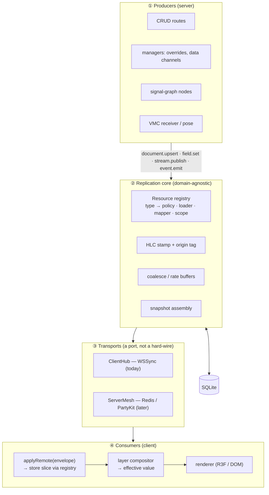
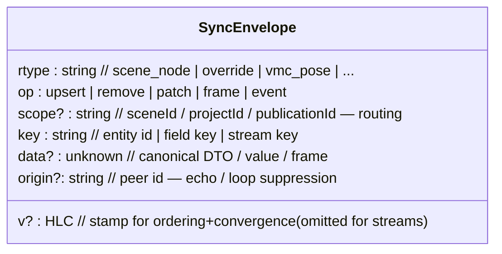
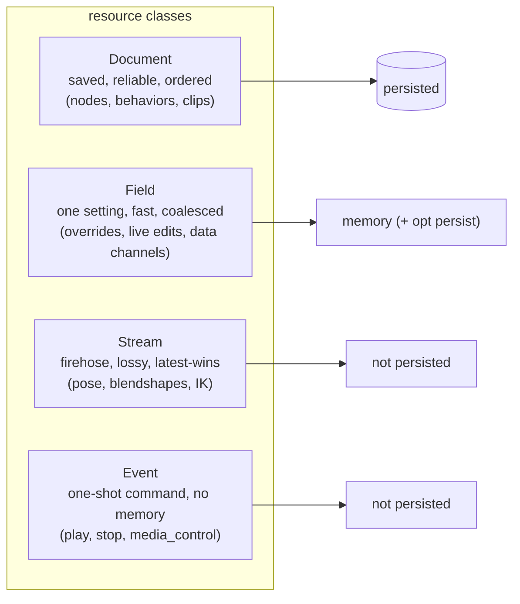
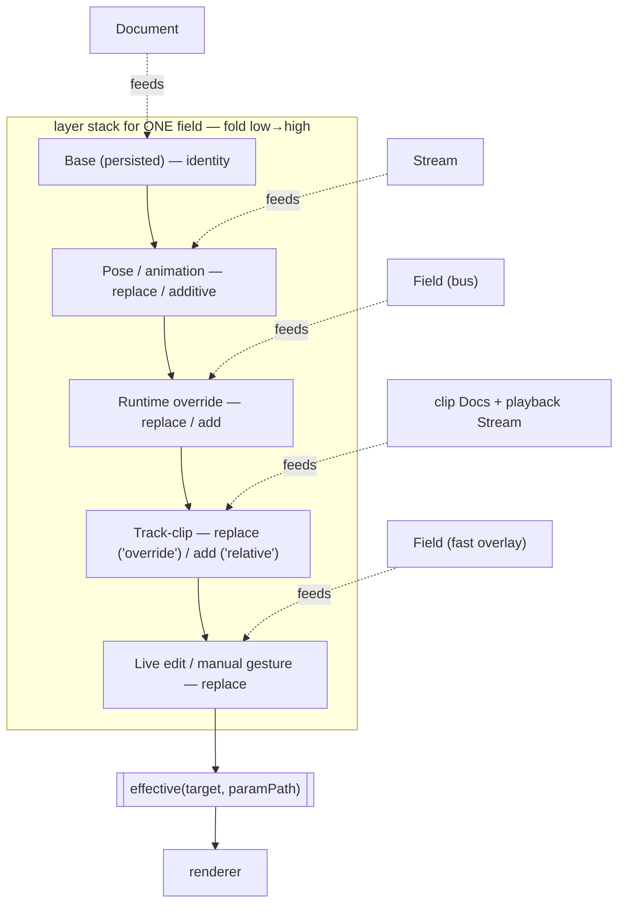
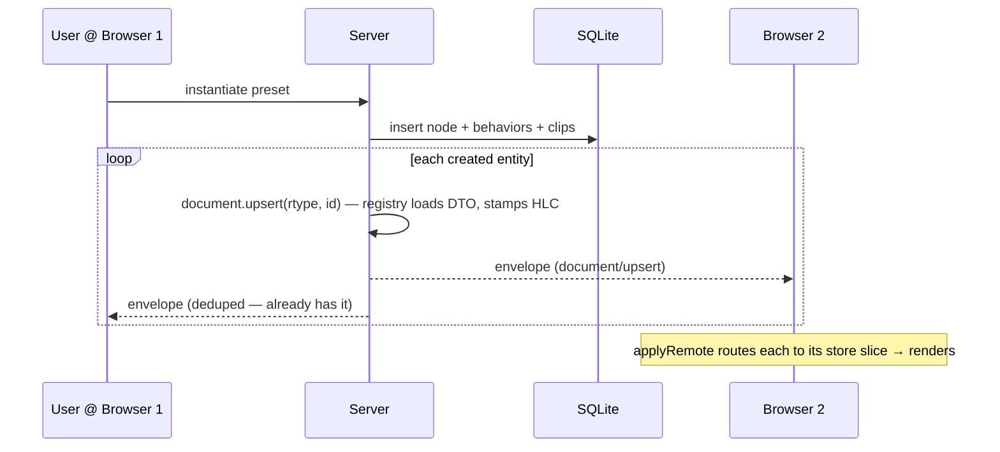
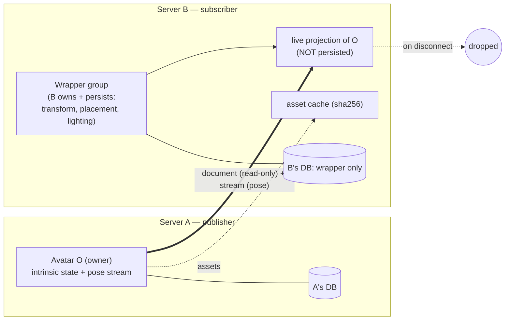
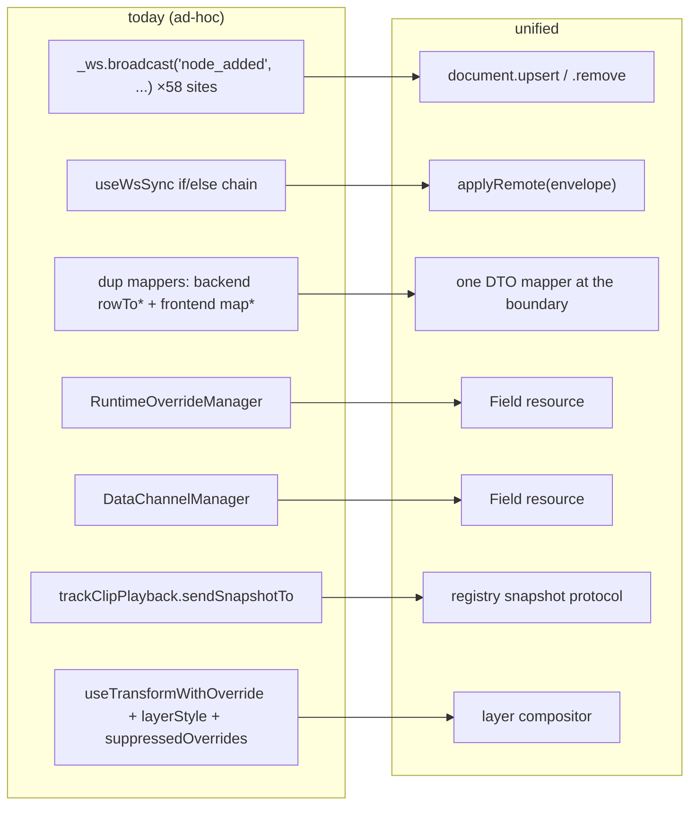

# Unified sync layer — illustrated

Companion to [`unified-sync-layer.md`](./unified-sync-layer.md). Diagrams (Mermaid) +
end-to-end use cases. Read the main doc for rationale and decisions.

---

## 1. The big picture

Four layers. Producers emit changes through one of four typed calls; a domain-agnostic core
stamps/persists/routes them; a transport carries them; consumers fold them into what renders.



The win: adding a syncable thing = **one registry entry on each side**, not a bespoke
sender + receiver + two mappers.

---

## 2. One message format (the envelope)

Every change on the wire looks the same, regardless of what it describes:



---

## 3. The four resource classes

Same pipe, different rules — chosen by how often a thing changes and whether it must survive.



---

## 4. The override-layer compositor

A field's rendered value is a **stack of layers** folded low→high. Each layer either
**replaces** the value beneath it or **composes** onto it (add / multiply).



Each layer is fed by one of the four resource classes — so the compositor **is** the sync
read-model. "Manual edit beats a paused clip" is just "the manual layer is higher" (no
suppression hack). Today's `clip > runtime > base` precedence is the top of this same stack.

---

## 5. Use case A — create via preset, other client updates (the original bug, generalized)



Today this needs a hand-written broadcast per entity type (and forgetting one *was* the bug).
With `document.upsert`, the preset code just loops created ids — every type rides the same path.

---

## 6. Use case B — live param drag while a clip plays (compositor + preview→commit)

```mermaid
sequenceDiagram
  participant B1 as Browser 1 (dragging)
  participant S as Server
  participant B2 as Browser 2
  Note over B1: a track-clip is playing on this field
  loop each tick (coalesced)
    B1->>S: field.set(position.x, live overlay)
    S-->>B2: envelope (field/patch, origin=B1)
    Note over B1,B2: compositor: LIVE layer sits above CLIP layer → drag wins, smoothly
  end
  Note over B1: mouse release
  B1->>S: document.upsert(node)  %% commit base
  S->>S: persist + stamp HLC
  S-->>B2: envelope (document/upsert)
  S-->>B1: (echo suppressed)
  Note over B1,B2: live layer cleared; base updated; clip resumes control next frame
```

No `suppressedOverrides` muting — the live edit wins purely by being a higher layer. A late
stale drag frame loses because its stamp is older than the committed value.

---

## 7. Use case C — object share (borrow an avatar across servers)



A renders O and is its sole authority. B places it inside a wrapper it owns; B never persists
O's content (only caches assets). Disconnect → projection dropped, wrapper stays, re-projects on
reconnect. A remote avatar is literally a pose **Stream** with a remote producer, so `Avatar.tsx`
renders it unchanged.

---

## 8. Use case D — full scene sync with a disconnect + reconcile

```mermaid
sequenceDiagram
  participant A as Server A (reconciliation authority)
  participant B as Server B
  Note over A,B: connected — both own + persist, live convergence
  A->>B: edits (envelopes, HLC-stamped)
  B->>A: edits (envelopes, HLC-stamped)
  Note over A,B: 🔌 link drops
  Note over A: keeps editing its own persisted replica
  Note over B: keeps editing its own persisted replica
  Note over A,B: 🔗 reconnect
  B->>A: changes since last common sync (dirty-since markers)
  A->>A: reconcile — apply both;<br/>authority breaks ties on the SAME field
  A-->>B: reconciled state
  Note over B: converges to reconciled result
```

Both keep working standalone (the fall-back requirement). On reconnect a designated authority
arbitrates — no version-vector/CRDT machinery; non-conflicting offline edits from both sides
survive, only same-field clashes defer to the authority.

---

## 9. How today's code maps onto this



The managers and snapshot/preview patterns already exist — they're the prototypes the unified
layer generalizes, not greenfield work.
