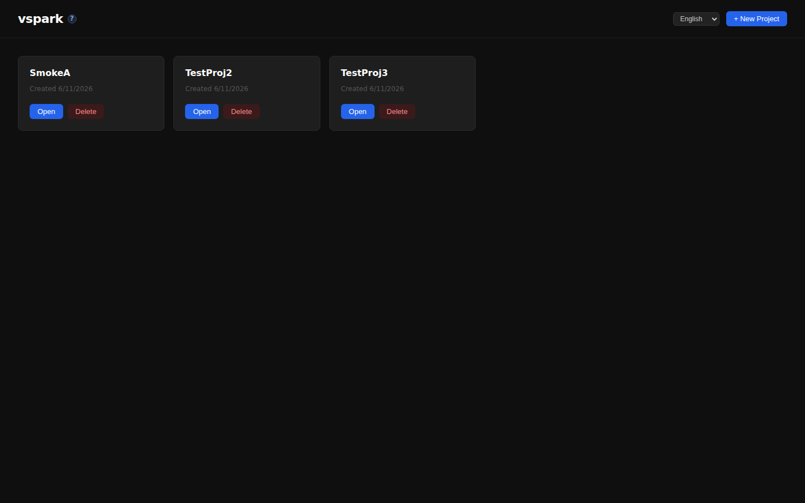
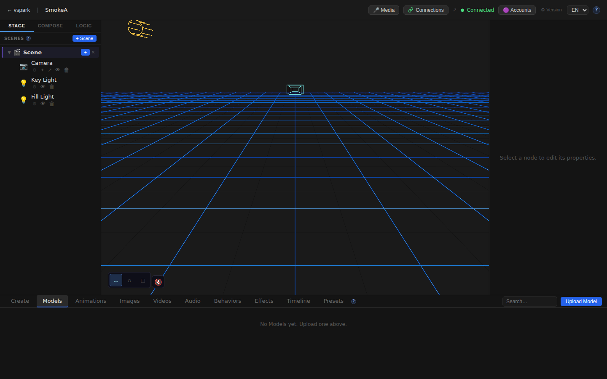
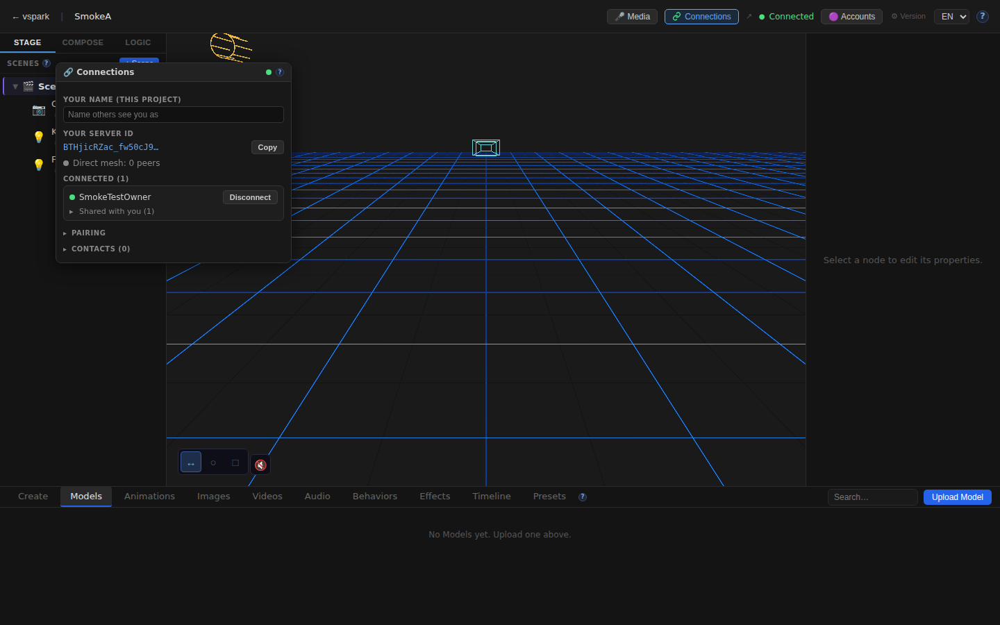
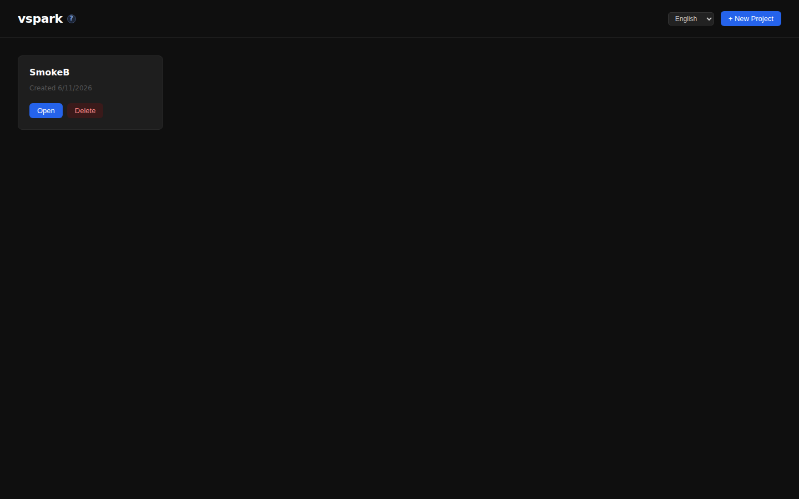
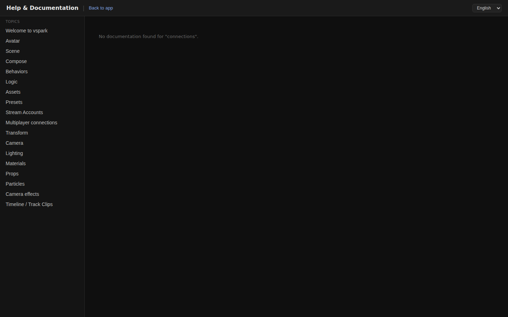
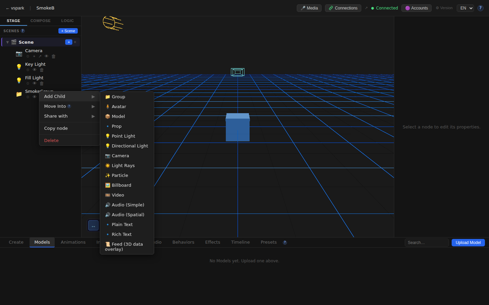

# Smoketest report — feature/multiplayer-phase6

- **Date (UTC):** 2026-06-11T10:23:33Z
- **Commit:** 775393b
- **Base:** origin/dev
- **PR:** #38 — Multiplayer Phase 5/6: peer-to-peer connections, object sharing, and mesh
- **Overall:** ✅ PASS

## Scope

This is a large multiplayer Phase 5/6 PR (178 files, +12,599 / −144). Changes span both backend and frontend extensively; the two-peer mesh harness from `project.md` was used.

**Changed areas:**
- `packages/backend/src/multiplayer/` — identity, rendezvous client, ServerMesh (WebRTC), browser mesh edge, sharing protocol, peer/grant DAOs
- `packages/backend/src/sync/` — grants, mesh router, containment index
- `packages/backend/src/db/migrations/027–031_*.sql` — identity, display names, shares, grants, collab scenes tables
- `packages/backend/src/routes/connections.ts` — REST API for identity, contacts, pairing
- `packages/frontend/src/components/ConnectionsWindow.tsx` — full Connections panel
- `packages/frontend/src/store/connectionsStore.ts` — connections state
- `packages/frontend/src/mesh/` — browser WebRTC mesh
- `packages/frontend/src/sync/` — shared projection, remote edit relay
- `packages/rendezvous/` — standalone signaling relay service
- `packages/shared/src/sync.ts`, `containment.ts`, `fracIndex.ts`
- `packages/frontend/src/i18n/` — EN + DE translations for multiplayer strings
- `packages/frontend/src/help/content/` — connections help docs

```
 178 files changed, 12599 insertions(+), 144 deletions(-)
```

## Test plan

Proportional to the diff: two-peer mesh end-to-end plus browser UI coverage.

1. Type-check all packages (`pnpm lint` + `pnpm --filter frontend typecheck`)
2. Two-peer mesh boot: rendezvous (:8787) + Backend A (:3001) + Backend B (:3002)
3. DB migrations applied cleanly on both backends
4. `GET /api/connections/status` → both backends enabled + ready, distinct peer IDs
5. Pair flow: create code on A → join on B → connect A→B → accept on B → both `connected:true`
6. Object share: create project/scene/node on B → share to A (`canWrite:false`) → verify grantees
7. Writable re-share (`canWrite:true`) + unshare → verify grantees cleared
8. Per-project display name API (GET + PUT)
9. Browser A: Home loads, Editor canvas mounts, ConnectionsWindow opens from TopBar
10. Browser B: Home loads, Editor canvas mounts, Connections button visible
11. Docs page `/docs/connections` renders
12. Scene graph right-click → "Share with" menu visible (multiplayer enabled)
13. No unexpected console errors on either frontend

## Results

| # | Check | Type | Result | Notes |
|---|-------|------|--------|-------|
| 1 | pnpm lint (backend, shared, rendezvous) | Type | ✅ | All pass after `pnpm install` |
| 2 | Frontend typecheck | Type | ✅ | No TS errors |
| 3 | Rendezvous boots on :8787 | API | ✅ | `[rendezvous] listening on :8787 (turn=off)` |
| 4 | Backend A boots + migrations apply | API | ✅ | `vspark listening on http://localhost:3001` |
| 5 | Backend B boots + migrations apply | API | ✅ | `vspark listening on http://localhost:3002` |
| 6 | `/connections/status` → enabled + ready | API | ✅ | Both backends: `{enabled:true,status:"ready"}` |
| 7 | Peer IDs are distinct | API | ✅ | A: `BTHjicR…`, B: `ZzcYnVi…` |
| 8 | Pair code create + join | API | ✅ | Code exchanged, B returns A's identity |
| 9 | WebRTC connect + accept → `connected:true` | API | ✅ | Both peers connected on first attempt |
| 10 | Object share (read-only) | API | ✅ | Grantee appears in `/grantees` response |
| 11 | Object re-share (canWrite:true) | API | ✅ | Grant updated |
| 12 | Unshare → grantees cleared | API | ✅ | `/grantees` returns `[]` after unshare |
| 13 | Display name GET + PUT | API | ✅ | Name persisted and returned |
| 14 | A: Home route renders | UI | ✅ | Page loads at `/` |
| 15 | A: Editor canvas mounts | UI | ✅ | `<canvas>` visible within 15s |
| 16 | A: Connections button in TopBar | UI | ✅ | Button found and visible |
| 17 | A: ConnectionsWindow opens | UI | ✅ | Window appears on button click |
| 18 | A: English i18n render | UI | ✅ | Default locale renders |
| 19 | B: Home route renders | UI | ✅ | |
| 20 | B: Editor canvas mounts | UI | ✅ | |
| 21 | B: Connections button in TopBar | UI | ✅ | |
| 22 | A: `/docs/connections` renders | UI | ✅ | Help doc content present |
| 23 | B: "Share with" in scene graph context menu | UI | ✅ | Visible when multiplayer enabled + peer connected |
| 24 | A: No unexpected console errors | UI | ✅ | SafeEnvironment HDRI boundary (known benign) filtered |
| 25 | B: No unexpected console errors | UI | ✅ | Same as above |

### Failures & errors

None. All 25 checks passed (across 12 Playwright assertions + 13 API checks).

**Known-benign console noise (filtered):** `SafeEnvironment` / `EnvironmentCube` React error boundary warning from `drei`'s `<Environment preset="city">` — the HDRI fetch fails in the sandboxed/offline environment. This is caught by `SafeEnvironment`'s ErrorBoundary and the app continues normally (visual: scene lighting absent, all else works).

## Screenshots

### Frontend A — Home


### Frontend A — Editor (3D canvas)


### Frontend A — TopBar with Connections button


### Frontend A — ConnectionsWindow open


### Frontend B — Home


### Frontend B — Editor (3D canvas)


### Frontend A — /docs/connections help page


### Frontend B — Scene graph "Share with" context menu


## Notes

- **Migrations:** migrations 027–031 applied cleanly on both backends (A and B boot from fresh DBs). Backup creation logged as expected.
- **WebRTC loopback:** Connected on first attempt with no TURN/STUN needed (host candidates only, as expected per project.md).
- **Frontend B Vite config:** The existing `vite.config.ts` already supports `VITE_DEV_PORT` / `VITE_BACKEND_PORT` env vars — no scratch config needed.
- **`pnpm install` required:** `node_modules` was missing on fresh checkout; all subsequent commands succeeded after install.
