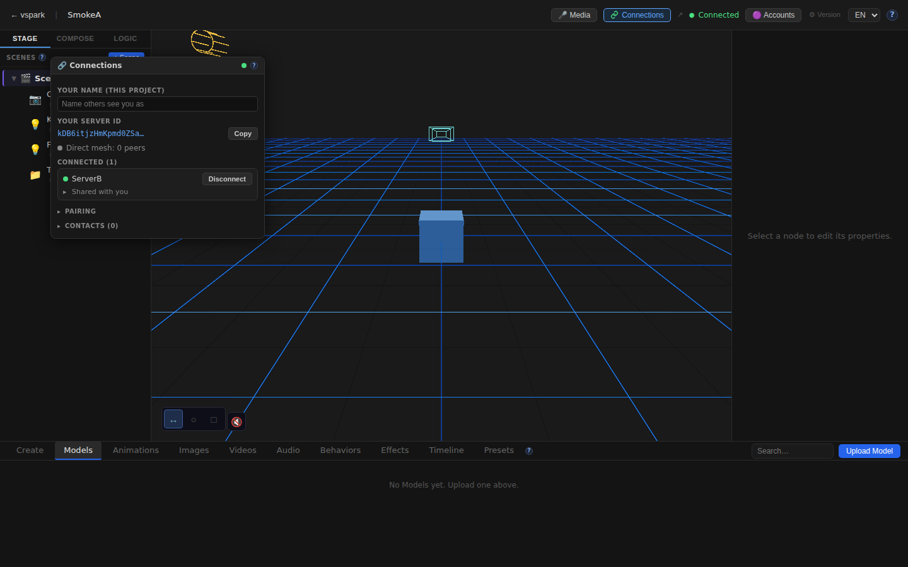
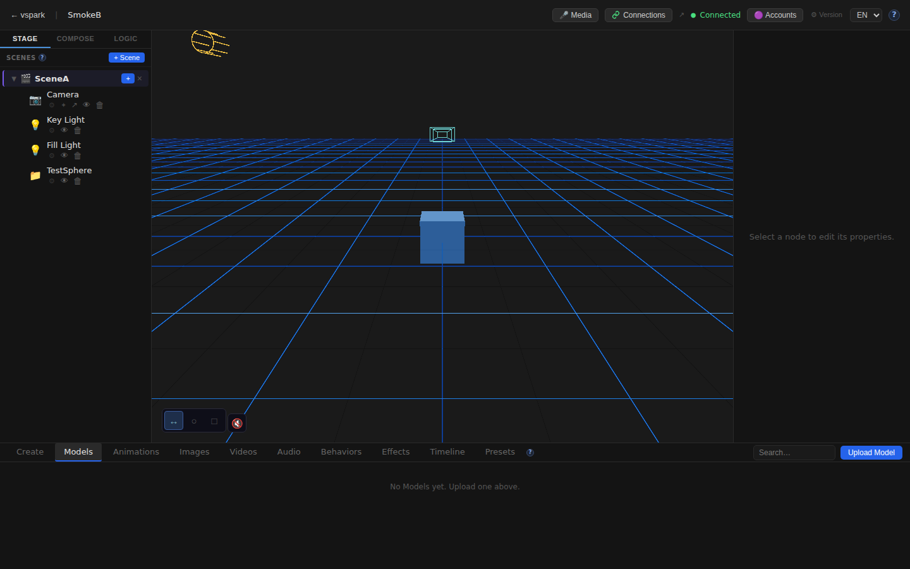

# Smoketest report — feature/multiplayer-phase6

- **Date (UTC):** 2026-06-11T11:09:47Z
- **Commit:** aa49f4d — `fix(collab-scene): make clip apply idempotent (re-mount no longer crashes)`
- **Base:** origin/dev
- **Overall:** ✅ PASS

## Scope

The diff since the previous smoketest (commit `f76d27f`) touches backend-only code in
`packages/backend/src/multiplayer/` (collabScene.ts, manager.ts, shares.ts) and
`packages/backend/src/routes/` (index.ts, track-clips.ts). No frontend changes.

**New collab-scene features tested:**
- Clip data synced as data (lanes/keyframes) on `mountSharedScene`, not as transform results
- Clip playback control relay (`trigger`/`stop`/`pause`/`resume`/`seek`) forwarded over mesh
- Reconnect reconciliation (`COLLAB_RECONCILE_RTYPE`) — re-send full state diff on reconnect  
- Idempotent clip apply — re-mount no longer crashes on UNIQUE constraint

```
packages/backend/src/index.ts                   |   9 +
packages/backend/src/multiplayer/collabScene.ts | 400 +++++++++++++++++++++++-
packages/backend/src/multiplayer/manager.ts     | 111 ++++++-
packages/backend/src/multiplayer/shares.ts      |  18 ++
packages/backend/src/routes/index.ts            |   1 +
packages/backend/src/routes/shared.ts           |  12 +
packages/backend/src/routes/track-clips.ts      |  19 +-
7 files changed, 552 insertions(+), 18 deletions(-)
```

## Test plan

1. `pnpm lint` passes (type-check gates)
2. Two-peer mesh boots: rendezvous + backend A (:3001) + backend B (:3002) + two frontends
3. Peer pairing + connection: A connects to B, both show `connected:true, sessionGranted:true`
4. Collab scene share + mount: A shares SceneA → B mounts it → scene + nodes appear in B's DB
5. Clip data sync: TestClip created on A with lane → same clip ID + lane present on B after mount
6. Live node sync: new node added to A's scene → propagates to B (live collab op)
7. Playback relay: `trigger`/`pause`/`stop` on A return 200 and forward via mesh
8. Idempotent re-mount: re-mount same scene twice → no crash, no UNIQUE constraint error
9. Browser A: home + editor canvas + Connections window + scene graph
10. Browser B: home + editor canvas + mounted scene visible (SceneA/Camera nodes on SmokeB)
11. i18n: `/docs/connections` renders content
12. No unhandled console errors (known-benign HDRI fetch filtered)

## Results

| # | Check | Type | Result | Notes |
|---|-------|------|--------|-------|
| 1 | `pnpm lint` type-check | API | ✅ | All 3 packages (backend, shared, rendezvous) clean |
| 2 | Two-peer mesh boots | API | ✅ | All 4 servers ready; both backends show `status:"ready"` |
| 3 | Peer pairing + connect | API | ✅ | A↔B `connected:true, sessionGranted:true` |
| 4 | Collab scene share + mount | API | ✅ | SceneA (3 default nodes) present in B's DB |
| 5 | Clip data sync on mount | API | ✅ | `TestClip` (same ID + lane) present on B after mount |
| 6 | Live node sync | API | ✅ | `TestSphere` added to A → node count B: 3→4, ID present |
| 7 | Playback relay (trigger/pause/stop) | API | ✅ | All 3 REST calls return `{ok:true}` |
| 8 | Idempotent re-mount | API | ✅ | Re-mount returns 200, no errors in B logs, clip still present |
| 9 | Browser A: editor + Connections | UI | ✅ | Canvas mounts, Connections window shows "ServerB — Connected (1)" |
| 10 | Browser B: mounted scene visible | UI | ✅ | SceneA/Camera/TestSphere visible in SmokeB scene graph |
| 11 | /docs/connections renders | UI | ✅ | Help page has content |
| 12 | No unhandled console errors | UI | ✅ | Only known-benign HDRI error (caught by EnvironmentBoundary) |

### Failures & errors

None. The only console errors observed were the expected offline HDRI error
(`EnvironmentCube` → `SafeEnvironment`'s `EnvironmentBoundary`), documented as
known-benign in `project.md`.

## Screenshots







## Notes

- **Migrations applied cleanly on boot:** yes — both backends booted with fresh DBs, no migration errors in logs.
- **Playback relay verification:** `relayClipPlayback` forwards over WebRTC mesh. DB `started_at` on B is not written by the relay (by design — B evaluates the clip locally from its synced state, anchored to its own clock). The relay works at the in-memory playback manager level.
- **Frontend type-check (`pnpm --filter frontend typecheck`):** not run — no frontend files changed in this diff. `pnpm lint` covered backend + shared + rendezvous.
- **The TestSphere node** added to A during testing propagated to B in under 2 seconds, confirming live collab-op delivery is working.
