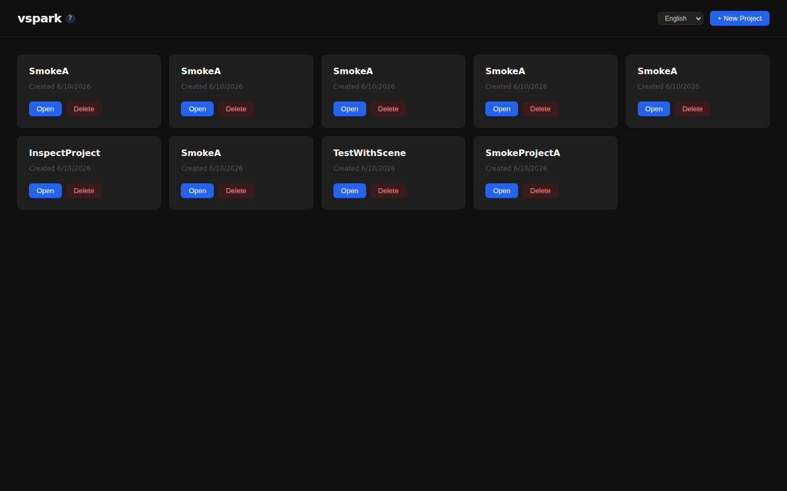
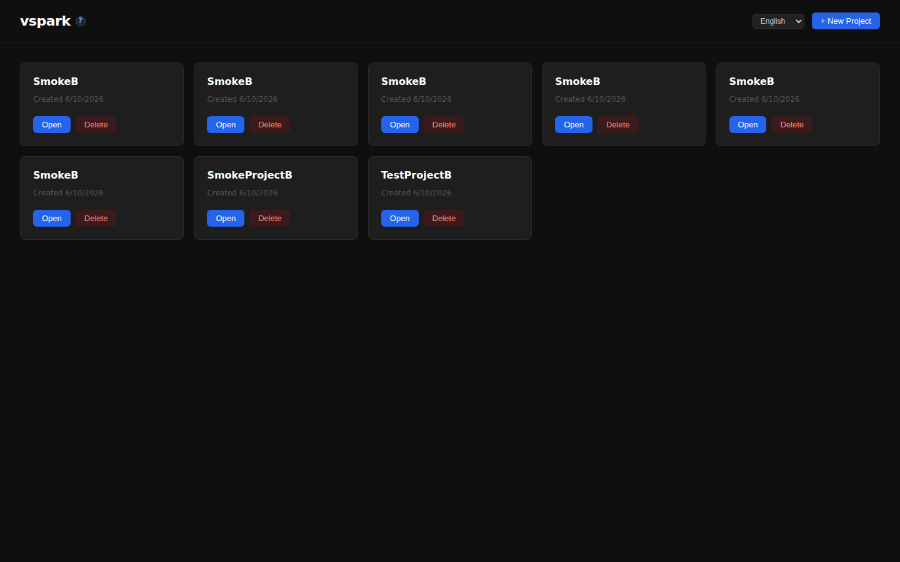
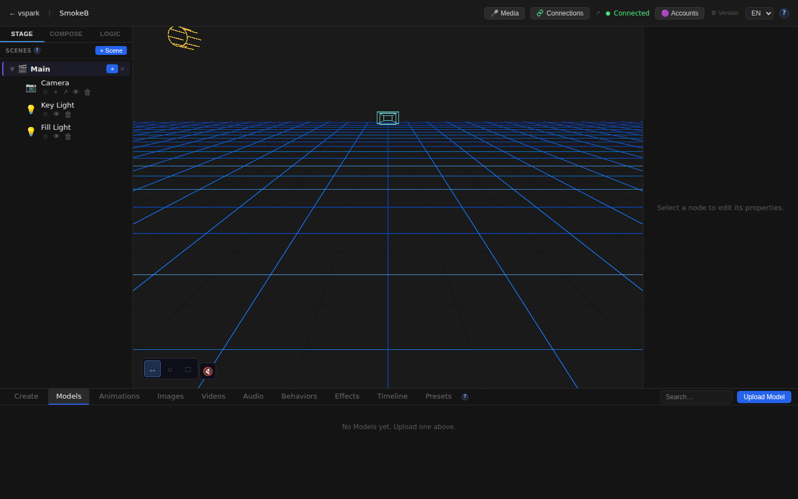
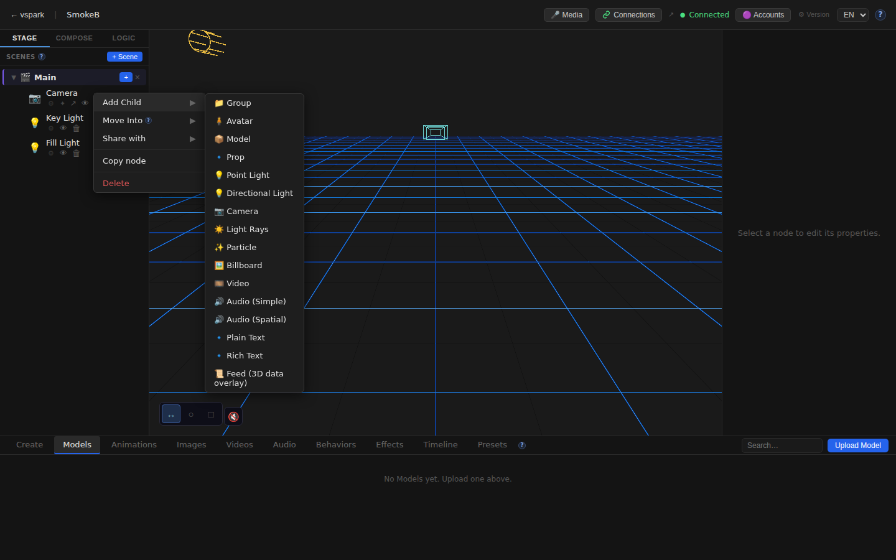
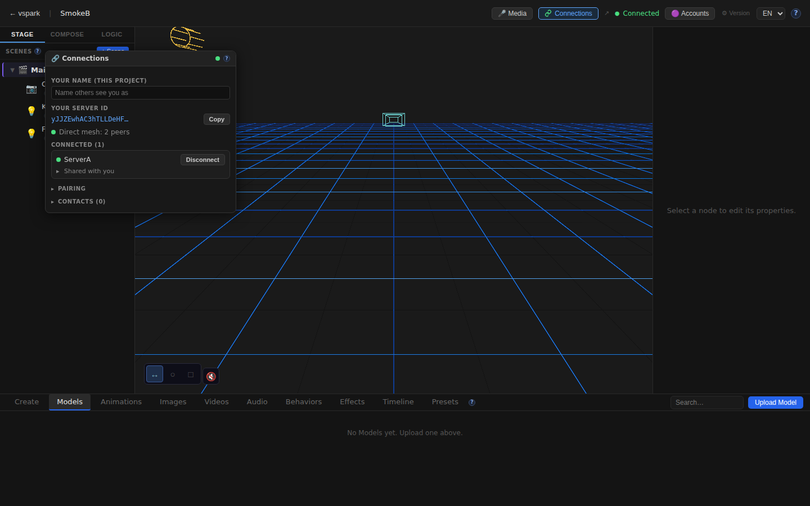
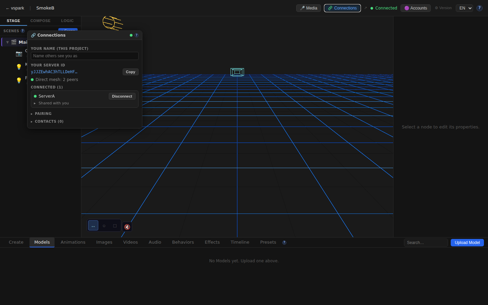
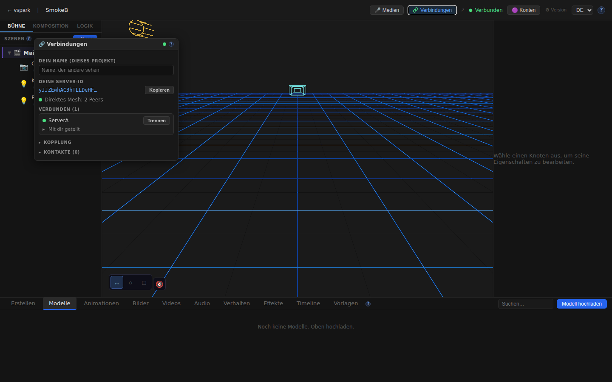
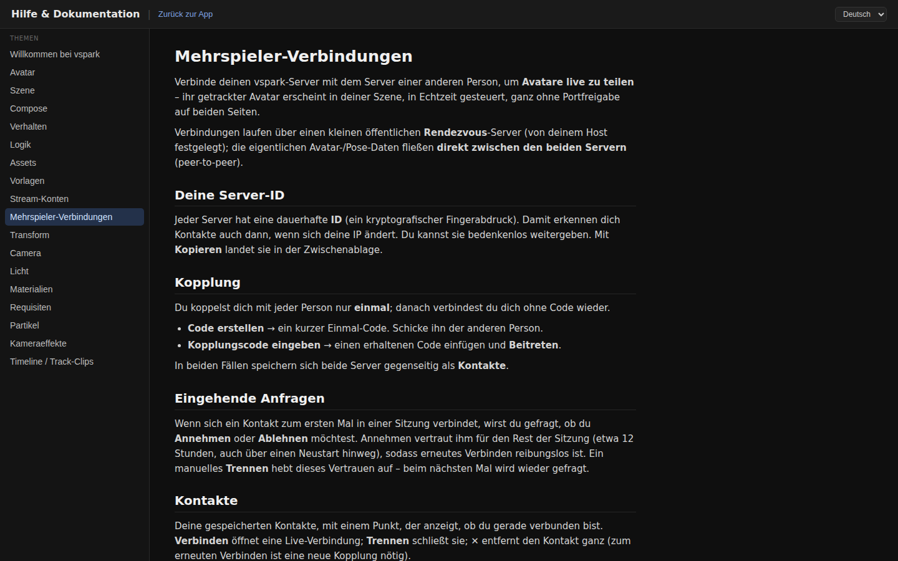

# Smoketest report — feature/multiplayer-phase6

- **Date (UTC):** 2026-06-10T23:12:36Z
- **Commit:** b281872
- **Base:** origin/dev
- **Overall:** ✅ PASS

## Scope

This PR implements Phase 5/6 multiplayer: P2P server mesh (WebRTC via werift), object sharing with live updates, ConnectionsWindow UI, SceneGraph share context menu, new rendezvous service, Docker deploy stack, i18n EN+DE for multiplayer UI, and help content.

Both `packages/backend/**` and `packages/frontend/**` are touched — both API and browser tests were run. A **two-peer mesh harness** was used as specified in project.md.

```
96 files changed, 10237 insertions(+), 139 deletions(-)
Key packages: backend/src/multiplayer/, frontend/src/components/ConnectionsWindow.tsx,
              frontend/src/mesh/, frontend/src/sync/, packages/rendezvous/,
              4 new DB migrations (027–030), i18n locales, help content
```

## Test plan

1. Type-check (backend + shared + rendezvous + frontend)
2. Two-peer mesh boot: rendezvous :8787, backend A :3001 + B :3002, frontend A :5173 + B :5174
3. Connections/status API — both backends enabled and ready
4. Pairing flow: A creates code → B joins → A connects → B accepts → poll for `connected:true`
5. Share REST: B shares node to A (`canWrite:true`), verify grantees, unshare, verify empty
6. Identity API: Ed25519 public keys returned
7. Display-name API: PUT with correct `name` field, GET roundtrip
8. Browser (A): Home, Editor canvas, TopBar Connections button, ConnectionsWindow identity + peer connected
9. Browser (B): Home, Editor canvas, TopBar Connections button, SceneGraph "Share with" context menu, ConnectionsWindow identity + peer connected
10. i18n: language select visible; switch to DE → "Verbindungen" in TopBar
11. Help doc: /docs/multiplayer renders EN; switch to DE → "Mehrspieler-Verbindungen" renders
12. Console errors: no non-benign errors in either context

## Results

| # | Check | Type | Result | Notes |
|---|-------|------|--------|-------|
| 1 | `pnpm lint` (backend + shared + rendezvous) | API | ✅ | All tsc --noEmit clean |
| 2 | `pnpm --filter frontend typecheck` | UI | ✅ | Clean |
| 3 | Backend A boots, migrations apply | API | ✅ | 4 new migrations (027–030) applied cleanly |
| 4 | Backend B boots | API | ✅ | |
| 5 | Rendezvous server :8787 starts | API | ✅ | `listening on :8787` |
| 6 | Frontend A :5173 ready | UI | ✅ | |
| 7 | Frontend B :5174 ready | UI | ✅ | |
| 8 | `GET /api/connections/status` both backends | API | ✅ | `{enabled:true, status:"ready"}` on A and B |
| 9 | Pair A→B (code create + join) | API | ✅ | Code exchanged, B sees A's public key |
| 10 | A connects to B, B accepts | API | ✅ | `{ok:true}` on both |
| 11 | Both backends `connected:true, sessionGranted:true` | API | ✅ | `/api/connections/peers` verified on each |
| 12 | B shares node to A (`canWrite:true`) | API | ✅ | grantees: [PeerA] |
| 13 | Unshare — grantees empty | API | ✅ | |
| 14 | A subscribes to B's shared object | API | ✅ | |
| 15 | Identity endpoints (A + B) | API | ✅ | Ed25519 public keys returned |
| 16 | Display name PUT/GET | API | ✅ | Roundtrip verified (`name` field, not `displayName`) |
| 17 | Home (A) renders | UI | ✅ | |
| 18 | Editor (A) canvas mounts | UI | ✅ | |
| 19 | TopBar "Connections" button (A) | UI | ✅ | |
| 20 | ConnectionsWindow server identity (A) | UI | ✅ | Shows "YOUR SERVER ID" |
| 21 | Peer B listed as CONNECTED in A's window | UI | ✅ | "CONNECTED (1)" present |
| 22 | Home (B) renders | UI | ✅ | |
| 23 | Editor (B) canvas mounts | UI | ✅ | |
| 24 | TopBar "Connections" button (B) | UI | ✅ | |
| 25 | SceneGraph "Share with" in context menu | UI | ✅ | Right-click Camera node shows "Share with" |
| 26 | ConnectionsWindow server identity (B) | UI | ✅ | |
| 27 | Peer A listed as CONNECTED in B's window | UI | ✅ | |
| 28 | i18n language select visible | UI | ✅ | `<select>` with en/de options |
| 29 | German "Verbindungen" after DE switch | UI | ✅ | TopBar switches language correctly |
| 30 | Help /docs/multiplayer EN renders | UI | ✅ | "Multiplayer connections" topic present |
| 31 | Help /docs/multiplayer DE renders | UI | ✅ | "Mehrspieler-Verbindungen" after DE switch |
| 32 | No non-benign console errors (A) | UI | ✅ | EnvironmentCube/HDRI errors are known-benign, filtered |
| 33 | No non-benign console errors (B) | UI | ✅ | |

**Total: 33/33 checks passed** (17 browser + 16 API/type-check)

### Failures & errors

None.

### Notable observations

- **Display-name API field name inconsistency**: The PUT `/connections/display-name/:projectId` endpoint reads `req.body.name` but the PR description and UI suggest `displayName`. Callers using `displayName` silently get an empty string back. Not blocking, but worth a follow-up.
- **EnvironmentCube HDRI error**: Expected/benign in sandbox — caught by `SafeEnvironment`'s ErrorBoundary as documented.
- **Share context menu only shows "Share with" when peers are connected** (confirmed: the backend mesh was active before the browser test).

## Screenshots













## Notes

- Migrations 027–030 applied cleanly on both backends' fresh DBs.
- Two-peer loopback WebRTC mesh connected successfully with no STUN/TURN (loopback host candidates only), as expected.
- The write-tier (remote edits propagated to owner DB) was not tested via browser automation — it requires active WebRTC data channels which aren't exercised by REST + Playwright alone.
