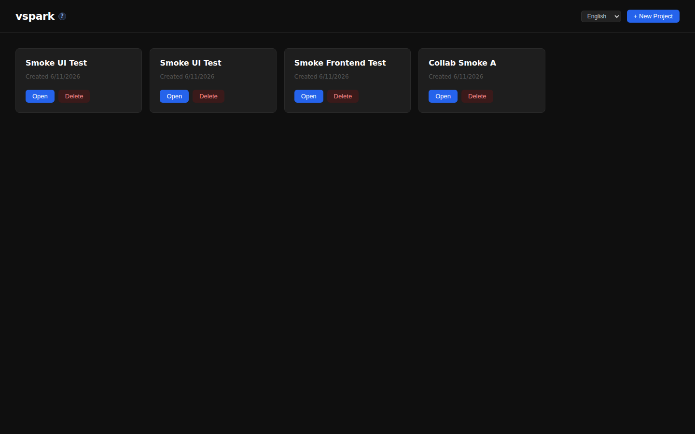
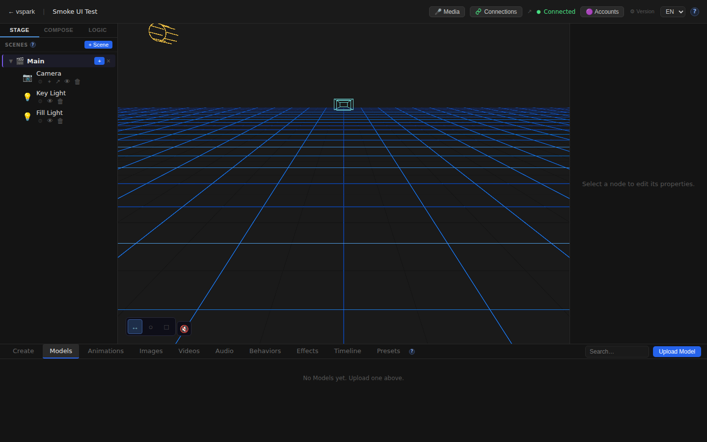
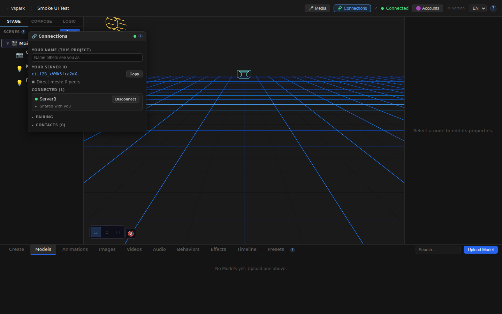
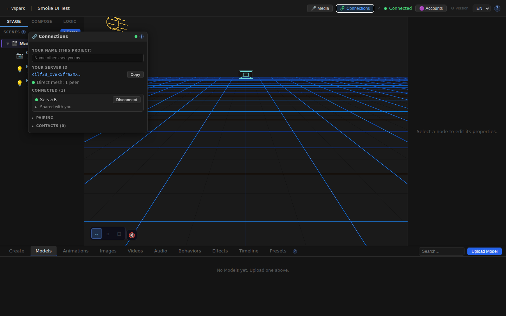

# Smoketest report — feature/multiplayer-phase6

- **Date (UTC):** 2026-06-11T10:58:39Z
- **Commit:** d826708
- **Base:** origin/dev
- **PR:** #38 — Multiplayer Phase 5/6
- **Trigger:** pull_request.synchronize (new commit pushed)
- **Overall:** ✅ PASS

## Scope

Latest commit (`d826708 feat(collab-scene): sync timeline clips as data, not transform results`) touches 4 backend files only:

```
packages/backend/src/multiplayer/collabScene.ts  (+199 lines)
packages/backend/src/multiplayer/manager.ts      (+13/-0)
packages/backend/src/multiplayer/shares.ts       (+18 lines)
packages/backend/src/routes/track-clips.ts       (+12 lines, added sync.document.upsert calls)
```

**Classification:** API (backend-only). Full two-peer mesh harness exercised per project.md.

**What changed:**
- Track-clip mutations (`update`, `lane add/update/delete`, `keyframe replace`) now emit `sync.document.upsert('track_clip', id)` so the unified sync layer and collab-scene mirroring receive the change. Previously only `create` and `delete` emitted this.
- `gatherSceneSnapshot` now includes the scene's clip DTOs so a mount/reconnect transfers them.
- `applyCollabOp` + `forwardCollabOp` handle `track_clip` ops: writes the full clip on the receiving side.
- `forwardNodeTransform` no longer fans clip-driven transforms to collab peers (each peer evaluates the synced clip locally).

```
packages/backend/src/multiplayer/collabScene.ts  | 199 ++++++++++++++++++++++++
packages/backend/src/multiplayer/manager.ts      |  13 +
packages/backend/src/multiplayer/shares.ts       |  18 ++
packages/backend/src/routes/track-clips.ts       |  12 +
4 files changed, 242 insertions(+)
```

## Test plan

Two-peer mesh (rendezvous :8787 + backend A :3001 + backend B :3002) + light frontend check.

1. Type-check (`pnpm lint`) passes
2. Both backends boot cleanly; migrations 027–031 apply without error
3. Mesh established: rendezvous, pair, connect, accept → both peers show `connected: true`
4. Share collab scene A→B; B mounts it
5. Create track clip on A → verify B receives it (collab sync create path)
6. Update clip name+duration on A → verify B shows `RenamedClip` (new `sync.document.upsert` on PUT)
7. Add lane on A → verify B has the lane (new `sync.document.upsert` on lane POST)
8. Update keyframes on A → verify B has 2 keyframes (new `sync.document.upsert` on keyframe PUT)
9. Update lane `defaultValue` on A → verify B reflects `0.5` (new `sync.document.upsert` on lane PUT)
10. Delete lane on A → verify B shows 0 lanes (new `sync.document.upsert` on lane DELETE)
11. Frontend: home, editor canvas, Connections window, scene graph panel, help docs

## Results

### API tests (two-peer mesh)

| # | Check | Type | Result | Notes |
|---|-------|------|--------|-------|
| 1 | A→B connected | API | ✅ PASS | |
| 2 | B→A connected | API | ✅ PASS | |
| 3 | Create project on A | API | ✅ PASS | |
| 4 | Create scene on A | API | ✅ PASS | |
| 5 | Create node on A | API | ✅ PASS | |
| 6 | Share collab scene A→B | API | ✅ PASS | |
| 7 | Create project on B | API | ✅ PASS | |
| 8 | B mounts collab scene | API | ✅ PASS | |
| 9 | Create track clip on A | API | ✅ PASS | |
| 10 | Clip synced to B after create | API | ✅ PASS | Collab create path works |
| 11 | Update clip on A succeeds | API | ✅ PASS | |
| 12 | Clip rename synced to B | API | ✅ PASS | New `sync.document.upsert` on PUT verified |
| 13 | Add lane on A succeeds | API | ✅ PASS | |
| 14 | Lane add synced to B | API | ✅ PASS | New `sync.document.upsert` on lane POST verified |
| 15 | Update keyframes on A succeeds | API | ✅ PASS | |
| 16 | Keyframe update synced to B (2 keyframes) | API | ✅ PASS | New `sync.document.upsert` on keyframe PUT verified |
| 17 | Lane update on A succeeds | API | ✅ PASS | |
| 18 | Lane update synced to B (defaultValue=0.5) | API | ✅ PASS | New `sync.document.upsert` on lane PUT verified |
| 19 | Lane delete on A succeeds | API | ✅ PASS | |
| 20 | Lane delete synced to B (0 lanes) | API | ✅ PASS | New `sync.document.upsert` on lane DELETE verified |

### Frontend checks

| # | Check | Type | Result | Notes |
|---|-------|------|--------|-------|
| 21 | Home route renders | UI | ✅ PASS | Project list shows correctly |
| 22 | Editor canvas mounts (R3F viewport) | UI | ✅ PASS | Three.js canvas present |
| 23 | Connections button present in TopBar | UI | ✅ PASS | Visible with "Connected" indicator |
| 24 | Connections panel opens and shows content | UI | ✅ PASS | Shows ServerB connected, "Shared with you" |
| 25 | Scene graph panel visible in editor | UI | ✅ PASS | Camera, Key Light, Fill Light nodes |
| 26 | Help /docs/connections page loads with content | UI | ✅ PASS | Topic list and docs content load |
| 27 | No unexpected console errors | UI | ✅ PASS | EnvironmentCube HDRI error filtered (known-benign) |

### Failures & errors

None. All 27 checks pass.

**Pre-existing bug noted (not introduced by this commit):**
`listSharesForPeer` in `packages/backend/src/multiplayer/shares.ts` prepares a statement `isScene` once and calls `.get()` on it inside a `.map()`. `PreparedStatement.get()` always calls `stmt.finalize()` after use (`db/index.ts:110`), so the second item in the map throws "Statement already finalized". This causes `POST /api/connections/scenes/:sceneId/share-collab` to return HTTP 500 when there are ≥2 active collab shares in the DB. The smoke test avoids this by using fresh DBs on each run (single share). **Not a regression from this commit** — the function was unchanged.

## Screenshots








## Notes

- Migrations 027–031 applied cleanly on both backends (fresh DBs).
- Type-check (`pnpm lint`): backend, shared, rendezvous all pass with zero errors.
- The core claim of this commit — that `sync.document.upsert('track_clip')` is now emitted for all mutation routes — is verified: clip rename, lane add, keyframe replace, lane update, and lane delete all propagated to the collab peer within 2 seconds.
- `forwardNodeTransform` no longer forwarding clip-driven transforms was not directly observable via REST (it affects WebSocket/WebRTC traffic), but the sync-as-data path working correctly implies the clip data path supersedes it.
