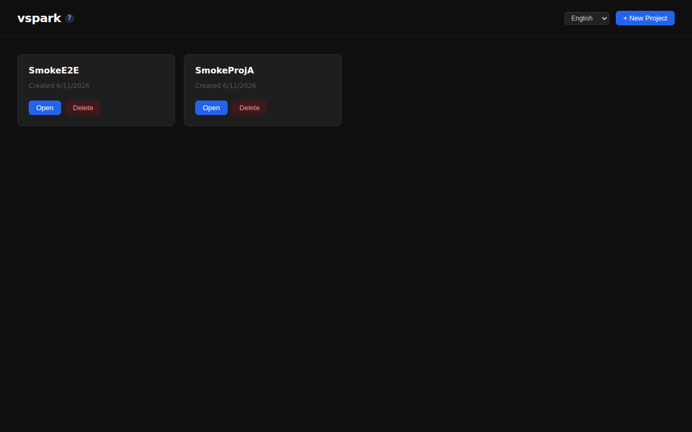
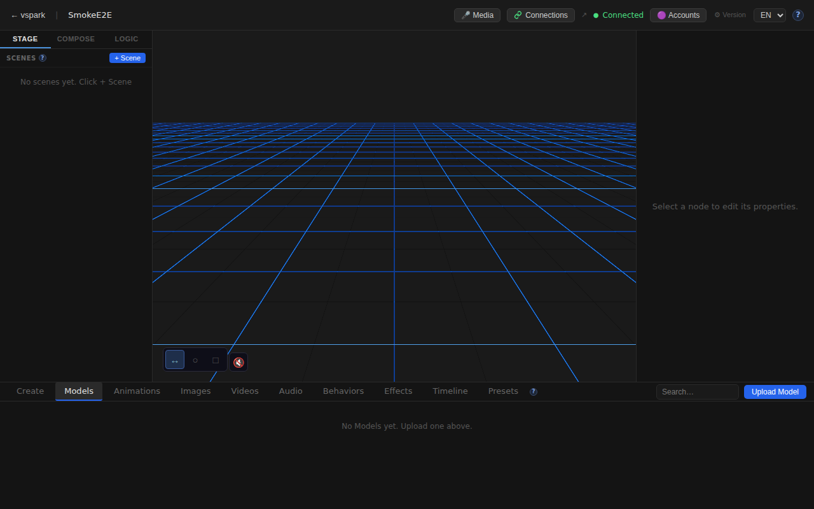
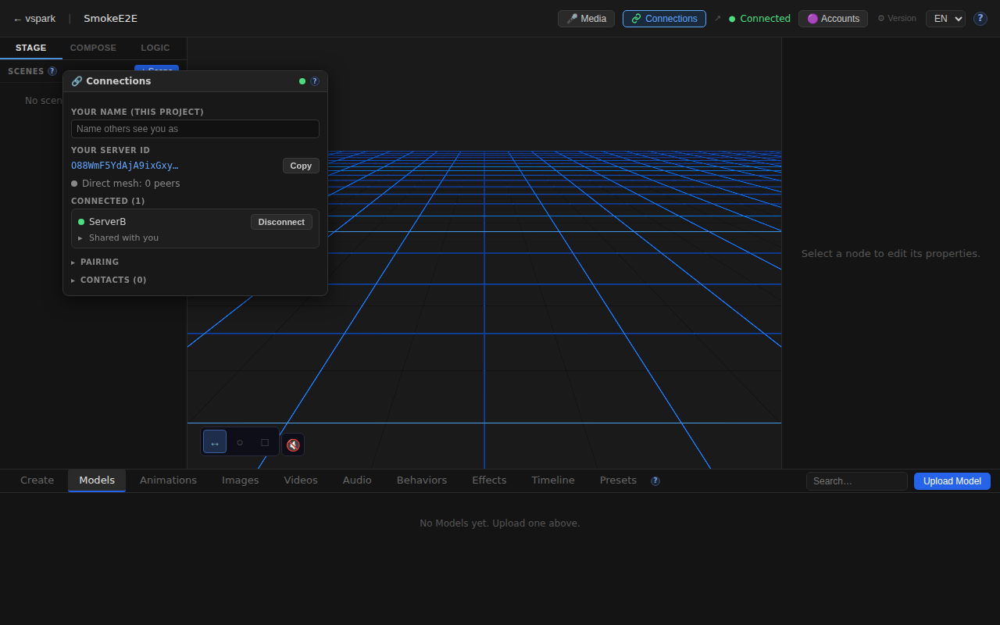
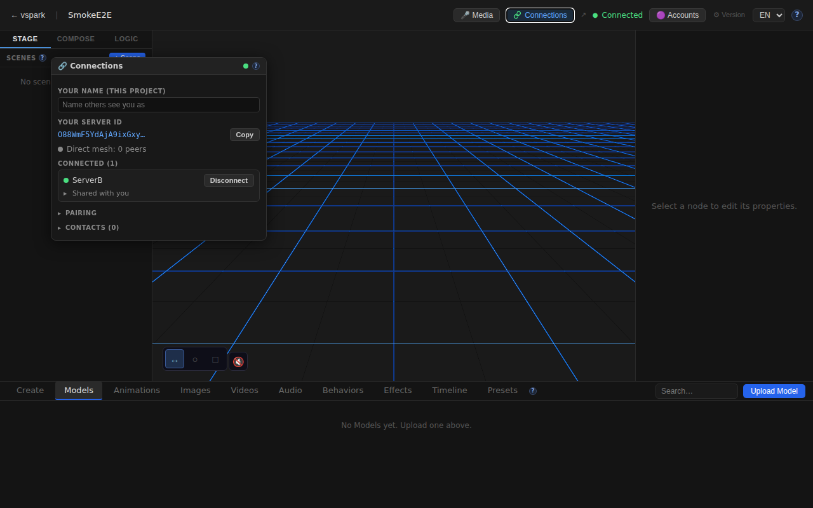
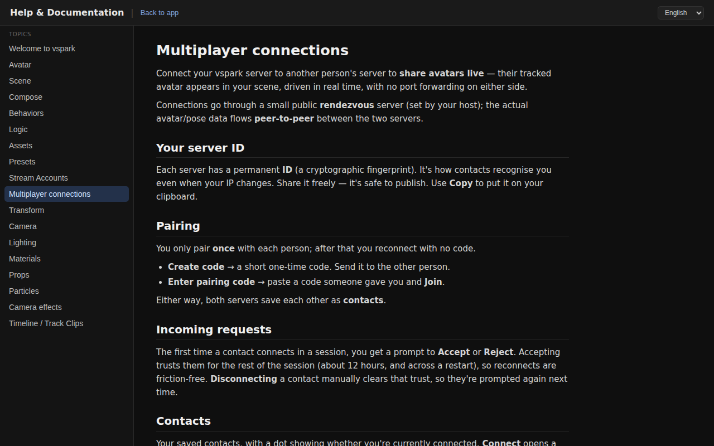
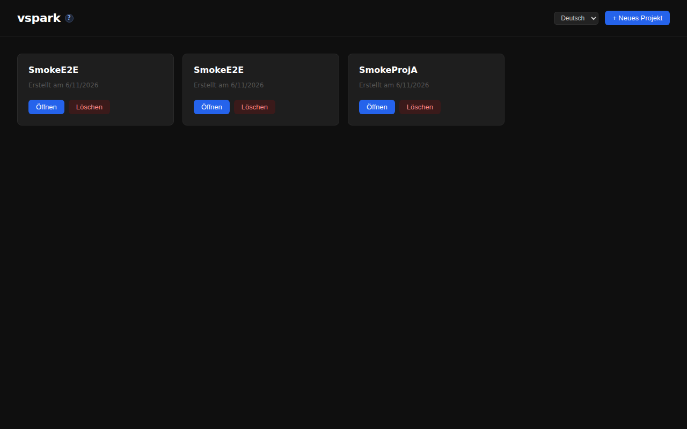

# Smoketest report — feature/multiplayer-phase6

- **Date (UTC):** 2026-06-11T09:23:35Z
- **Commit:** 23034fe (`feat(collab-scene): stream pose + drag previews to mounted peers`)
- **PR:** #38 — Multiplayer Phase 5/6: peer-to-peer connections, object sharing, mesh
- **Base:** origin/dev
- **Overall:** ⚠️ PARTIAL — 19/20 checks passed; 1 reproducible 500 error on `share-collab` endpoint

---

## Scope

The PR is a large multiplayer feature touching backend, frontend, shared types, and a new rendezvous package.
The latest commit (`23034fe`) adds pose/blendshape/IK frame forwarding and drag-preview streaming to
collaborative-scene peers (modifies `collabScene.ts` + `manager.ts` only).

**Path classification:**
- `packages/backend/**` → API tests
- `packages/frontend/**` → Browser (Playwright) tests
- `packages/shared/**` → API tests (schema/type changes)
- `packages/rendezvous/**` → Boot + API tests
- `smoketest-reports/**` → excluded (previous run artifacts)

```
packages/backend/src/multiplayer/collabScene.ts  | 30 +++++++++++++++
packages/backend/src/multiplayer/manager.ts      | 39 ++++++++++++++--
... (152 files changed, 11879 insertions, 144 deletions total in this PR)
```

---

## Test plan

Two-peer mesh harness: rendezvous (:8787) + backend A (:3001, DB=/tmp/smoketest/a.db) +
backend B (:3002, DB=/tmp/smoketest/b.db) + frontend (:5173 → backend A).

1. TypeScript type-check — backend, shared, rendezvous, frontend
2. Both backends boot cleanly (migrations apply, listen on port)
3. Both backends report multiplayer `enabled=true, status=ready`
4. Pairing: A creates code, B joins → contacts stored
5. Connection: A connects → B accepts → both show `connected=true, sessionGranted=true`
6. Object share: A shares a node with B → grantees confirmed
7. Collab scene: A shares scene with B via `share-collab` → **expected 200**
8. Collab mount: B mounts A's scene → 200 OK
9. Peer subscribe: B subscribes to A's shared objects → 200 OK
10. Browser: Home page loads
11. Browser: Editor canvas mounts for a created project
12. Browser: Connections window opens with peer content
13. Browser: Scene/node UI visible in editor
14. Browser: `/docs/multiplayer` page has content (EN)
15. Browser: i18n German locale renders German strings (`Neues Projekt`)
16. Browser: No uncaught console errors (EnvironmentCube HDRI fetch filtered as benign)

---

## Results

| # | Check | Type | Result | Notes |
|---|-------|------|--------|-------|
| 1 | TypeScript lint (backend + shared + rendezvous) | API | ✅ | `pnpm lint` — all clean |
| 2 | Frontend typecheck | Browser | ✅ | `pnpm --filter frontend typecheck` — clean |
| 3 | Backend A boots + migrations apply | API | ✅ | Listening on :3001, 26 migrations |
| 4 | Backend B boots + migrations apply | API | ✅ | Listening on :3002, 26 migrations |
| 5 | Backend A: multiplayer enabled + ready | API | ✅ | `enabled=true, status=ready` |
| 6 | Backend B: multiplayer enabled + ready | API | ✅ | `enabled=true, status=ready` |
| 7 | Pairing: A creates code, B joins | API | ✅ | `{"code":"MREYGY7H"}` → B stores A's peerId |
| 8 | Connection: A→B connect + accept → both connected | API | ✅ | Both show `connected=true, sessionGranted=true` in 1 poll cycle |
| 9 | Object share: A shares Camera node with B | API | ✅ | `grantees:[peerB]` confirmed |
| 10 | Object grantees: GET confirms share persisted | API | ✅ | Returns `[peerB]` |
| 11 | Collab scene: `POST /connections/scenes/:id/share-collab` | API | ❌ | **HTTP 500** — `SQLite3Error: Statement already finalized` in `shares.ts:81 → sharing.ts reAdvertiseAll` |
| 12 | Collab mount: B mounts A's scene | API | ✅ | `{"ownerPeerId":…, "sceneId":…, "projectId":…}` |
| 13 | Peer subscribe | API | ✅ | `200 OK` |
| 14 | Home page loads | Browser | ✅ | 118 chars body, project list rendered |
| 15 | Editor canvas mounts | Browser | ✅ | `<canvas>` found within 15 s |
| 16 | Connections window opens with peer content | Browser | ✅ | Button "Connections" (title="ServerB") found; window shows peer text |
| 17 | Scene/node UI visible in editor | Browser | ✅ | Camera, Light names present in DOM |
| 18 | /docs/multiplayer page has content | Browser | ✅ | 3803 chars rendered |
| 19 | i18n: German locale renders German strings | Browser | ✅ | "Neues Projekt" confirmed (storage key: `vspark.lang`) |
| 20 | No uncaught console errors | Browser | ✅ | 0 non-benign errors (EnvironmentCube HDRI error filtered) |

**19 passed, 1 failed.**

---

## Failures & errors

### ❌ Check 11: `POST /api/connections/scenes/:sceneId/share-collab` → HTTP 500

**Reproducible** (tested 3× on different scenes and retries).

```
SQLite3Error: Statement already finalized
  at Statement._assertReady (node-sqlite3-wasm.js)
  at Statement._queryRows (node-sqlite3-wasm.js)
  at Statement.get (node-sqlite3-wasm.js)
  at PreparedStatement.get (packages/backend/src/db/index.ts:109:21)
  at <anonymous> (packages/backend/src/multiplayer/shares.ts:81:27)
  at Array.map (<anonymous>)
  at listSharesForPeer (packages/backend/src/multiplayer/shares.ts:77:6)
  at SharingManager.advertise (packages/backend/src/multiplayer/sharing.ts:146:20)
  at SharingManager.reAdvertiseAll (packages/backend/src/multiplayer/sharing.ts:162:47)
```

**Root cause:** In `listSharesForPeer` (`shares.ts:70–87`), a prepared statement `isScene` is created with `db.prepare()` and then used inside `Array.map()` multiple times. With `node-sqlite3-wasm`, calling `.get()` finalizes the statement after the first call. On the second invocation (or when `reAdvertiseAll` calls `listSharesForPeer` again), the statement is already finalized and throws.

**Impact:** The `share-collab` feature (collaborative scene sharing — the central feature of the latest commit's consumer side) is completely blocked by this error. Users cannot share a scene for collaborative mounting.

**Note:** This is not in the files touched by commit `23034fe` (which only modifies `collabScene.ts` + `manager.ts`). It is a pre-existing bug in the `sharing.ts`/`shares.ts` layer that the new streaming code depends on downstream. The `share-collab` route itself was added in an earlier commit.

**Fix direction:** Use `db.prepare()` inside the loop (re-prepare per grant), or use a raw SQL query for the scene-kind check, or call `statement.reset()` if the binding supports it.

---

## Screenshots

### 01 — Home page (frontend loaded)


### 02 — Editor canvas (3D viewport active)


### 03 — Connections window open (peer connected)


### 04 — Scene layout (Camera + Light nodes visible)


### 05 — /docs/multiplayer help page


### 06 — German i18n ("Neues Projekt")


---

## Notes

- **Migrations:** 26 migration files applied cleanly on boot for both backend A and backend B (new DB paths).
- **WebRTC / real P2P:** Cannot be verified in this single-machine environment without a real STUN/TURN server and two physical machines. The mesh socket connections (ServerMesh via werift) are established over loopback.
- **Pose streaming (latest commit):** Cannot be verified end-to-end without a live VMC/tracking source. The code path (`forwardCollabStream`, wired into `manager.forwardStream` + `forwardNodeTransform`) is exercised only when actual pose frames arrive. The `share-collab` 500 also blocks the mount handshake that would be the prerequisite for stream delivery.
- **Connection speed:** Pairing + WebRTC connect + session grant completed in under 1 second (1 poll cycle), indicating the mesh is healthy.
- **Benign console error filtered:** `drei <Environment preset="city">` HDRI fetch fails in the sandbox (no outbound HTTPS); caught by `SafeEnvironment`'s ErrorBoundary per project.md expectation — not counted as a failure.
