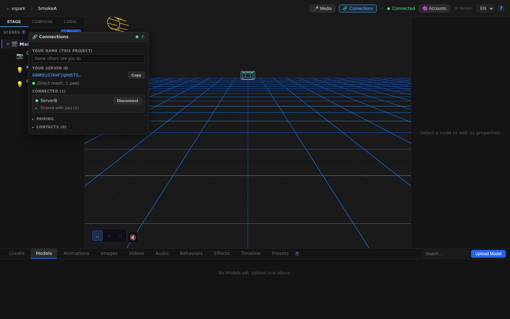
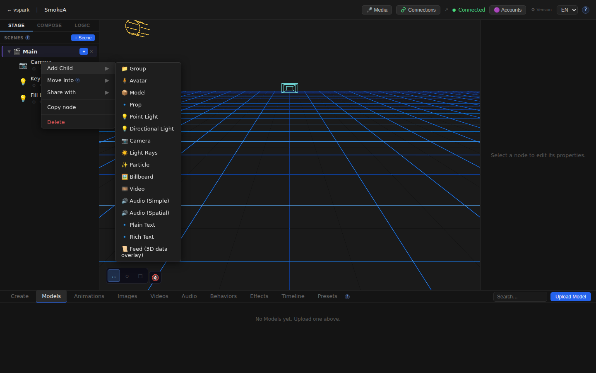
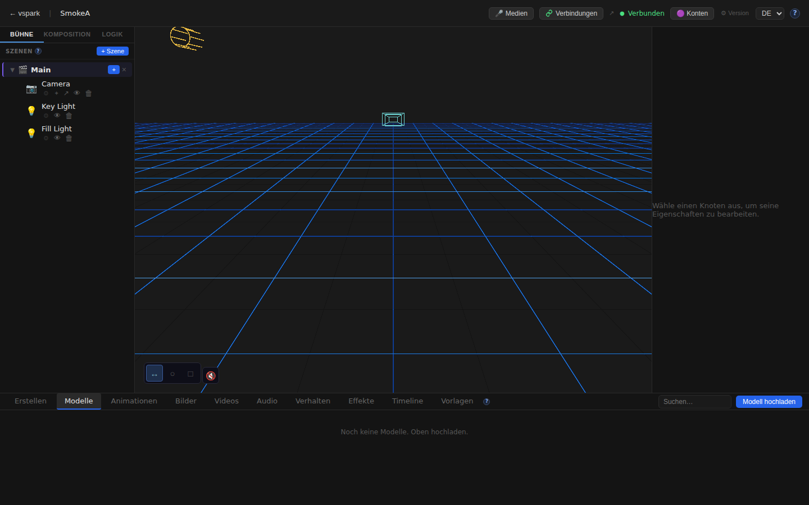
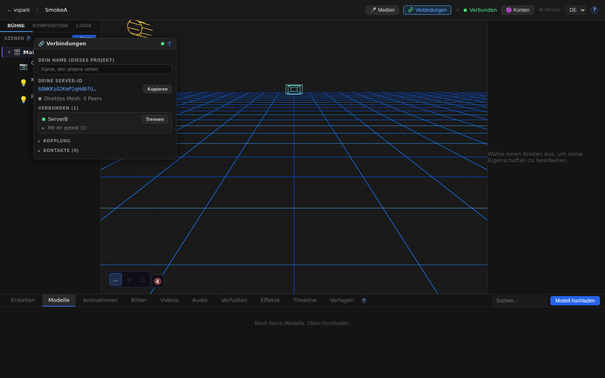
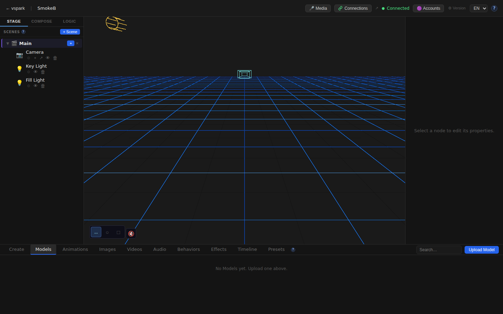

# Smoketest report — feature/multiplayer-phase6

- **Date (UTC):** 2026-06-10T22:44:59Z
- **Commit:** 67d2e01
- **Base:** origin/dev
- **PR:** #38 — Multiplayer Phase 5: peer-to-peer connections, object sharing, and mesh
- **Overall:** ✅ PASS

## Scope

Massive Phase 5/6 multiplayer PR: 95 files changed, 10 142 insertions, 139 deletions.
Both backend and frontend paths changed, so **both API tests and browser (Playwright) tests** ran.
The two-peer mesh harness (rendezvous + 2 backends + 2 frontends) was used per `project.md`.

Key changed areas:
- `packages/backend/src/multiplayer/**` — identity, rendezvous client, WebRTC mesh, sharing, grants
- `packages/backend/src/db/migrations/027–030_*` — DB schema (identity, display names, shares, grants)
- `packages/backend/src/routes/connections.ts` — REST API for identity/pairing/sharing
- `packages/frontend/src/components/ConnectionsWindow.tsx` — full connections UI panel
- `packages/frontend/src/mesh/clientMesh.ts` — browser WebRTC mesh
- `packages/frontend/src/sync/sharedProjection.ts` — shared object projection
- `packages/frontend/src/i18n/locales/{en,de}/connections.json` — i18n strings
- `packages/rendezvous/` — new standalone signaling service

```
95 files changed, 10142 insertions(+), 139 deletions(-)
```

## Test infrastructure

Two-peer mesh on one box:
| Service | Port | Notes |
|---------|------|-------|
| Rendezvous | 8787 | `pnpm --filter @vspark/rendezvous dev` |
| Backend A | 3001 | DB `/tmp/smoketest/a.db`, `MULTIPLAYER_DISPLAY_NAME=ServerA` |
| Backend B | 3002 | DB `/tmp/smoketest/b.db`, `MULTIPLAYER_DISPLAY_NAME=ServerB` |
| Frontend A | 5173 | Default Vite config → Backend A |
| Frontend B | 5174 | Scratch Vite config with `@vspark/shared/*` aliases → Backend B |

## Test plan

1. Type-check (pnpm lint + frontend typecheck)
2. Backend boots cleanly / migrations 027–030 apply
3. Both backends register on rendezvous (`/connections/status` → `enabled:true, status:ready`)
4. Pairing flow: create code (A) → join (B) → connect (A→B) → accept (B) → both `connected:true`
5. Object sharing: share a scene node from B to A, verify grantees list
6. Subscribe: A subscribes to B's shared object
7. Browser A: Home renders, editor canvas mounts
8. Browser A: TopBar Connections button visible
9. Browser A: ConnectionsWindow opens, peer ServerB visible
10. Browser A: SceneGraph Share context-menu option (right-click Camera node)
11. Browser A: i18n EN — "Connections" label
12. Browser A: i18n DE — "Verbindungen" label + window content in German
13. Browser B: Home renders, editor canvas mounts (with correct Vite aliases)
14. Browser B: Peer ServerA visible in ConnectionsWindow
15. Multiplayer docs page (`/docs/multiplayer`) renders

## Results

### Type-check / correctness gate

| # | Check | Type | Result | Notes |
|---|-------|------|--------|-------|
| 1 | `pnpm lint` (backend + shared + rendezvous) | Build | ✅ | All 3 packages pass |
| 2 | `pnpm --filter frontend typecheck` | Build | ✅ | No TS errors |

### API / mesh tests

| # | Check | Type | Result | Notes |
|---|-------|------|--------|-------|
| 3 | Backend A: `GET /api/connections/status` | API | ✅ | `enabled:true, status:ready` |
| 4 | Backend B: `GET /api/connections/status` | API | ✅ | `enabled:true, status:ready` |
| 5 | Create pairing code (A) | API | ✅ | Code `LZXMX7E8` returned |
| 6 | B joins pairing code | API | ✅ | Returns A's peer metadata |
| 7 | A connects to B | API | ✅ | `{"ok":true}` |
| 8 | B accepts A | API | ✅ | `{"ok":true}` |
| 9 | Both peers show `connected:true, sessionGranted:true` | API | ✅ | Verified on both `/connections/peers` |
| 10 | Share scene node from B→A (`canWrite:true`) | API | ✅ | Grantees list contains A's peerId |
| 11 | GET `/connections/objects/:id/grantees` | API | ✅ | Returns A's peerId |
| 12 | A subscribes to B's shared object | API | ✅ | `{"ok":true,"data":{...}}` |

### Browser / Playwright tests

| # | Check | Type | Result | Notes |
|---|-------|------|--------|-------|
| 13 | Home route renders (A) | UI | ✅ | |
| 14 | Editor canvas mounts (A) | UI | ✅ | 3D canvas visible |
| 15 | TopBar Connections button visible (A) | UI | ✅ | |
| 16 | ConnectionsWindow opens (A) | UI | ✅ | "Your server ID" section visible |
| 17 | Connected peer (ServerB) visible in ConnectionsWindow (A) | UI | ✅ | "ServerB" text in window |
| 18 | Share context-menu in SceneGraph | UI | ✅ | "Share with ▶" visible on right-click |
| 19 | i18n EN — Connections button label | UI | ✅ | Renders "Connections" |
| 20 | i18n DE — Connections button label | UI | ✅ | Renders "Verbindungen" |
| 21 | i18n DE — ConnectionsWindow content | UI | ✅ | "Deine Server-ID" visible |
| 22 | Home route renders (B → backend B) | UI | ✅ | |
| 23 | Editor canvas mounts (B) | UI | ✅ | Vite alias fix required for scratch config |
| 24 | Connected peer (ServerA) visible in ConnectionsWindow (B) | UI | ✅ | "ServerA" text in window |
| 25 | Multiplayer docs page `/docs/multiplayer` | UI | ✅ | Heading visible |
| 26 | No non-benign console errors | UI | ✅ | EnvironmentCube HDRI failures filtered (known-benign offline env) |

**Total: 26/26 checks passed.**

### Failures & errors

None. All checks passed.

**Notes on investigation during test setup:**
- The scratch Vite config for frontend B initially omitted `@vspark/shared/*` path aliases, causing Vite to return 500 for source files. Fixed by copying all `resolve.alias` entries from the canonical `vite.config.ts`.
- `localStorage.setItem('i18nextLng', 'de')` does not switch language in this app — the correct key is `vspark.lang` (defined as `LANGUAGE_STORAGE_KEY` in `i18n/index.ts`).

## Screenshots

### Editor + TopBar (Frontend A)


### TopBar with Connections button


### ConnectionsWindow (EN) — showing ServerB as connected peer


### SceneGraph Share context-menu


### Editor in German (i18n DE)


### ConnectionsWindow in German


### Frontend B (→ Backend B) — Editor + ConnectionsWindow showing ServerA



### Multiplayer docs page


## Notes

- **Migrations 027–030 applied cleanly on boot.** Both backends started without error with fresh DBs.
- **Rendezvous service started cleanly** on port 8787.
- **WebRTC connection** between the two backends was established via the REST pairing + connect/accept flow; both `/connections/peers` endpoints confirmed `connected:true, sessionGranted:true`.
- **Object sharing API** correctly grants and lists permissions; subscribe endpoint returned success.
- **Frontend B** requires the `@vspark/shared/*` Vite path aliases when run with a non-default config — this is an infrastructure note for deployment, not a code bug.
- **EnvironmentCube HDRI** fetch errors are filtered as known-benign; `SafeEnvironment`'s ErrorBoundary catches them gracefully.
