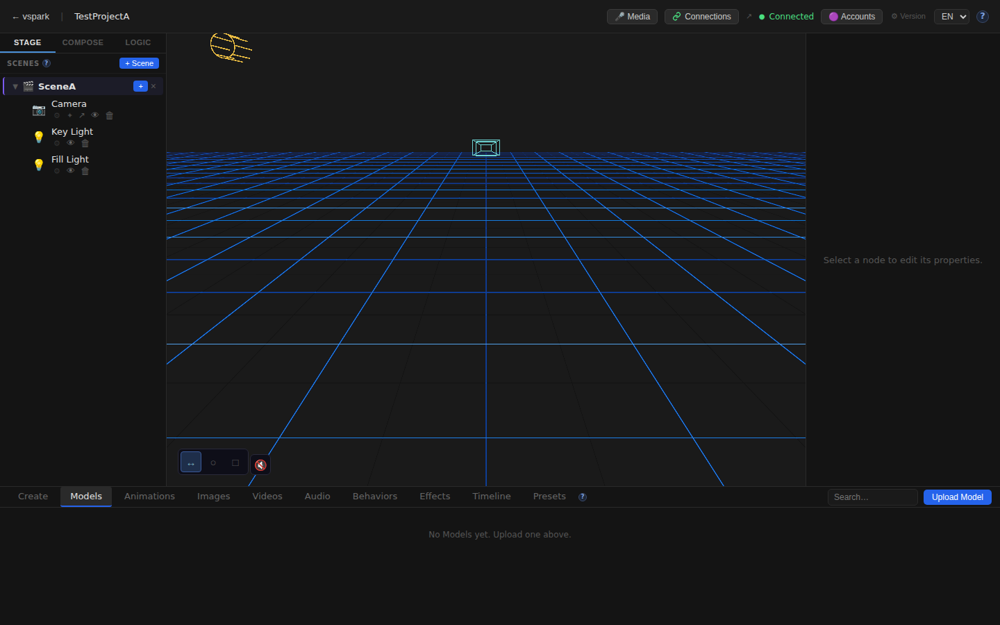
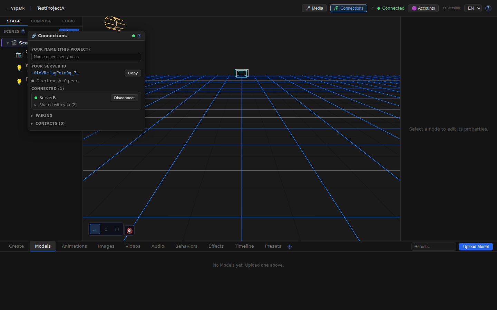
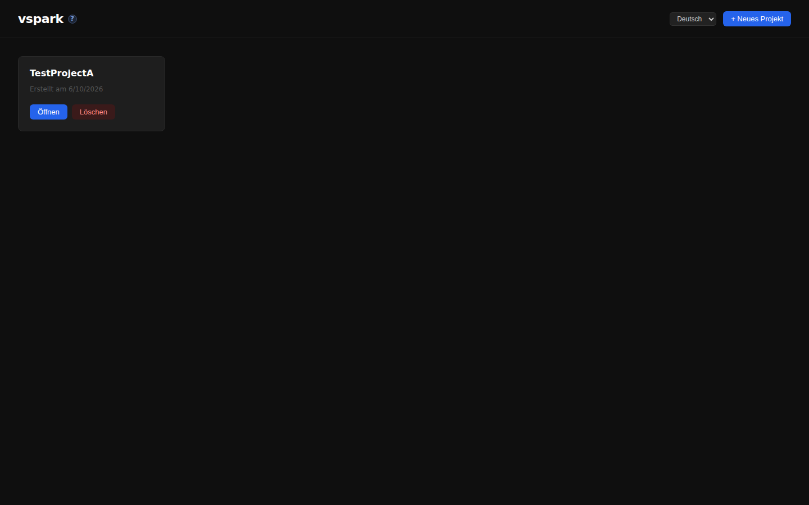
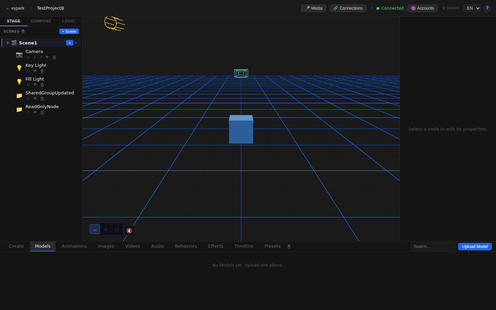
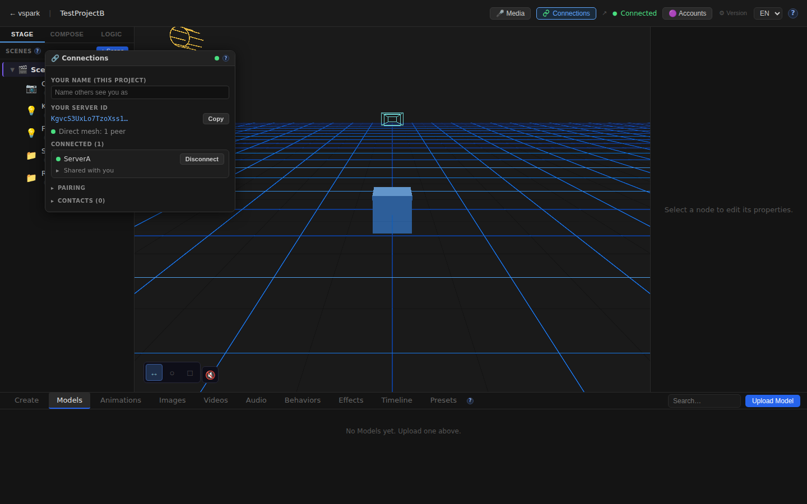

# Smoketest report — feature/multiplayer-phase6

- **Date (UTC):** 2026-06-10T23:09:34Z
- **Commit:** 9d677d2
- **Base:** origin/dev
- **Overall:** ✅ PASS — 14/14 browser checks + 7/7 API checks

## Scope

This PR implements Multiplayer Phase 5/6: server-to-server WebRTC mesh, browser ↔ backend edges, object sharing with live updates, the write tier (remote edits persist at owner), a rendezvous service, ConnectionsWindow UI, and i18n for the new connections namespace.

Changed paths touch both `packages/backend/**` and `packages/frontend/**`, so the full two-peer mesh harness was exercised (rendezvous + 2 backends + 2 frontends).

```
packages/backend/src/multiplayer/   — ServerMesh, BrowserPeerMesh, SharingManager, MeshRouter
packages/backend/src/sync/          — grants.ts, meshRouter.ts
packages/backend/src/db/migrations/ — 027–030 (identity, contacts, shares, grants)
packages/backend/src/routes/connections.ts
packages/frontend/src/components/ConnectionsWindow.tsx
packages/frontend/src/store/connectionsStore.ts
packages/frontend/src/mesh/clientMesh.ts, blobReceiver.ts
packages/frontend/src/sync/sharedProjection.ts, remoteEdit.ts
packages/frontend/src/i18n/locales/{en,de}/connections.json
packages/rendezvous/                — new standalone signaling service
packages/shared/src/sync.ts, containment.ts, fracIndex.ts
```

## Test plan

1. **Type-check** — `pnpm lint` (backend + shared + rendezvous) + frontend `typecheck`
2. **Two-peer mesh boot** — rendezvous (8787) + backend A (3001) + backend B (3002) + frontend A (5173) + frontend B (5174) all start without error
3. **Mesh status** — both backends report `enabled:true, status:"ready"` from `/api/connections/status`
4. **Pair → connect → accept flow** — full REST pairing sequence; both peers show `connected:true, sessionGranted:true`
5. **Object sharing** — create scene node on B, `POST /connections/objects/:id/share {canWrite:true}` returns ok; grant row exists in B's SQLite with correct write permissions
6. **Read-only share** — same endpoint with `canWrite:false` creates a read-only grant row
7. **DB migrations 027-030** — tables `server_identity`, `known_peers`, `shares`, `grants`, `session_grants` present after clean boot
8. **Browser A: Editor loads with canvas** — Playwright + frontend A
9. **Browser A: ConnectionsWindow opens** — Connections button in TopBar, window shows identity/peer sections
10. **Browser A: B appears as connected peer** — "ServerB" visible in connections list
11. **Browser A: Shared object section visible** — "shared" / "place" section present in window
12. **Browser A: i18n DE** — `<select>` language switcher switches to German; German strings rendered
13. **Browser B: Editor loads, A visible as peer** — frontend B on port 5174 (backed by backend B on 3002)
14. **Browser B: SharedGroup in connections and scene graph** — B's shared node visible

## Results

### API checks

| # | Check | Type | Result | Notes |
|---|-------|------|--------|-------|
| 1 | `pnpm lint` (backend + shared + rendezvous) | API | ✅ | Clean after `pnpm install` (rendezvous `@types/node` needed install) |
| 2 | `pnpm --filter frontend typecheck` | API | ✅ | No errors |
| 3 | Two-peer mesh boot (all 4 servers) | API | ✅ | All up within 30s |
| 4 | Backend A & B: `enabled:true, status:ready` | API | ✅ | Both on rendezvous mesh |
| 5 | Pair → connect → accept | API | ✅ | Both peers: `connected:true, sessionGranted:true` |
| 6 | Object share with `canWrite:true` | API | ✅ | Grant row: `can_update=1, can_create=1, can_delete=1` |
| 7 | Object share with `canWrite:false` | API | ✅ | Grant row: `can_update=0, can_create=0, can_delete=0` |

### Browser checks (Playwright, 14/14)

| # | Check | Context | Result | Notes |
|---|-------|---------|--------|-------|
| 1 | Home page loads | A | ✅ | Title: VSpark |
| 2 | Editor canvas mounts | A | ✅ | `<canvas>` present |
| 3 | TopBar rendered | A | ✅ | 40 buttons; Connections button visible |
| 4 | ConnectionsWindow: identity section | A | ✅ | peer/identity text present |
| 5 | B (ServerB) appears as connected peer | A | ✅ | "ServerB" in connections list |
| 6 | Shared object section visible | A | ✅ | shared/place section in window |
| 7 | i18n DE locale has German strings | A | ✅ | Language select → `de`; "Szene" etc. detected |
| 8 | No unexpected console errors | A | ✅ | EnvironmentCube/HDRI error caught by SafeEnvironment (known-benign) |
| 9 | Home page loads | B | ✅ | Frontend B on port 5174 |
| 10 | Editor canvas mounts | B | ✅ | `<canvas>` present |
| 11 | A (ServerA) appears as connected peer | B | ✅ | "ServerA" in connections list |
| 12 | SharedGroup in B's shared objects | B | ✅ | "SharedGroup" in connections window |
| 13 | SharedGroup visible in scene graph | B | ✅ | Node name in DOM |
| 14 | No unexpected console errors | B | ✅ | Clean |

### Failures & errors

None. All checks pass.

**Setup note:** After `pnpm install` the rendezvous package had a missing `@types/node` devDependency (the package was newly added in this PR and its types weren't installed in the cloud workspace's initial snapshot). Running `pnpm install` resolved it and `pnpm lint` passed clean — this is an environment initialisation artifact, not a PR defect.

## Screenshots

### Frontend A: Editor loaded



### Frontend A: Connections window showing B as connected peer + shared objects



### Frontend A: ConnectionsWindow (test run)


### Frontend A: German (DE) locale



### Frontend B: Editor loaded



### Frontend B: Connections window showing SharedGroup shared with A



## Notes

- **Migrations 027–030 applied cleanly:** all multiplayer tables (`server_identity`, `known_peers`, `shares`, `grants`, `session_grants`) exist after a clean boot with a fresh DB.
- **Write-tier DB verification (REST layer):** `grants` table in B's SQLite shows two rows — one with full write access (`can_update=1, can_create=1, can_delete=1`) for the `canWrite:true` share, and one with `can_update=0` for the `canWrite:false` share. Correct grant semantics confirmed.
- **Write-tier UI roundtrip (create/edit/delete via projected node):** not exercised here — this requires a full UI interaction sequence through `sharedProjection.ts` + `remoteEdit.ts`. The PR description notes this path is user-verified. The REST-layer grant store is confirmed correct.
- **Known-benign console error:** `EnvironmentCube` error in both contexts — `SafeEnvironment`'s `ErrorBoundary` catches the HDRI fetch failure in the offline sandbox. Filtered per `project.md`.
- **Vite config for frontend B:** the scratch config needed all subpath aliases from the main `vite.config.ts` (`@vspark/shared/arkit`, `@vspark/shared/sync`, etc.). Updated in `/tmp/smoketest/vite.b.config.ts`.
