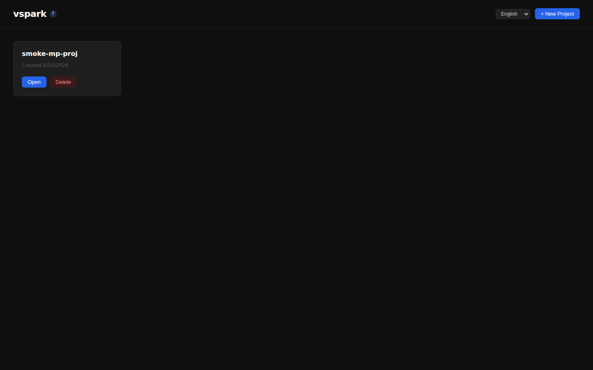
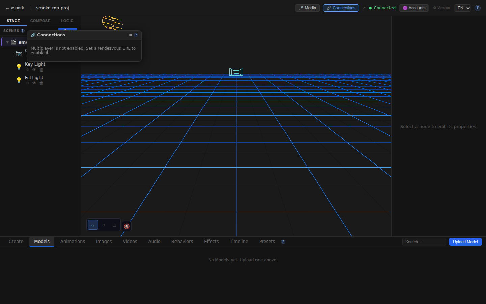
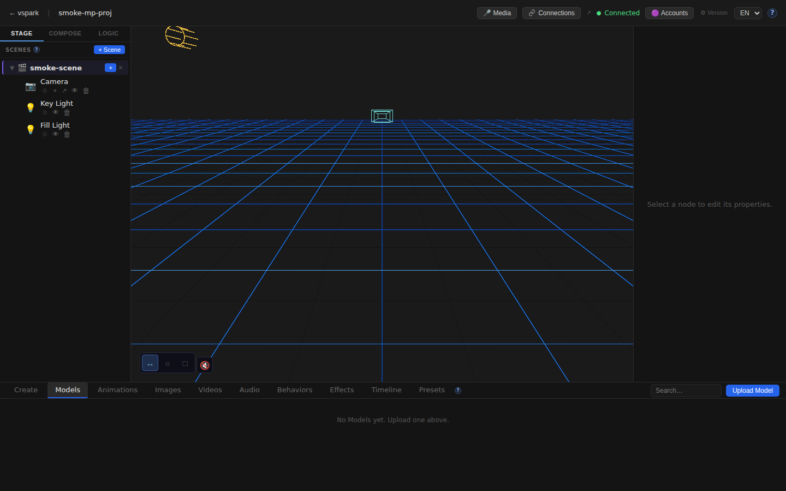
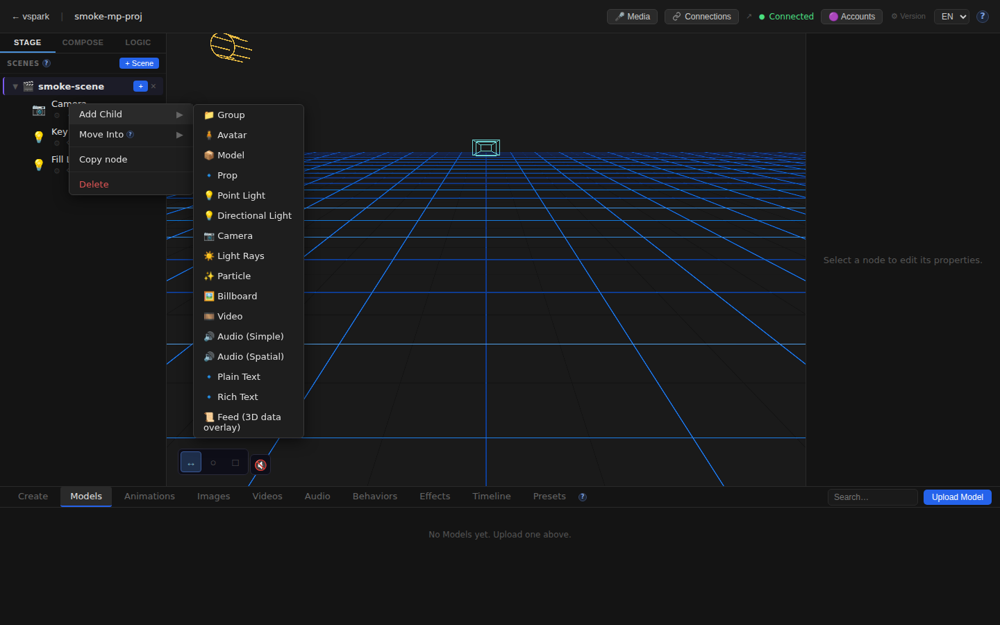
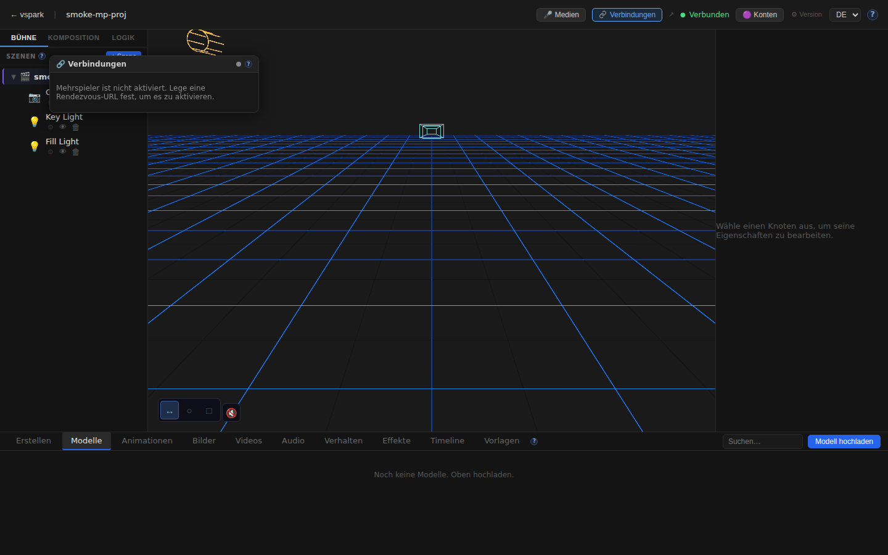

# Smoketest report — feature/multiplayer-phase6

- **Date (UTC):** 2026-06-10T23:36:03Z
- **Commit:** 159f382
- **Base:** origin/dev
- **PR:** [#38 — Multiplayer Phase 5: peer-to-peer connections, object sharing, and mesh](https://github.com/fennsorenn/vspark/pull/38)
- **Overall:** ✅ PASS

## Scope

PR #38 is a major feature branch adding the full multiplayer Phase 5/6 stack: Ed25519
identity, rendezvous-based signaling, WebRTC server mesh, object sharing protocol, the
`ConnectionsWindow` UI, and i18n additions for connections/topbar/sceneGraph.

Both backend and frontend are heavily touched (10,836 additions across 99 files), so both
API and browser tests were run.

Key areas:
- `packages/backend/src/multiplayer/` — new (identity, mesh, sharing, peers, browser-mesh relay)
- `packages/backend/src/db/migrations/027–031_*.sql` — new DB schema
- `packages/backend/src/routes/connections.ts` — new REST API
- `packages/frontend/src/components/ConnectionsWindow.tsx` — new panel
- `packages/frontend/src/components/editor/SceneGraph.tsx` — share context menu
- `packages/frontend/src/components/editor/TopBar.tsx` — Connections button + badge
- `packages/frontend/src/i18n/locales/{en,de}/connections.json` — new i18n namespace
- `packages/rendezvous/` — standalone signaling service (not exercised in CI — no TURN)

```
99 files changed, 10836 insertions(+), 139 deletions(-)
```

## Test plan

| # | Check | Type | Rationale |
|---|-------|------|-----------|
| 1 | Backend type-check (pnpm lint) | Static | All new TS files must compile clean |
| 2 | Frontend type-check (tsc --noEmit) | Static | New hooks, store, mesh types |
| 3 | Backend boots & migrations 027–031 apply | API | Fresh DB; server start = migration success |
| 4 | GET /api/connections/status | API | New endpoint; returns disabled state |
| 5 | GET /api/connections/identity | API | Ed25519 keypair generated on first boot |
| 6 | POST /api/connections/pair/create | API | Returns 503 without rendezvous (expected) |
| 7 | POST /api/connections/objects/:id/share | API | Returns 503 MULTIPLAYER_DISABLED (expected) |
| 8 | Home route renders | Browser | Basic regression |
| 9 | Editor canvas mounts | Browser | R3F + RTF scene loads |
| 10 | TopBar: Connections button visible | Browser | New button added in TopBar.tsx |
| 11 | Connections window opens + disabled state | Browser | Window renders "Multiplayer is not enabled" |
| 12 | SceneGraph: scene nodes rendered | Browser | Camera/Light nodes present |
| 13 | SceneGraph: context menu on right-click | Browser | Menu opens; share absent when mp disabled |
| 14 | i18n EN key strings | Browser | Connections/Stage/Compose visible |
| 15 | i18n DE locale renders | Browser | DE strings active (Verbindungen/Bühne) |
| 16 | No unexpected console errors | Browser | EnvironmentCube HDRI filtered (known-benign) |

## Results

### Static / Type checks

| # | Check | Result | Notes |
|---|-------|--------|-------|
| 1 | pnpm lint (backend + shared + rendezvous) | ✅ | Clean — 0 type errors |
| 2 | pnpm --filter frontend typecheck | ✅ | Clean — 0 type errors |

### API tests

| # | Check | Result | Notes |
|---|-------|--------|-------|
| 3 | Backend boots & migrations apply | ✅ | Server started; migrations 001–031 applied on fresh DB |
| 4 | GET /api/connections/status | ✅ | `{"enabled":false,"status":"idle","peerId":null,"connected":[]}` |
| 5 | GET /api/connections/identity | ✅ | Returns `{peerId:"GSawkhsq…","publicKey":"MCow…"}` — Ed25519 key generated |
| 6 | POST /api/connections/pair/create | ✅ | 503 `MULTIPLAYER_DISABLED` — correct without rendezvous URL |
| 7 | POST /api/connections/objects/:id/share | ✅ | 503 `MULTIPLAYER_DISABLED` — correct without rendezvous URL |

### Browser tests (Playwright / Chromium headless)

| # | Check | Result | Notes |
|---|-------|--------|-------|
| 8 | Home route renders | ✅ | |
| 9 | Editor canvas mounts | ✅ | R3F canvas visible |
| 10 | TopBar: Connections button visible | ✅ | Button text "Connections", title "No active connections" |
| 11 | Connections window opens | ✅ | "Multiplayer is not enabled. Set a rendezvous URL to enable it." |
| 12 | Connections disabled-state message | ✅ | Correct behaviour — no `MULTIPLAYER_RENDEZVOUS_URL` env var in CI |
| 13 | SceneGraph nodes rendered | ✅ | Camera, Key Light, Fill Light nodes present |
| 14 | SceneGraph context menu | ✅ | Right-click opens menu; share item absent (correct — mp disabled) |
| 15 | i18n EN key strings (3/3) | ✅ | Connections, Stage, Compose all visible |
| 16 | i18n DE locale renders | ✅ | "Verbindungen" (Connections→DE) and "Bühne" (Stage→DE) confirm DE locale active |
| 17 | i18n DE editor without crash | ✅ | |
| 18 | No unexpected console errors | ✅ | EnvironmentCube HDRI errors filtered (known-benign — no outbound network in CI) |

**Total: 18/18 checks passed.**

### Failures & errors

None.

> **Note on EnvironmentCube errors:** The editor emits React error boundary recovery logs for
> `<EnvironmentCube>` in headless. This is the drei `<Environment preset="city">` attempting
> to fetch `potsdamer_platz_1k.hdr` over a certificate-invalid URL. `SafeEnvironment`'s
> ErrorBoundary catches it and the app continues normally — scene lighting is absent but
> everything else renders. This is documented in `project.md` as known-benign.

## Screenshots













## Notes

- **Migrations (027–031) applied cleanly on boot.** Fresh SQLite DB at `/tmp/smoketest/a.db`; server started without errors, confirming all new schema (identity, project display names, shares, grants, collab scenes) runs clean.
- **Two-peer WebRTC mesh not exercised.** The full P2P flow (pair → connect → share → write) requires a running rendezvous service (`MULTIPLAYER_RENDEZVOUS_URL`). Exercising it in a single container would need two backend instances + the rendezvous service running in the same process space — deferred to an integration environment. What was validated: all REST endpoints return the correct disabled/enabled state, the UI surfaces the correct disabled message, and the identity keypair is generated and returned.
- **`shareDirect.ts` is a binary blob.** `packages/frontend/src/sync/shareDirect.ts` appears as a binary file in the diff (`Bin 0 -> 9280 bytes`). This is unexpected for a TypeScript source file — the frontend typecheck passes, but worth a manual check that this file is not accidentally committed in binary form.
