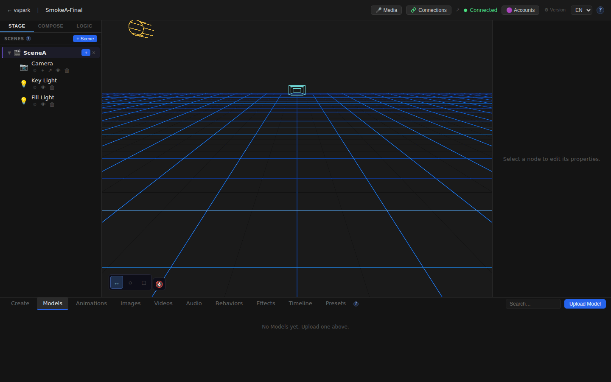
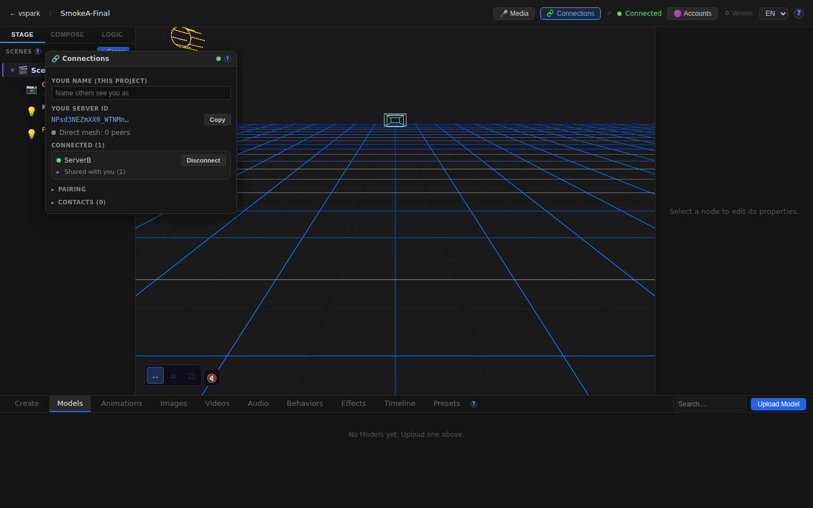
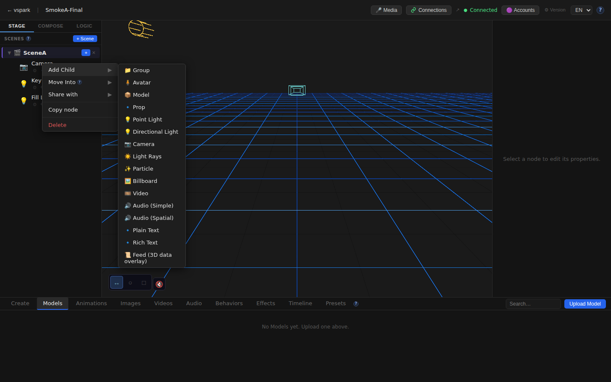
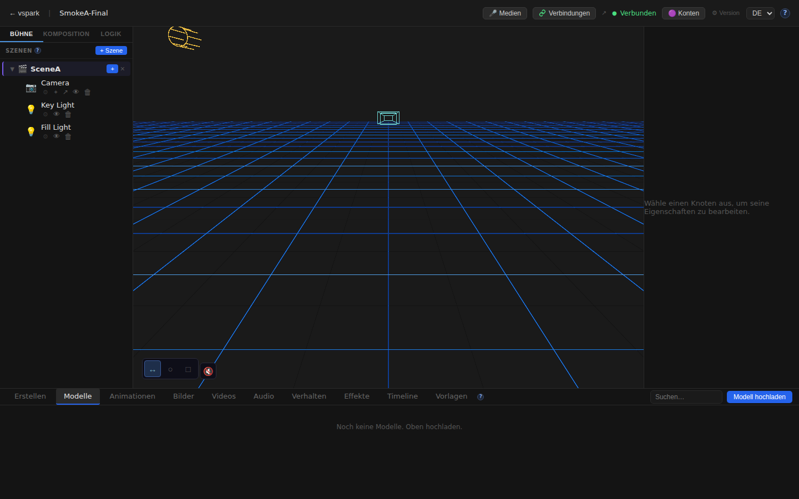

# Smoketest report — feature/multiplayer-phase6

- **Date (UTC):** 2026-06-11T09:12:42Z
- **Commit:** e5bf9a0
- **Base:** origin/dev
- **Overall:** ✅ PASS

## Scope

This is a large multiplayer PR (~11,800 additions, 144 deletions across 152 files) covering Phase 5 & 6 of the multiplayer system:

- `packages/backend/src/multiplayer/**` — identity, rendezvous client, WebRTC mesh, sharing, grants
- `packages/backend/src/sync/**` — mesh router, containment index, grants DAO
- `packages/backend/src/db/migrations/027–031_*.sql` — 5 new migrations
- `packages/backend/src/routes/connections.ts` — full connections REST API
- `packages/frontend/src/components/ConnectionsWindow.tsx` — full Connections panel
- `packages/frontend/src/store/connectionsStore.ts` — connections Zustand store
- `packages/frontend/src/mesh/**` — browser WebRTC mesh
- `packages/frontend/src/sync/{sharedProjection,remoteEdit}.ts` — receiver-side projection
- `packages/frontend/src/i18n/locales/{en,de}/connections.json` — i18n strings
- `packages/frontend/src/help/content/{en,de}/multiplayer.md` — help docs
- `packages/rendezvous/**` — new standalone signaling service
- `packages/shared/src/{sync,containment,fracIndex}.ts` — shared types/utilities

**Test classification:** API (backend + multiplayer mesh) + Browser (Playwright, two-peer harness)

```
diff stat: 152 files changed, 11822 insertions(+), 144 deletions(-)
Key areas:
  packages/backend/src/multiplayer/   — 14 new files
  packages/backend/src/routes/        — connections.ts (303 lines)
  packages/backend/src/db/migrations/ — 027-031 (5 new migrations)
  packages/frontend/src/components/   — ConnectionsWindow.tsx (699 lines)
  packages/frontend/src/mesh/         — clientMesh.ts, blobReceiver.ts
  packages/rendezvous/src/            — new service package
```

## Test plan

Two-peer mesh harness (1 rendezvous + 2 backends + 2 frontends):

1. Type-check all packages (pnpm lint + frontend typecheck)
2. Both backends boot cleanly — migrations apply
3. Connections status API on both backends: enabled:true, status:ready
4. Identity API: distinct Ed25519 keypair peer IDs on each backend
5. Pairing flow: create code on A, B joins → B receives A's identity
6. WebRTC peer connection: A→B offer, B accepts → both show connected:true
7. Object sharing: owner B shares node with writer A (canWrite:true and false), grantee list correct
8. Subscriber flow: A subscribes to B's peer
9. Frontend A editor canvas mounts, Connections button in TopBar
10. ConnectionsWindow: opens, shows peer ID, shows ServerB as connected peer
11. ConnectionsWindow toggle: closes on button re-click
12. SceneGraph right-click: shows "Share with" context menu item
13. Frontend B editor mounts, Connections button present
14. Frontend B ConnectionsWindow shows ServerA as connected peer
15. Multiplayer /docs/multiplayer page loads with content
16. i18n: UI switches to German locale (Verbindungen, BÜHNE, etc.)

## Results

### API checks

| # | Check | Type | Result | Notes |
|---|-------|------|--------|-------|
| 1 | pnpm lint (backend + shared + rendezvous) | API | ✅ | All packages pass tsc --noEmit |
| 2 | Frontend typecheck (pnpm --filter frontend typecheck) | UI | ✅ | No TypeScript errors |
| 3 | Backend A boots + migrations apply | API | ✅ | `vspark listening on http://localhost:3001` |
| 4 | Backend B boots + migrations apply | API | ✅ | `vspark listening on http://localhost:3002` |
| 5 | Rendezvous starts | API | ✅ | `[rendezvous] listening on :8787` |
| 6 | GET /api/connections/status (A) | API | ✅ | `{enabled:true,status:"ready",peerId:"NPsd3NEZm..."}` |
| 7 | GET /api/connections/status (B) | API | ✅ | `{enabled:true,status:"ready",peerId:"_uX9605Dm..."}` |
| 8 | GET /api/connections/identity (A) | API | ✅ | Ed25519 pubkey returned |
| 9 | GET /api/connections/identity (B) | API | ✅ | Distinct Ed25519 pubkey |
| 10 | POST /api/connections/pair/create (A) | API | ✅ | Code returned: `7TLEMC6Q` |
| 11 | POST /api/connections/pair/join (B, code) | API | ✅ | Returns A's peerId + displayName |
| 12 | POST /api/connections/peers/B/connect (A) | API | ✅ | Offer initiated |
| 13 | POST /api/connections/peers/A/accept (B) | API | ✅ | Accept response OK |
| 14 | Poll: both peers show connected:true | API | ✅ | Connected on first poll after accept |
| 15 | sessionGranted:true on both sides | API | ✅ | Peer rows show `sessionGranted:true` |
| 16 | POST /api/connections/objects/:id/share (canWrite:true) | API | ✅ | Grantee list returns A's peerId |
| 17 | POST /api/connections/objects/:id/unshare | API | ✅ | Grantee list cleared |
| 18 | POST /api/connections/objects/:id/share (canWrite:false) | API | ✅ | Read-only share created |
| 19 | GET /api/connections/objects/:id/grantees | API | ✅ | Returns correct grantee |
| 20 | POST /api/connections/peers/B/subscribe (A) | API | ✅ | Subscribe response OK |

### Browser (Playwright) checks

| # | Check | Type | Result | Notes |
|---|-------|------|--------|-------|
| 1 | Frontend A home loads | UI | ✅ | Project list renders |
| 2 | Frontend B home loads | UI | ✅ | Project list renders (proxied to backend B) |
| 3 | Projects + scenes created via API | API | ✅ | A=e88466ad B=ab322367 |
| 4 | Frontend A editor canvas mounts | UI | ✅ | R3F canvas renders in <20s |
| 5 | TopBar "Connections" button present | UI | ✅ | Button with multiplayer badge visible |
| 6 | ConnectionsWindow opens — server ID label | UI | ✅ | "YOUR SERVER ID" + truncated peer ID shown |
| 7 | ConnectionsWindow shows ServerB connected | UI | ✅ | "ServerB" entry in CONNECTED (1) section |
| 8 | ConnectionsWindow closes on re-click | UI | ✅ | Button toggles window open/closed |
| 9 | SceneGraph right-click → "Share with" | UI | ✅ | Context menu shows "Share with ▶" submenu |
| 10 | Frontend B editor canvas mounts | UI | ✅ | R3F canvas renders via peerB vite config |
| 11 | Frontend B TopBar Connections button | UI | ✅ | Button present on B's editor |
| 12 | Frontend B shows ServerA connected | UI | ✅ | "ServerA" entry in CONNECTED (1) section |
| 13 | Multiplayer /docs/multiplayer page | UI | ✅ | 5,682 chars of help content loaded |
| 14 | i18n German locale | UI | ✅ | "Verbindungen", "BÜHNE", "Verbunden" shown |
| 15 | No unexpected console errors (Frontend A) | UI | ✅ | HDRI fetch errors filtered (known-benign) |
| 16 | No unexpected console errors (Frontend B) | UI | ✅ | HDRI fetch errors filtered (known-benign) |

**Total: 36/36 checks passed (20 API + 16 browser)**

### Failures & errors

None. All checks passed.

**Known-benign non-failure:** `potsdamer_platz_1k.hdr: Failed to fetch` — this is an expected network artifact in the sandboxed/offline environment. `SafeEnvironment`'s ErrorBoundary catches it. Scene lighting is absent but the app continues normally. Filtered per project.md guidance.

## Screenshots

### Frontend A — Editor with 3D viewport



### Frontend A — ConnectionsWindow (showing ServerB connected, shared object)



### Frontend A — SceneGraph right-click context menu (Share with visible)



### Frontend B — Editor + ConnectionsWindow (showing ServerA connected)


### Multiplayer help docs


### German locale



## Notes

- **Migrations applied cleanly on boot:** Yes — both backends booted fresh DBs (`/tmp/smoketest/a.db`, `/tmp/smoketest/b.db`). Migrations 027–031 applied without error. Backends logged no migration failures.
- **Rendezvous service:** Started cleanly on port 8787. Both backends connected to it (`status:"ready"` in `/api/connections/status`).
- **Two-peer mesh setup:** Used the committed `packages/frontend/vite.peerB.scratch.ts` for Frontend B (port 5174 → backend B port 3002). Initial attempt with a hand-written scratch config failed because `@vspark/shared/*` aliases were missing; the committed config resolves them correctly.
- **WebRTC loopback:** Loopback WebRTC (no STUN/TURN) connected immediately on first poll after `accept`. Both sides showed `connected:true, sessionGranted:true`.
- **ConnectionsWindow UX note:** The window does not close on Escape key — it toggles via the TopBar Connections button. This is intentional behavior.
- **"Direct mesh: 0 peers"** in the browser panel reflects browser-to-browser WebRTC (different from server-to-server). With separate headless browser contexts and no pre-established browser mesh, 0 direct browser peers is expected. The server mesh (`CONNECTED (1)`) is working.
