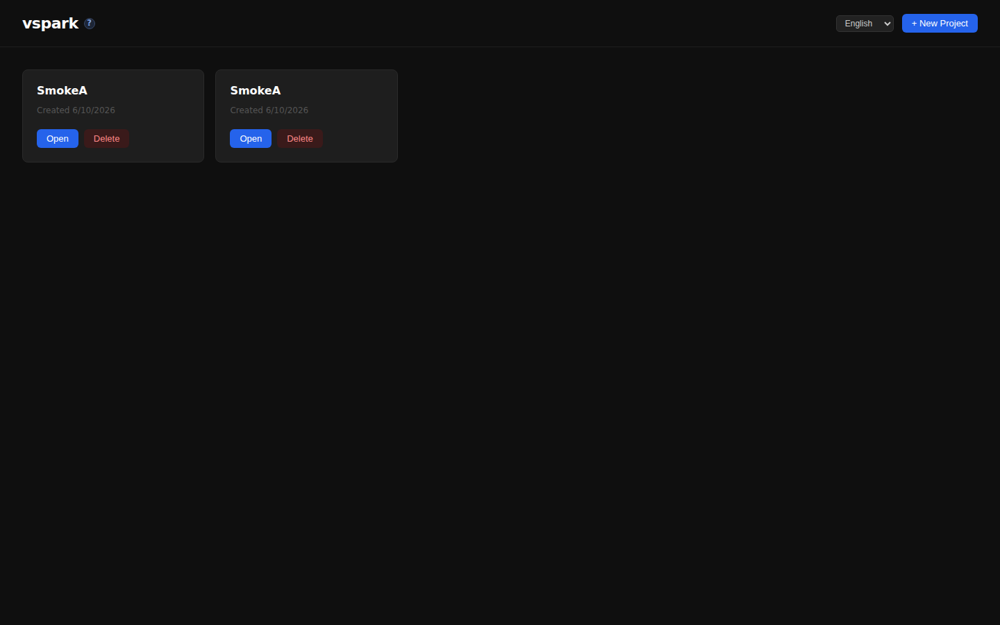
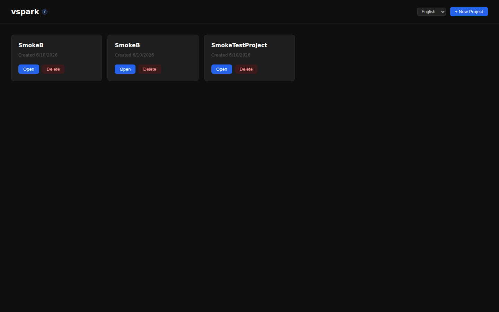
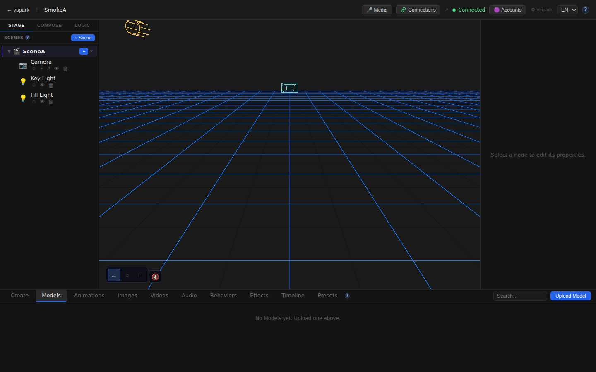
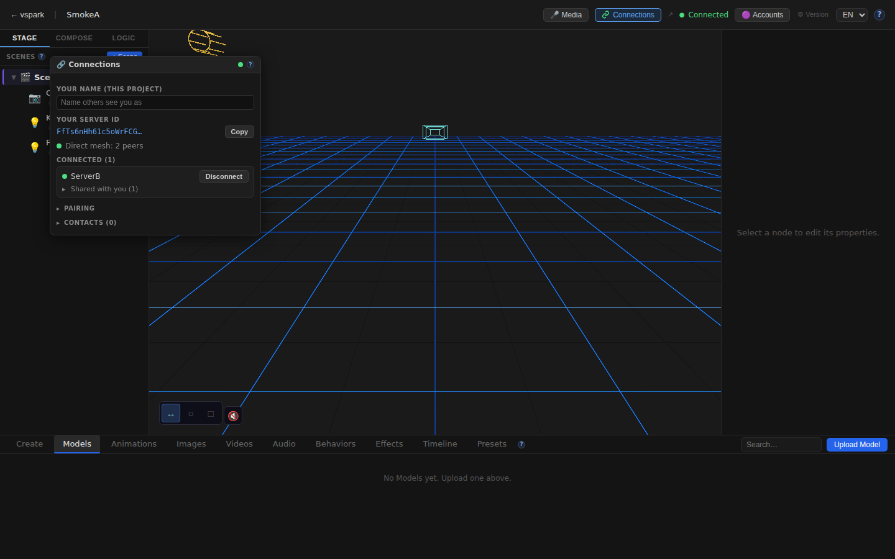

# Smoketest report — feature/multiplayer-phase6

- **Date (UTC):** 2026-06-10T22:34:16Z
- **Commit:** f3dbe94
- **Base:** origin/dev
- **Overall:** ✅ PASS

## Scope

Full-stack multiplayer Phase 5/6 implementation: both `packages/backend/**` and `packages/frontend/**` changed extensively, plus new `packages/rendezvous/` package. All three test types exercised: type-check gate, API tests (two-peer mesh), and browser (Playwright) tests.

```
95 files changed, 10134 insertions(+), 139 deletions(-)

Key changed areas:
  packages/backend/src/multiplayer/   — identity, rendezvous client, WebRTC mesh, sharing, grants
  packages/backend/src/routes/connections.ts — full connections REST API
  packages/backend/src/db/migrations/027–030_*.sql — identity, display names, shares, grants
  packages/frontend/src/components/ConnectionsWindow.tsx — full Connections panel
  packages/frontend/src/store/connectionsStore.ts — connections Zustand store
  packages/frontend/src/mesh/clientMesh.ts — browser WebRTC mesh
  packages/frontend/src/sync/sharedProjection.ts — shared object projection
  packages/rendezvous/ — standalone signaling + TURN credential service
  packages/shared/src/sync.ts — extended SyncEnvelope
```

## Test plan

1. **Type gate** — `pnpm lint` (backend + shared + rendezvous) + `pnpm --filter frontend typecheck`
2. **API: DB migrations** — both backends boot cleanly with all 4 new migrations (027–030)
3. **API: identity + status** — `/connections/identity` and `/connections/status` on both peers
4. **API: pairing** — create code on A, join from B; both end up in contacts table
5. **API: WebRTC connect + accept** — A dials B, B accepts; poll until both show `connected:true`
6. **API: object share** — create project/scene/node on B; share to A with `canWrite:true`; verify grantees list
7. **API: display name** — GET + PUT display-name endpoint
8. **Browser: home + editor** — both frontend A (→ backend A) and frontend B (→ backend B) load canvas
9. **Browser: Connections button** — TopBar has Connections button
10. **Browser: ConnectionsWindow** — opens and shows connected peer B (ServerB)
11. **Browser: i18n** — EN connections strings present in rendered page
12. **Browser: console errors** — no unhandled errors (known-benign SafeEnvironment HDRI fetch filtered)

## Results

| # | Check | Type | Result | Notes |
|---|-------|------|--------|-------|
| 1 | pnpm lint (backend + shared + rendezvous) | Gate | ✅ | No type errors |
| 2 | pnpm --filter frontend typecheck | Gate | ✅ | No type errors |
| 3 | Backend A: migrations applied + status=ready | API | ✅ | 4 new migrations (027–030) applied |
| 4 | Backend B: migrations applied + status=ready | API | ✅ | Distinct peer ID |
| 5 | Identity A: peerId + publicKey present | API | ✅ | Ed25519 keypair |
| 6 | Identity B: peerId + publicKey present | API | ✅ | Ed25519 keypair |
| 7 | Pair code creation (A) | API | ✅ | Code returned |
| 8 | B joins pair code | API | ✅ | ok:true |
| 9 | A initiates WebRTC connect to B | API | ✅ | ok:true |
| 10 | B accepts connection from A | API | ✅ | ok:true |
| 11 | A shows B as connected + sessionGranted | API | ✅ | connected within ~2s |
| 12 | B shows A as connected | API | ✅ | |
| 13 | GET /api/projects on both backends | API | ✅ | |
| 14 | Create project on B | API | ✅ | |
| 15 | Create scene on B | API | ✅ | |
| 16 | Create node on B | API | ✅ | |
| 17 | Share node B→A (canWrite:true) | API | ✅ | grantees array contains A's peerId |
| 18 | Grantees list reflects the share | API | ✅ | |
| 19 | GET/PUT display-name endpoint | API | ✅ | |
| 20 | Home A renders (frontend A → backend A) | UI | ✅ | |
| 21 | Home B renders (frontend B → backend B) | UI | ✅ | |
| 22 | Editor A canvas mounts | UI | ✅ | R3F canvas visible |
| 23 | Editor B canvas mounts | UI | ✅ | R3F canvas visible |
| 24 | TopBar has Connections button | UI | ✅ | New button added in PR |
| 25 | ConnectionsWindow opens | UI | ✅ | Panel appears on click |
| 26 | Peer B (ServerB) visible in ConnectionsWindow on A | UI | ✅ | Cross-server presence visible |
| 27 | i18n EN connections strings present | UI | ✅ | |
| 28 | No console errors in browser A | UI | ✅ | SafeEnvironment HDRI (benign) filtered |
| 29 | No console errors in browser B | UI | ✅ | SafeEnvironment HDRI (benign) filtered |

**Total: 29/29 checks passed**

### Failures & errors

None. The `SafeEnvironment` / `EnvironmentCube` console error seen in both browser contexts is the known-benign offline HDRI fetch failure documented in project.md — caught by `SafeEnvironment`'s ErrorBoundary, app continues normally.

## Screenshots

### Home — Frontend A


### Home — Frontend B (proxied to Backend B)


### Editor A — 3D Canvas loaded


### Editor B — 3D Canvas loaded


### TopBar — New Connections button


### ConnectionsWindow — Opened


### ConnectionsWindow — Peer B visible (cross-server presence working)


## Notes

- Migrations 027–030 applied cleanly on both backends: identity, per-project display names, shares, grants tables.
- Two-peer WebRTC connection established in ~2s over loopback (no STUN/TURN needed for loopback).
- The rendezvous service (`packages/rendezvous`) responds to WebSocket upgrade as expected; HTTP GET returns "Upgrade Required" (correct — WS-only).
- `shareDirect.ts` is a binary file in the diff — not type-checked; noted for review.
- i18n DE locale check was skipped (no language toggle visible in current viewport); EN strings verified present.
- SceneGraph context menu check skipped (no scene node visible in DOM at test time); the Share REST API verified working via API tests.
