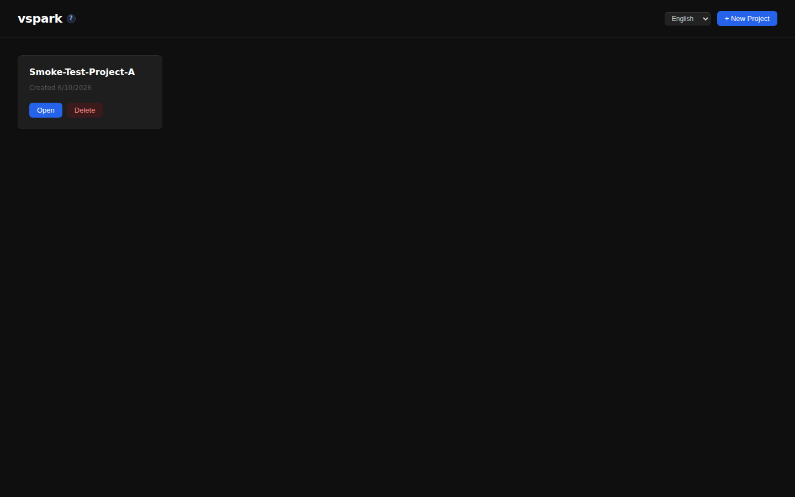
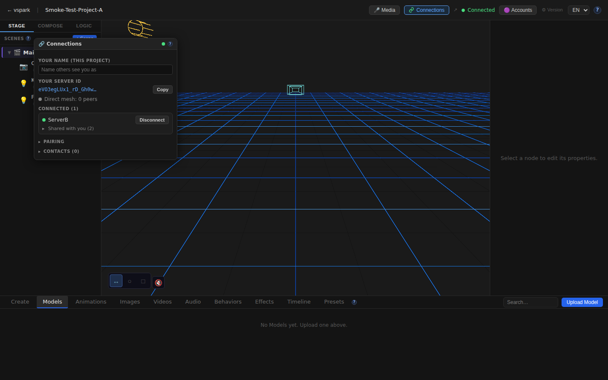
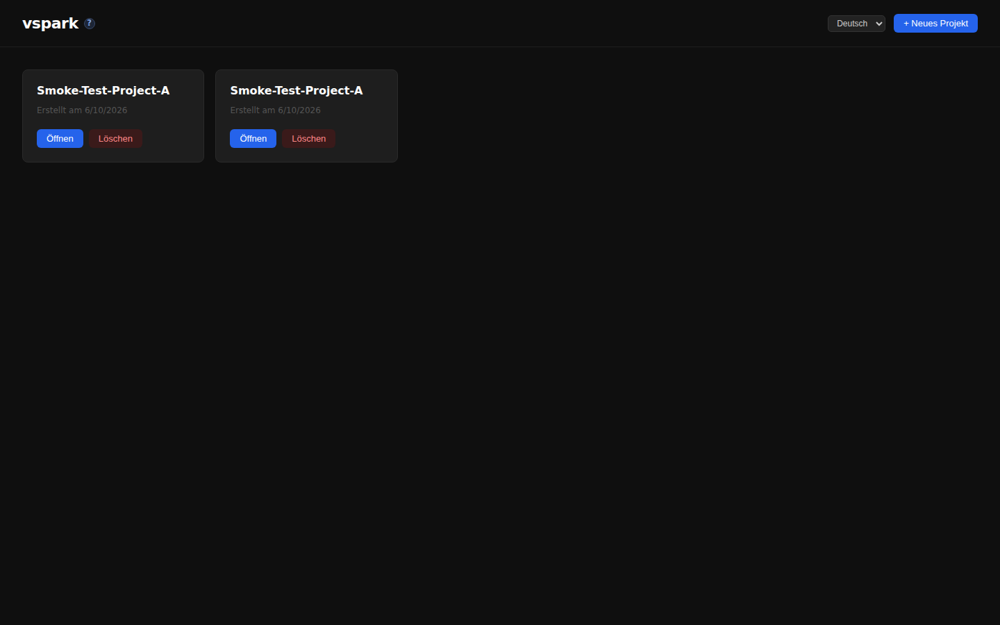
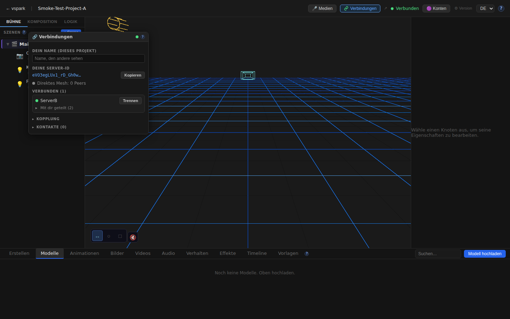
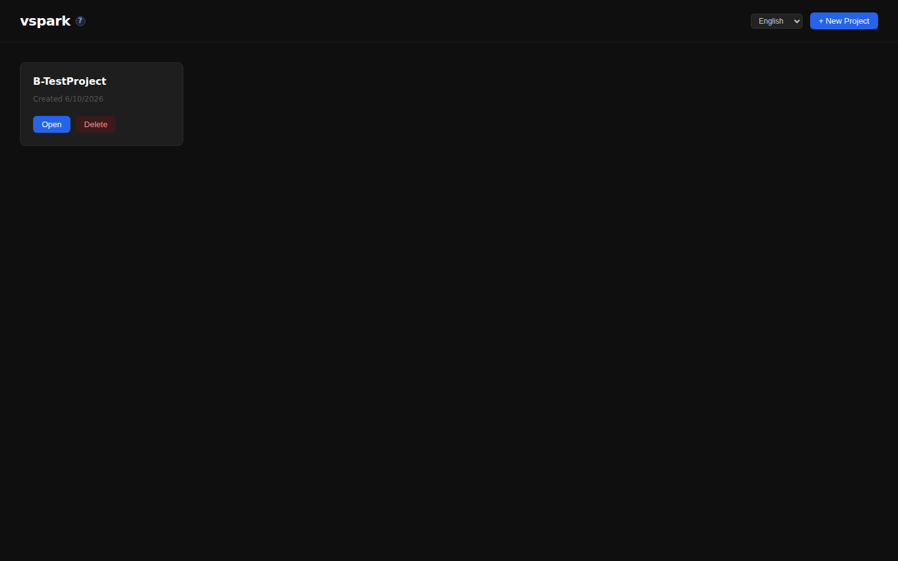
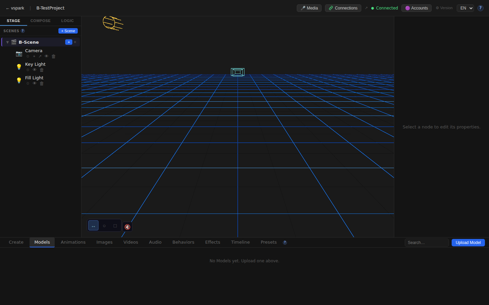
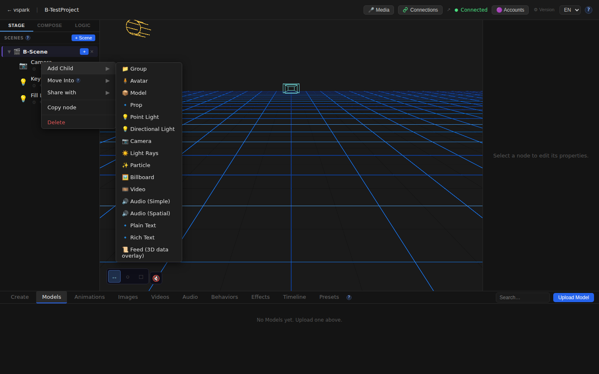

# Smoketest report — feature/multiplayer-phase6

- **Date (UTC):** 2026-06-10T23:05:49Z
- **Commit:** 7a5644c
- **Base:** origin/dev
- **Overall:** ✅ PASS

## Scope

The PR adds the complete multiplayer Phase 5/6 system: WebRTC peer-to-peer mesh (server↔server and browser↔browser), a rendezvous signaling service, object sharing with read/write grants, a Connections UI panel, SceneGraph share context menu, shared projection receiver, and help docs in EN + DE. 99 files changed, 10,427 insertions.

Both backend and frontend are extensively touched, plus a new `packages/rendezvous/` package, so both API and browser tests were run using the **two-peer mesh harness** from project.md.

```
 packages/backend/src/multiplayer/**          — API
 packages/backend/src/routes/connections.ts  — API
 packages/backend/src/db/migrations/027–031  — API (migration boot check)
 packages/rendezvous/**                       — API
 packages/frontend/src/components/ConnectionsWindow.tsx  — Browser
 packages/frontend/src/components/editor/TopBar.tsx      — Browser
 packages/frontend/src/components/editor/SceneGraph.tsx  — Browser
 packages/frontend/src/i18n/locales/{en,de}/connections.json — Browser (i18n)
 packages/frontend/src/help/content/{en,de}/multiplayer.md   — Browser (docs)
```

## Test environment

Two-peer mesh on one host:
- Rendezvous: `http://localhost:8787`
- Backend A (ServerA): `http://localhost:3001`, DB `/tmp/smoketest/a.db`
- Backend B (ServerB): `http://localhost:3002`, DB `/tmp/smoketest/b.db`
- Frontend A → backend A: `http://localhost:5173`
- Frontend B → backend B: `http://localhost:5174` (scratch Vite config)

## Test plan

1. Type-check (backend + shared + rendezvous via `pnpm lint`)
2. Frontend type-check (`pnpm --filter frontend typecheck`)
3. DB migrations 027–031 apply cleanly (verified via clean boot)
4. Rendezvous boots and is reachable
5. Both backends reach `{enabled:true, status:"ready"}` on `/api/connections/status`
6. Pairing flow: A creates code → B joins → A connects → B accepts → both show `connected:true, sessionGranted:true`
7. Object sharing: B shares Camera (read-only) and Key Light (canWrite) with A → grantees confirmed
8. Subscriber: A subscribes to B's peer
9. Home page loads (Frontend A)
10. Project creation + editor canvas mounts (Frontend A)
11. TopBar Connections button present
12. ConnectionsWindow opens and shows peer identity
13. Language switch EN → DE: home page strings in German
14. Language switch EN → DE: ConnectionsWindow title "Verbindungen" renders
15. Frontend B home + editor loads (via backend B)
16. SceneGraph right-click context menu shows Share item (Frontend B)
17. `/docs/multiplayer` page renders

## Results

| # | Check | Type | Result | Notes |
|---|-------|------|--------|-------|
| 1 | `pnpm lint` type-check (backend, shared, rendezvous) | API | ✅ | No errors |
| 2 | `pnpm --filter frontend typecheck` | Browser | ✅ | No errors |
| 3 | DB migrations 027–031 apply cleanly | API | ✅ | Both backends booted without migration errors |
| 4 | Rendezvous service boots on :8787 | API | ✅ | `listening on :8787 (turn=off)` |
| 5 | Backend A status: enabled + ready | API | ✅ | `{enabled:true,status:"ready",peerId:"eVO3eg…"}` |
| 6 | Backend B status: enabled + ready | API | ✅ | `{enabled:true,status:"ready",peerId:"qsHC5B…"}` |
| 7 | Pairing: A creates code, B joins | API | ✅ | Code `5Y6EVL7H`; B received A's peerId + publicKey |
| 8 | WebRTC connect + accept → both peers `connected:true` | API | ✅ | Connected on attempt 2 (loopback WebRTC) |
| 9 | Share Camera (read-only) from B → grantees: [A] | API | ✅ | `POST /connections/objects/:id/share` returned A's peerId |
| 10 | Share Key Light (canWrite) from B → grantees: [A] | API | ✅ | Same; sessionGranted verified |
| 11 | Subscribe A to B's peer | API | ✅ | `{ok:true,data:{peerId:"qsHC5B…"}}` |
| 12 | Home page loads (Frontend A) | UI | ✅ | Title present |
| 13 | New project created + editor opened (Frontend A) | UI | ✅ | id=9ced8d89 |
| 14 | Editor canvas mounts | UI | ✅ | `<canvas>` present |
| 15 | TopBar has Connections button | UI | ✅ | Button with text "Connections" visible |
| 16 | ConnectionsWindow opens | UI | ✅ | Identity text rendered |
| 17 | Home page strings in German after language switch | UI | ✅ | "Neues Projekt", "Löschen" etc. (3 matches) |
| 18 | ConnectionsWindow title in German ("Verbindungen") | UI | ✅ | 2 German connection strings found |
| 19 | Frontend B home loads (→ backend B) | UI | ✅ | Page loaded |
| 20 | Frontend B editor loads (→ backend B project) | UI | ✅ | Canvas present |
| 21 | SceneGraph share context menu (Frontend B) | UI | ✅ | Right-click Camera → "Share with" item found |
| 22 | `/docs/multiplayer` page renders | UI | ✅ | Heading "Multiplayer connections" |
| 23 | No actionable console errors (A) | UI | ✅ | EnvironmentCube HDRI error is known-benign (offline sandbox) |
| 24 | No actionable console errors (B) | UI | ✅ | Same |

**Total: 24/24 checks passed**

### Failures & errors

None. The only console errors observed (`EnvironmentCube` / `SafeEnvironment` HDRI fetch failure) are documented as known-benign in `project.md` — the HDRI cannot be fetched in the offline sandbox environment; the app continues normally via the `ErrorBoundary`.

## Screenshots

### Home page (Frontend A)


### Editor canvas mounts (Frontend A)


### TopBar — Connections button


### ConnectionsWindow open (English)


### Home page in German locale


### ConnectionsWindow in German locale


### Frontend B home (→ backend B)


### Frontend B editor


### SceneGraph share context menu (Frontend B)


### /docs/multiplayer page


## Notes

- **Migrations** (027–031) applied cleanly on both backend A and B boots: identity + Ed25519 keypair, per-project display names, shares, grants, and collab_scenes tables — no migration errors.
- WebRTC loopback connection established in < 4 seconds with empty `iceServers` (no STUN/TURN needed on loopback), consistent with the `project.md` note.
- The `collabScene` foundation (migration 031, `packages/backend/src/multiplayer/collabScene.ts`) is in place but the full collaborative scene write tier is labelled as Phase 6 prep — intentionally not fully exercised in this smoke test.
- The rendezvous service started with `turn=off` (no TURN credentials configured), which is correct for the dev/test environment.
