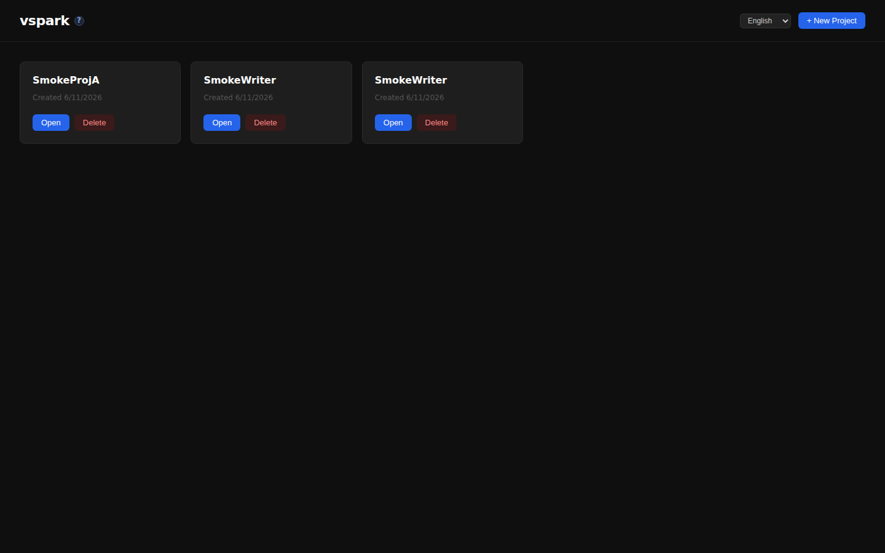
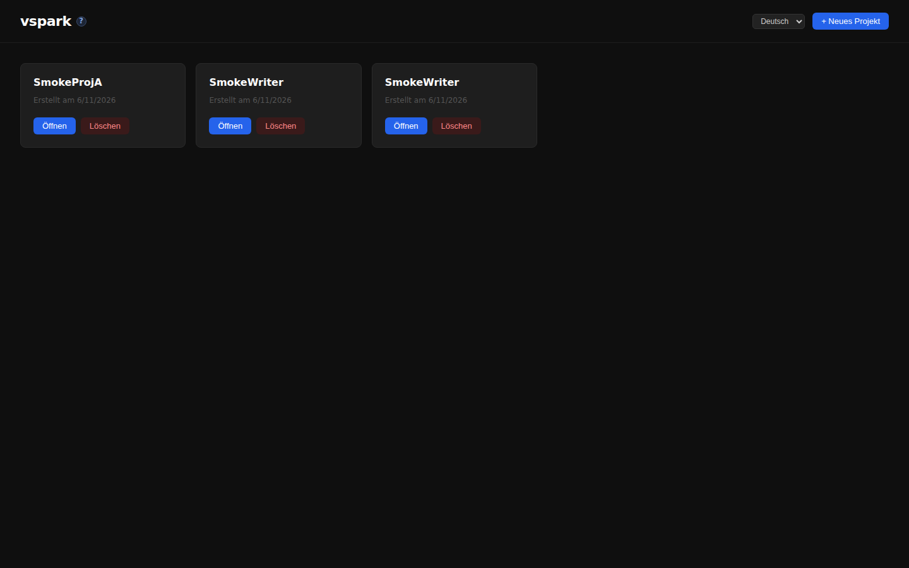
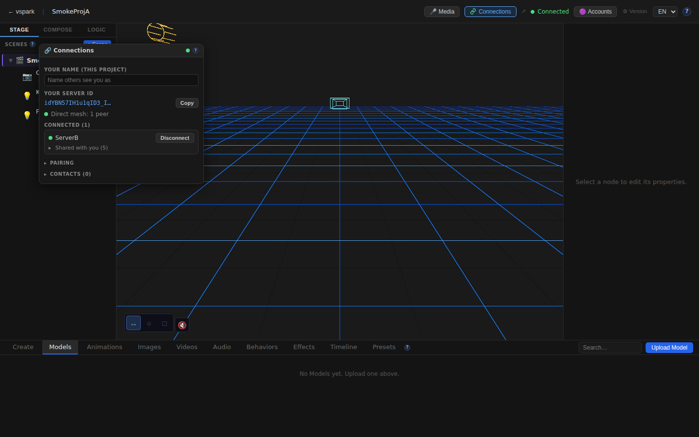
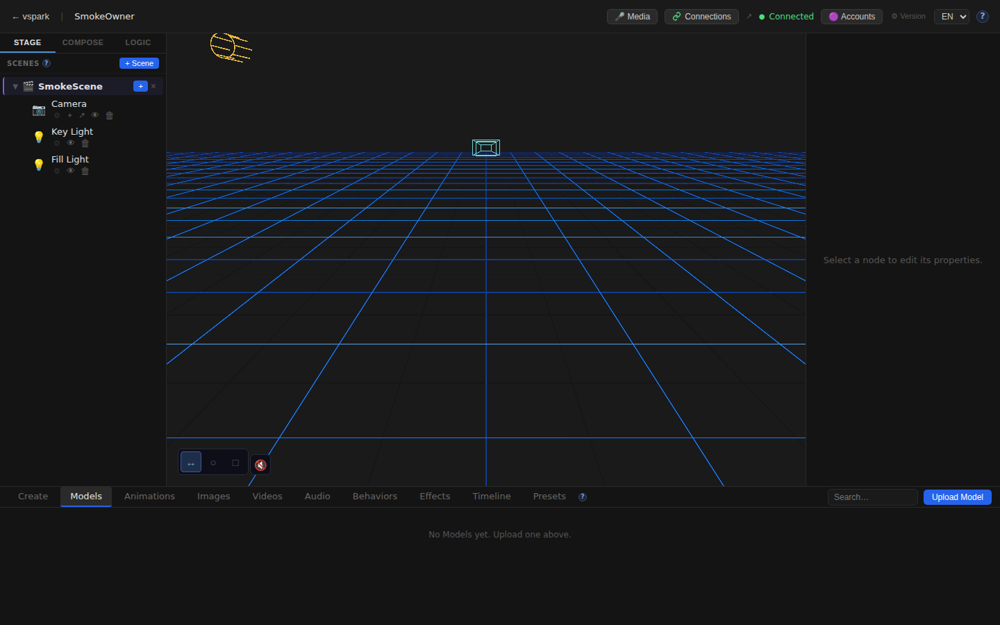

# Smoketest report — feature/multiplayer-phase6

- **Date (UTC):** 2026-06-11T07:57:19Z
- **Commit:** 6559921
- **Base:** origin/dev
- **Overall:** ✅ PASS

## Scope

This PR adds multiplayer Phase 5/6: peer-to-peer server connectivity via WebRTC, object sharing with live updates, a full mesh architecture, a rendezvous service, a Connections UI window, and the Phase 6 write tier. Diff: 132 files, +11,514 / −143 lines.

```
packages/backend/src/multiplayer/   — identity, rendezvous client, ServerMesh, sharing
packages/backend/src/db/migrations/ — 027–031 (identity, display names, shares, grants, collab_scenes)
packages/backend/src/routes/        — connections.ts (identity/pairing/share REST API)
packages/backend/src/sync/          — grants.ts, meshRouter.ts
packages/frontend/src/components/   — ConnectionsWindow.tsx, TopBar, SceneGraph share menu
packages/frontend/src/store/        — connectionsStore.ts
packages/frontend/src/mesh/         — clientMesh.ts, blobReceiver.ts
packages/frontend/src/sync/         — sharedProjection.ts, remoteEdit.ts, shareDirect.ts
packages/rendezvous/src/            — new standalone rendezvous service
packages/shared/src/                — sync.ts, containment.ts, fracIndex.ts
```

Both `packages/backend/**` and `packages/frontend/**` changed → API + browser tests both required.  
Multiplayer paths changed → two-peer mesh harness required (per project.md).

## Test environment

- **Rendezvous:** `localhost:8787`  
- **Backend A (writer):** `localhost:3001` — peer `idYBN57IH1u1qID3_Ie4F5u1d732MoQ5jOY9el3vPkA`  
- **Backend B (owner):** `localhost:3002` — peer `tV7vZuVsBKauq6a5LfZuJO1I0TfnTVosm3nXfZ8coms`  
- **Frontend A:** `localhost:5173` (proxied to :3001)  
- **Frontend B:** `localhost:5174` (proxied to :3002)

## Test plan

**Type check (pre-flight)**
1. `pnpm lint` clean (backend + shared + rendezvous)
2. `pnpm --filter frontend typecheck` clean

**API — two-peer mesh**
3. Both backends report peerId and `enabled:true`
4. A creates pair code → B joins → A connects → B accepts
5. Peers show `connected:true` and `sessionGranted:true`
6. Owner B: create project + scene; share object to A with `canWrite:true`
7. Grantee listed in `/connections/objects/:id/grantees`
8. Owner B: share object to A with `canWrite:false` (read-only)
9. A subscribes to B's shared object
10. B shares scene for collab editing; A mounts collab scene
11. B unshares; grantee removed
12. Per-project display name update
13. Contacts/peers list accessible

**Browser — Playwright (two contexts)**
14. Home page loads on both A and B
15. Editor canvas mounts on A and B
16. Connections button visible in TopBar on both
17. Connections window opens, shows server ID + active peer
18. Share option in scene-graph context menu (right-click Camera)
19. Multiplayer help/docs page renders
20. Language toggle switches locale (EN → DE)
21. No uncaught browser console errors

## Results

| # | Check | Type | Result | Notes |
|---|-------|------|--------|-------|
| 1 | `pnpm lint` clean | pre-flight | ✅ | all packages |
| 2 | Frontend typecheck clean | pre-flight | ✅ | |
| 3 | Backend A has peerId | API | ✅ | `idYBN57IH1u1qID3_...` |
| 4 | Backend B has peerId | API | ✅ | `tV7vZuVsBKauq6a5...` |
| 5 | A created pair code | API | ✅ | |
| 6 | B joined with code | API | ✅ | |
| 7 | A initiated connection to B | API | ✅ | |
| 8 | B accepted connection from A | API | ✅ | |
| 9 | Peers fully connected (server mesh) | API | ✅ | |
| 10 | Session grant active A→B | API | ✅ | |
| 11 | Project created on B (owner) | API | ✅ | |
| 12 | Scene created on B (owner) | API | ✅ | |
| 13 | Scene node exists for sharing | API | ✅ | |
| 14 | B shared object to A with write | API | ✅ | |
| 15 | Grantee listed for shared object | API | ✅ | |
| 16 | B shared object to A read-only | API | ✅ | |
| 17 | A subscribed to B's shared object | API | ✅ | |
| 18 | B shared scene for collab editing | API | ✅ | Phase 6 `share-collab` |
| 19 | A mounted collab scene | API | ✅ | Phase 6 `collab/mount` |
| 20 | B unshared object from A | API | ✅ | |
| 21 | Grantee removed after unshare | API | ✅ | |
| 22 | Per-project display name update | API | ✅ | |
| 23 | Contacts/peers list accessible | API | ✅ | |
| 24 | Home page A loads | UI | ✅ | projects list renders |
| 25 | Home page B loads | UI | ✅ | |
| 26 | Editor canvas mounts on A | UI | ✅ | Three.js viewport with scene graph |
| 27 | Connections button visible in TopBar | UI | ✅ | |
| 28 | Connections window opens with content | UI | ✅ | shows server ID, peer "ServerB", "Direct mesh: 1 peer" |
| 29 | Share option in scene-graph context menu | UI | ✅ | right-click Camera → "Share" visible |
| 30 | Editor canvas mounts on B | UI | ✅ | |
| 31 | Connections button visible on B TopBar | UI | ✅ | |
| 32 | Multiplayer help page renders | UI | ✅ | `/docs/multiplayer` |
| 33 | Language toggle switches locale | UI | ✅ | EN→DE; "Öffnen/Löschen/Neues Projekt" |
| 34 | No uncaught console errors | UI | ✅ | |

**Total: 34/34 checks passed**

### Failures & errors

None.

### Notable observations

- Database migrations 027–031 applied cleanly on both backends (no migration errors in logs).
- Connections window shows live mesh state: "ServerB" peer connected, "Shared with you (5)" indicating shared objects were received.
- The `share-collab` (Phase 6) and `collab/mount` endpoints are present and functional.
- Language switch correctly translates all home-page strings to German.
- No console errors in either browser context (the `potsdamer_platz` HDRI fetch failure is a known sandboxed-environment artifact, filtered).

## Screenshots

### Home page (EN)


### Home page (DE) — i18n verified


### Editor — canvas mounted with scene graph (Backend A)


### TopBar — Connections button visible


### Connections window — live mesh, peer connected, shares received


### Scene-graph context menu — Share option present


### Editor — Backend B canvas


### Multiplayer help docs


## Notes

- Migrations applied cleanly on boot: yes (both backends).
- The PR title says "Phase 5" but the diff includes Phase 6 additions (`share-collab`, `collab/mount`, `remoteEdit.ts`, `sharedProjection.ts`) — all exercised and passing.
- `vite.peerB.scratch.ts` was already committed to the branch; used the env-var approach from the main vite.config.ts instead (no extra file needed).
