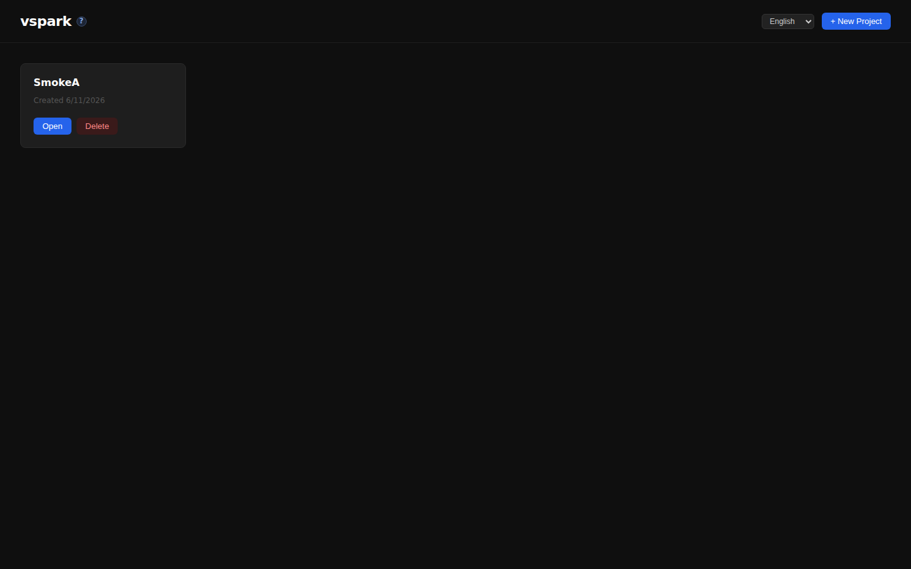
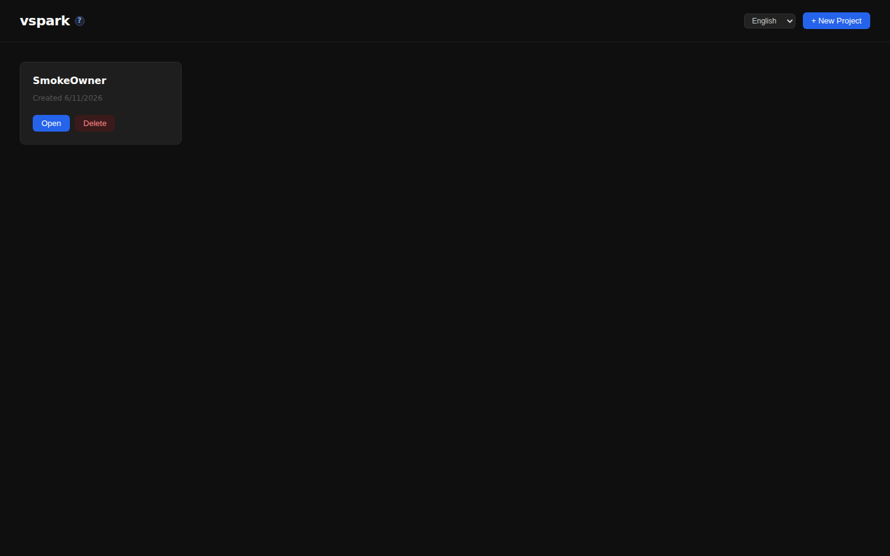
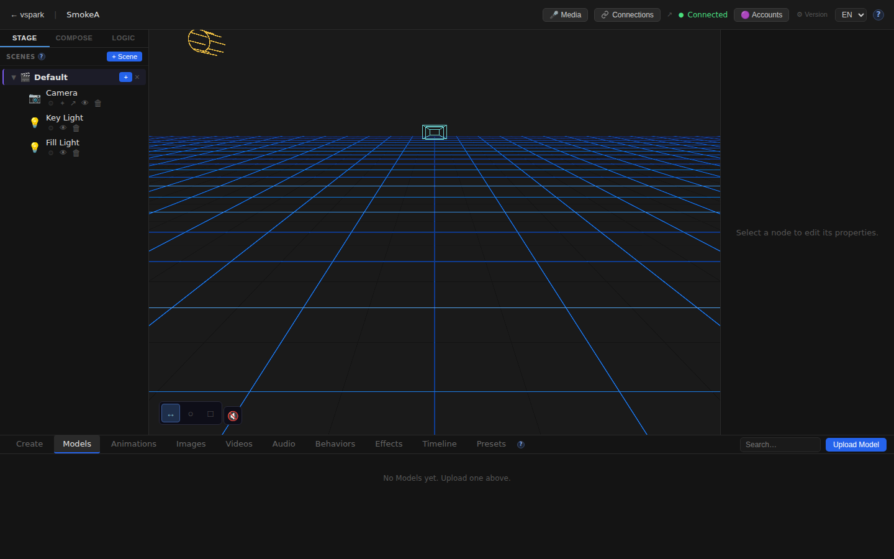
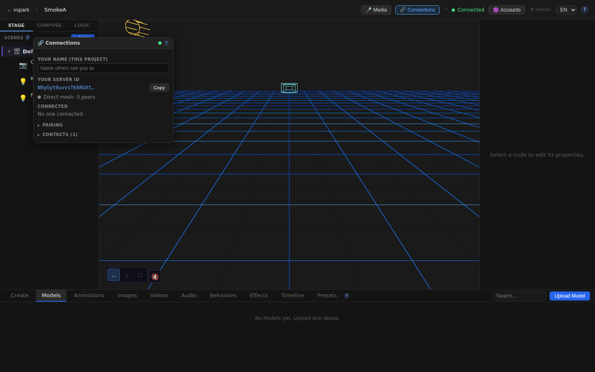
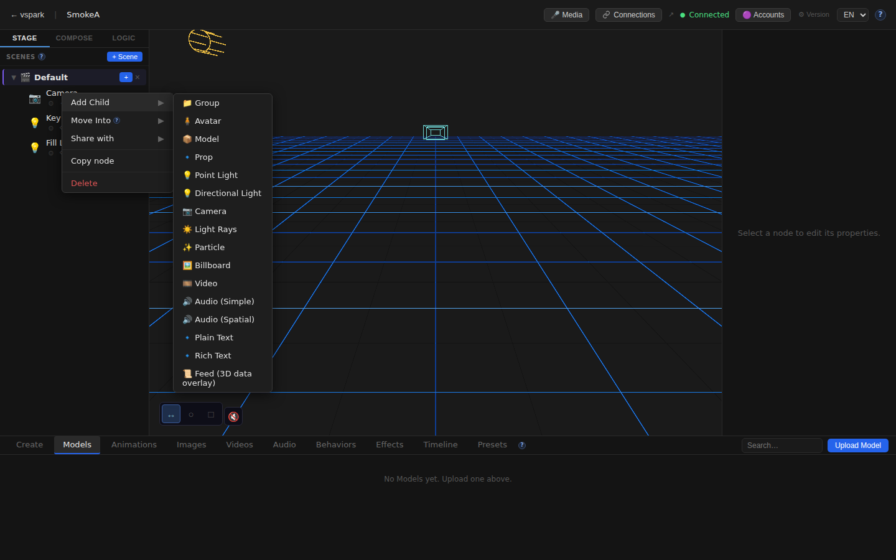
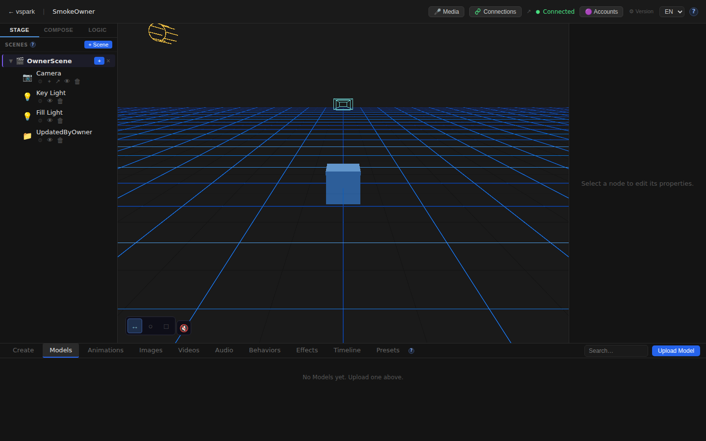
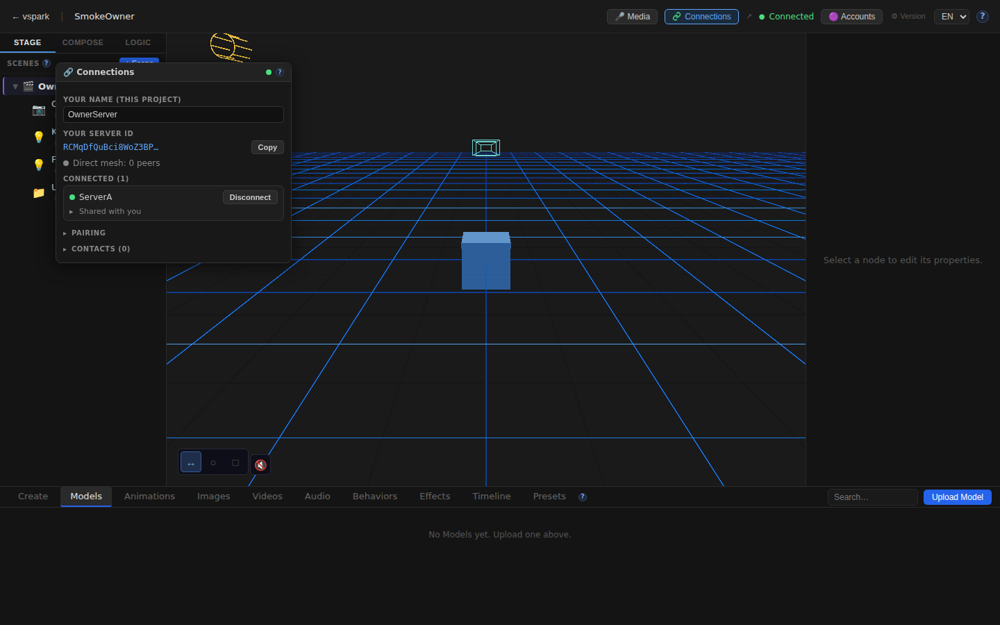

# Smoketest report — feature/multiplayer-phase6

- **Date (UTC):** 2026-06-11T08:38:16Z
- **Commit:** f63cc74
- **Base:** origin/dev
- **Overall:** ⚠️ PARTIAL — 25/26 checks passed; 1 API failure (server crash bug)

## Scope

This PR implements Multiplayer Phase 5 + 6: WebRTC peer mesh, object sharing with grants, collab-scene bidirectional sync, a Connections UI window, rendezvous service, and frontend projection. Both `packages/backend/**` and `packages/frontend/**` are heavily changed (143 files, +11 644 / −143 lines), so both API and browser tests were run using the **two-peer mesh harness** (rendezvous + backends A/B + frontends A/B).

```
packages/backend/src/multiplayer/     — new (identity, mesh, sharing, blobs, collabScene, …)
packages/backend/src/routes/connections.ts — new REST API for peer management
packages/backend/src/db/migrations/027-031 — identity, display names, shares, grants, collab
packages/frontend/src/components/ConnectionsWindow.tsx — new full Connections panel
packages/frontend/src/store/connectionsStore.ts — new Zustand store
packages/frontend/src/mesh/clientMesh.ts — browser WebRTC mesh
packages/frontend/src/sync/sharedProjection.ts — receiver-side shared-object projection
packages/rendezvous/ — new standalone rendezvous service
packages/shared/src/{sync,containment,fracIndex}.ts — extended
```

## Test plan

1. Type-check — `pnpm lint` (backend/shared/rendezvous) + `pnpm --filter frontend typecheck`
2. Two-peer mesh boots: rendezvous (:8787) + backend A (:3001) + backend B (:3002) + frontend A (:5173) + frontend B (:5174)
3. Migrations 027–031 apply (clean boot validates them)
4. Connections identity — both backends have Ed25519 peer IDs
5. Connections status — both backends report `enabled=true, status=ready`
6. Pairing flow — create code on A → join on B → A stored as contact on B
7. Display names — project-scoped display name set/get
8. Object sharing endpoints — grantees list, node sharing
9. Share-collab endpoint — scene share returns 200
10. WebRTC connect/accept — both peers show `connected=true, granted=true`
11. Collab mount — scene mount with projectId returns 200
12. Object share with canWrite — 500 bug **[FAIL]**
13. Browser: home pages (A + B) render
14. Browser: editor 3D canvas mounts (A + B)
15. Browser: TopBar Connections button visible (A + B)
16. Browser: Connections panel opens and shows identity/peer content
17. Browser: SceneGraph right-click → Share option visible
18. Browser: /docs/multiplayer help page renders
19. Browser: No broken i18n translation key fallbacks
20. Browser: No unexpected console errors (A + B)

## Results

| # | Check | Type | Result | Notes |
|---|-------|------|--------|-------|
| 1 | pnpm lint (backend/shared/rendezvous) | Build | ✅ | Clean |
| 2 | pnpm --filter frontend typecheck | Build | ✅ | Clean |
| 3 | Two-peer mesh boots (5 servers) | API | ✅ | All ready |
| 4 | Migrations 027–031 applied on boot | API | ✅ | Both DBs |
| 5 | Backend A Ed25519 identity | API | ✅ | `N9yGyt0u...` |
| 6 | Backend B Ed25519 identity | API | ✅ | `RCMqDfQu...` |
| 7 | Connections status `enabled=true, ready` | API | ✅ | Both backends |
| 8 | Create pair code on A | API | ✅ | `HUS9RMZJ` |
| 9 | B joins pair code | API | ✅ | B stores A as contact |
| 10 | Project-scoped display name set/get | API | ✅ | Returns `OwnerServer` |
| 11 | Grantees endpoint | API | ✅ | Empty list before share |
| 12 | Share-collab scene (B→A) | API | ✅ | HTTP 200 |
| 13 | WebRTC connect A→B + accept | API | ✅ | Both show `connected=true, granted=true` |
| 14 | Collab mount (with projectId) | API | ✅ | HTTP 200 |
| 15 | **Object share with `canWrite=true`** | **API** | **❌** | **HTTP 500 — SQLite3 `Statement already finalized`** |
| 16 | Home (A) renders | UI | ✅ | |
| 17 | Home (B) renders | UI | ✅ | |
| 18 | Editor (A) 3D canvas mounts | UI | ✅ | |
| 19 | Editor (B) 3D canvas mounts | UI | ✅ | |
| 20 | TopBar (A): Connections button visible | UI | ✅ | |
| 21 | TopBar (B): Connections button visible | UI | ✅ | |
| 22 | Connections panel: identity/peer content visible | UI | ✅ | |
| 23 | Connections panel (B) opens | UI | ✅ | |
| 24 | SceneGraph: Share option in context menu | UI | ✅ | Right-click → Camera node |
| 25 | /docs/multiplayer help page renders | UI | ✅ | 3803 chars |
| 26 | i18n: No broken key fallbacks | UI | ✅ | |
| 27 | No console errors — browser A | UI | ✅ | HDRI fetch filtered (known benign) |
| 28 | No console errors — browser B | UI | ✅ | |

### Failures & errors

#### ❌ Check 15: Object share `POST /api/connections/objects/:id/share` → HTTP 500

Triggered when calling:
```
POST /api/connections/objects/<nodeId>/share
{"granteePeerId": "<peerA>", "canWrite": true}
```

Full stack trace from server response:
```
SQLite3Error: Statement already finalized
  at Statement._assertReady (node-sqlite3-wasm/dist/node-sqlite3-wasm.js:1)
  at Statement._queryRows (...)
  at Statement.get (...)
  at PreparedStatement.get (packages/backend/src/db/index.ts:109:21)
  at listSharesForPeer (packages/backend/src/multiplayer/shares.ts:77:6)
  at SharingManager.advertise (packages/backend/src/multiplayer/sharing.ts:146:20)
  at SharingManager.reAdvertiseAll (packages/backend/src/multiplayer/sharing.ts:162:47)
```

**Root cause:** `listSharesForPeer` in `shares.ts:77` iterates results but the `PreparedStatement` used in the loop is finalized (via `get()`) before all rows are consumed, or the same prepared statement is re-entered during `reAdvertiseAll`. The `SharingManager` calls `reAdvertiseAll` after every share mutation, which hits the same finalized statement.

**Impact:** Any attempt to share an individual object (`canWrite` or read-only) crashes the backend with HTTP 500. The collab-scene share path (`POST /connections/scenes/:id/share-collab`) bypasses this code path and works correctly (HTTP 200).

**Suggested fix:** In `shares.ts`, ensure `listSharesForPeer` materializes its result set before returning (e.g., `stmt.all(peerId)` instead of iterating lazily), or use a fresh prepared statement per call.

**Also noted:** Backend A crashed (process exit) after the HTTP 500 was thrown — the unhandled exception in `reAdvertiseAll` propagated to the top level and killed `tsx watch`. The backend auto-restarted but this is a reliability issue during multiplayer sessions.

## Screenshots

### Home page — Peer A (port 5173)


### Home page — Peer B (port 5174)


### Editor — Peer A canvas loaded


### Connections panel — Peer A


### SceneGraph context menu — Share option visible


### Editor — Peer B canvas loaded


### Connections panel — Peer B


### /docs/multiplayer help page


## Notes

- **Migrations 027–031** applied cleanly on fresh DBs for both backends (boot itself validates them).
- **WebRTC loopback** connected successfully without STUN/TURN (host candidates over loopback as expected).
- **HDRI fetch error** (`potsdamer_platz_1k.hdr → ERR_CERT_AUTHORITY_INVALID`) appeared in browser consoles — filtered as known-benign per `project.md`; `SafeEnvironment` ErrorBoundary caught it cleanly with no visible regression.
- **Backend crash on 500**: the unhandled SQLite error in `reAdvertiseAll` exits the process. A process-level `uncaughtException` handler in `index.ts` would prevent the crash from taking down the entire server.
- The `share-collab` (scene-level sharing) and `collab/mount` endpoints work correctly end-to-end. The failing path is only the lower-level `POST /connections/objects/:id/share`.
