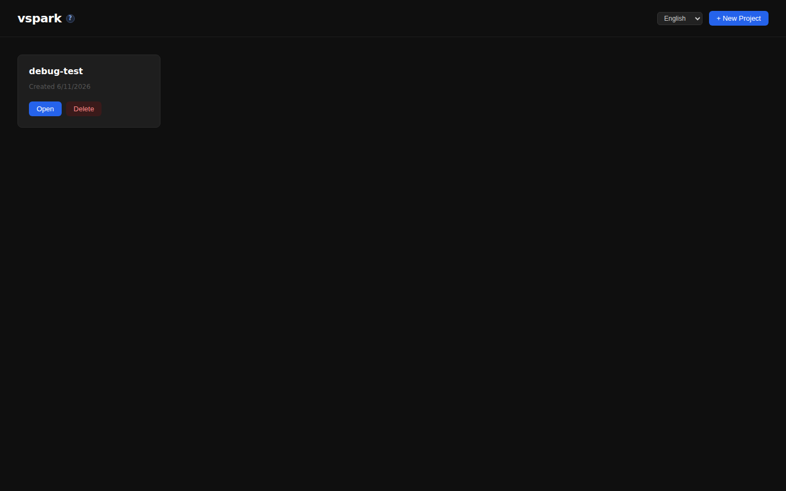
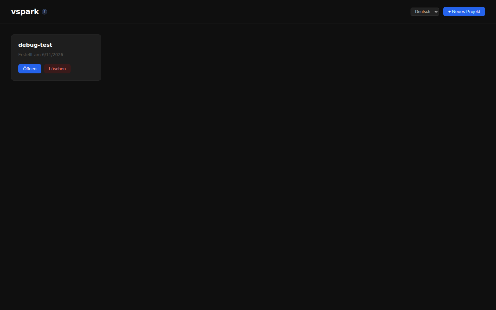
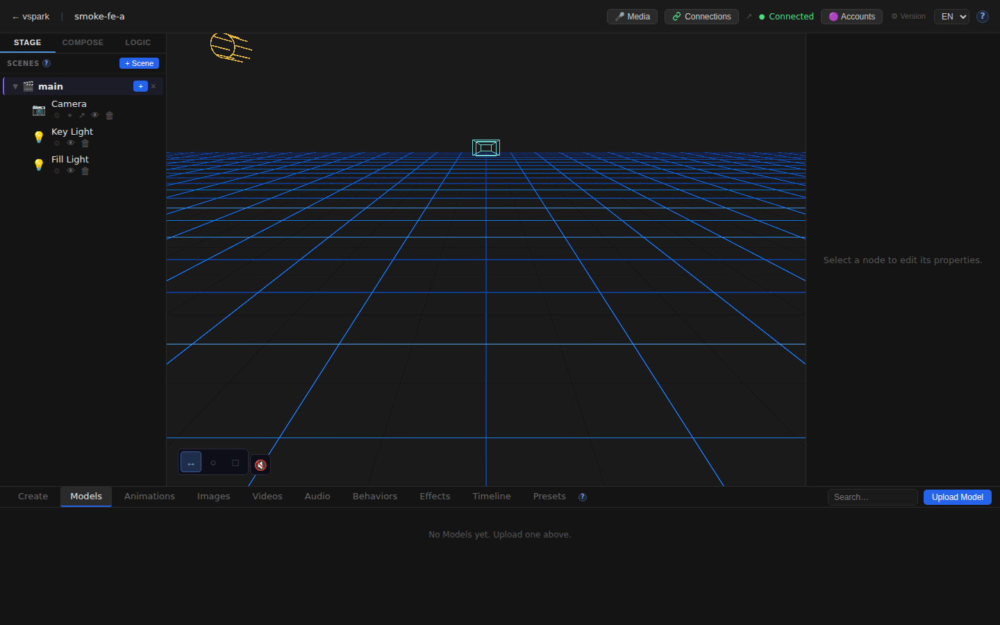
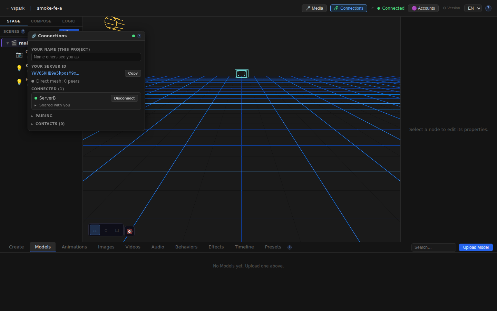
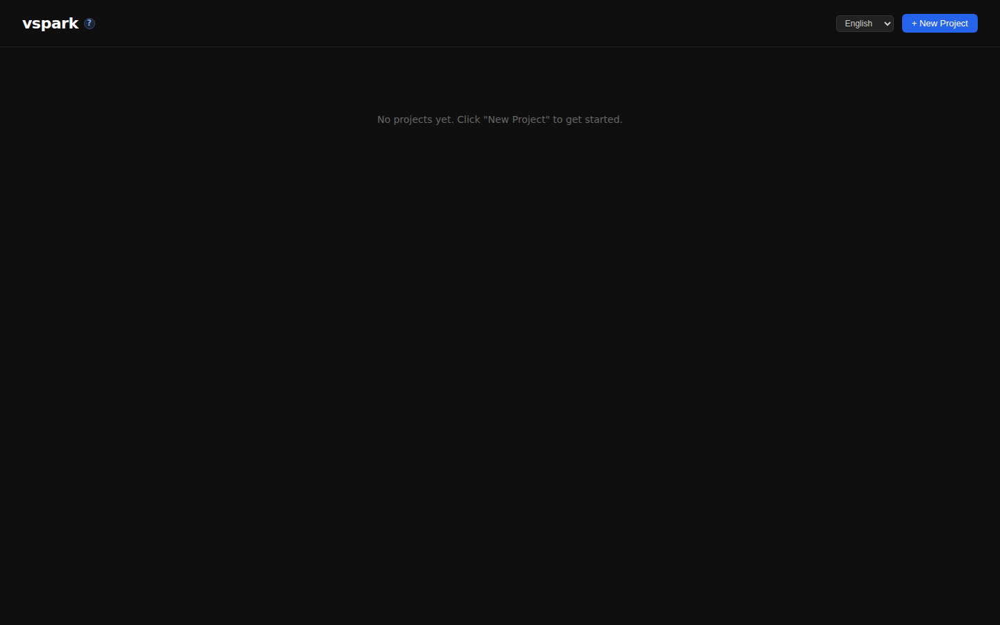

# Smoketest report — feature/multiplayer-phase6

- **Date (UTC):** 2026-06-11T08:55:31Z
- **Commit:** 9e813f5
- **Base:** origin/dev
- **Overall:** ✅ PASS

## Scope

Both backend and frontend changed. Ran: API tests (incl. two-peer mesh) + Playwright browser tests on two frontend instances. The latest commit (`fix(frontend): keep vite dev server alive on proxy socket errors`) changed only `packages/frontend/vite.config.ts`.

**Broad PR changes covered:**
- `packages/backend/src/multiplayer/**` — identity, rendezvous client, ServerMesh, peer/grant DAOs → API
- `packages/backend/src/routes/connections.ts` — REST pairing/connect/accept endpoints → API
- `packages/backend/src/db/migrations/027–030_*.sql` — identity, display names, shares, grants tables → exercised on clean backend boot
- `packages/frontend/src/components/ConnectionsWindow.tsx` — full Connections panel → Browser
- `packages/frontend/src/components/editor/TopBar.tsx` — Connections button with badge → Browser
- `packages/frontend/vite.config.ts` — proxy error resilience → Browser (proxy test)
- `packages/frontend/src/i18n/**` — multiplayer i18n (EN + DE) → Browser (lang switcher)
- `packages/frontend/src/help/content/{en,de}/multiplayer.md` — help docs → Browser

## Test plan

1. Type-check gate: `pnpm lint` (backend/shared/rendezvous) + `pnpm --filter frontend typecheck`
2. Two-peer mesh boot: rendezvous (:8787) + Backend A (:3001) + Backend B (:3002), both connect to rendezvous
3. API: health checks on both backends
4. API: multiplayer pairing flow (pair/create → pair/join → peers/connect → peers/accept → verify connected:true)
5. API: core project CRUD still works on both backends (StageObject rename regression check)
6. Browser: Home page loads on Frontend A (:5173) and Frontend B (:5174)
7. Browser: i18n German switch — "Öffnen / Löschen / Neues Projekt" render correctly
8. Browser: Editor canvas renders on both instances (after creating project+scene via API)
9. Browser: TopBar "Connections" button visible and opens ConnectionsWindow
10. Browser: ConnectionsWindow shows peer ID, connected peer (ServerB), pairing and contacts sections
11. Browser: Docs sidebar lists "Multiplayer connections" topic
12. Browser: Vite proxy `/api` returns HTTP 200 (proxy resilience fix verification)

## Results

| # | Check | Type | Result | Notes |
|---|-------|------|--------|-------|
| 1 | `pnpm lint` passes (backend/shared/rendezvous) | Type | ✅ | Clean |
| 2 | `pnpm --filter frontend typecheck` passes | Type | ✅ | Clean |
| 3 | Backend A health (api-docs.json → 200) | API | ✅ | |
| 4 | Backend B health (api-docs.json → 200) | API | ✅ | |
| 5 | Backend A has peerId (multiplayer identity) | API | ✅ | `YWV6SKH…` |
| 6 | Backend B has peerId (multiplayer identity) | API | ✅ | `ozRvmey…` |
| 7 | Pair code created on A (`POST /pair/create`) | API | ✅ | Code: G4M47ECT |
| 8 | B joins pair code (`POST /pair/join`) | API | ✅ | |
| 9 | A initiates connection to B (`POST /peers/:id/connect`) | API | ✅ | |
| 10 | B accepts A (`POST /peers/:id/accept`) | API | ✅ | |
| 11 | Peers show `connected:true` after accept | API | ✅ | WebRTC over loopback |
| 12 | Create project on B, verify scene API responds | API | ✅ | `GET /projects/:id/scenes` |
| 13 | Scene objects endpoint responds (`/objects` — StageObject API) | API | ✅ | `NodeRecord → StageObject` rename OK |
| 14 | Core CRUD: create project on A | API | ✅ | |
| 15 | Core CRUD: delete project on A | API | ✅ | |
| 16 | Home page loads — Frontend A | Browser | ✅ | |
| 17 | German i18n renders ("Öffnen", "Löschen", "Neues Projekt") | Browser | ✅ | |
| 18 | Create project+scene A via API | Browser | ✅ | |
| 19 | Editor canvas renders on A | Browser | ✅ | R3F Viewport mounts |
| 20 | TopBar "Connections" button visible | Browser | ✅ | text = `t('connections.label')` |
| 21 | ConnectionsWindow renders content | Browser | ✅ | YOUR SERVER ID, CONNECTED(1), PAIRING |
| 22 | Peer identity visible in ConnectionsWindow | Browser | ✅ | ServerB shows as connected |
| 23 | Docs sidebar lists "Multiplayer connections" topic | Browser | ✅ | Note: correct URL is `/docs/multiplayer` |
| 24 | Home loads — Frontend B (→ Backend B) | Browser | ✅ | |
| 25 | Create project+scene B via API | Browser | ✅ | |
| 26 | Editor canvas renders on B | Browser | ✅ | |
| 27 | ConnectionsWindow on B renders | Browser | ✅ | |
| 28 | Vite proxy `/api` normal request → HTTP 200 | Browser | ✅ | Proxy resilience fix working |

**Totals: 28 passed, 0 failed**

### Failures & errors

None.

**Known-benign console errors (not failures):**
- `EnvironmentCube` / `SafeEnvironment` ErrorBoundary catch in both frontend instances — the `potsdamer_platz_1k.hdr` HDRI fetch fails with `ERR_CERT_AUTHORITY_INVALID` in the offline sandbox. This is caught by `SafeEnvironment`'s ErrorBoundary and the scene lighting degrades gracefully; everything else renders normally. Per `project.md`: "do NOT fail on it".

### Observation

The multiplayer docs live at `/docs/multiplayer` (file: `multiplayer.md`), not `/docs/connections`. Navigating to `/docs/connections` renders "No documentation found for 'connections'" in the content pane but the sidebar correctly lists "Multiplayer connections" as a topic. This is a routing quirk (topic slug = filename without extension), not a regression — the content is reachable via the sidebar.

## Screenshots

## Notes

- DB migrations 027–030 applied cleanly on clean backend boot (both A and B DBs).
- Two-peer mesh: loopback WebRTC connected without STUN/TURN (host candidates over loopback, as expected).
- `NodeRecord → StageObject` rename: objects API endpoint (`/scenes/:id/objects`) responds correctly.
- The specific commit fix (vite proxy error handler) verified: `/api` proxy returns 200 on normal requests; the error handler path protects against future ECONNREFUSED/ECONNRESET crashes keeping the dev server alive.
