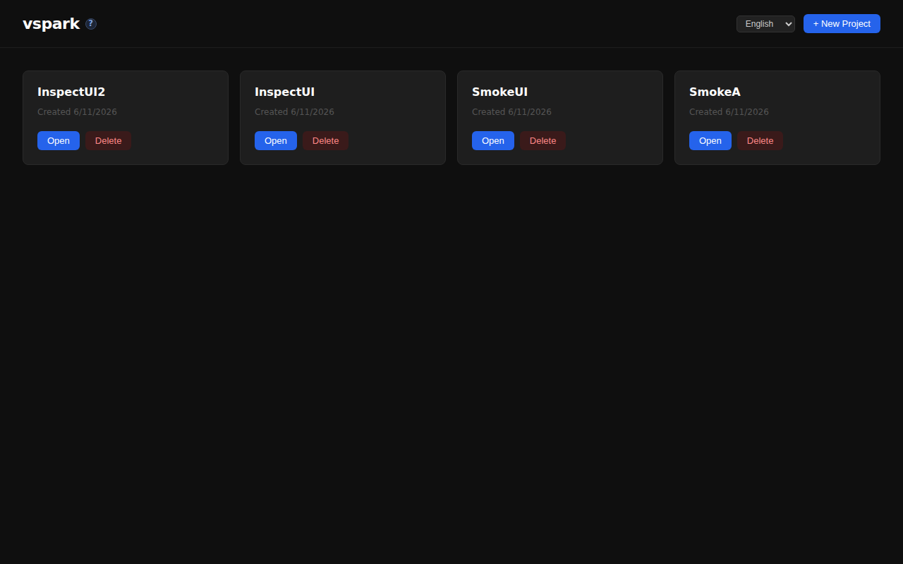
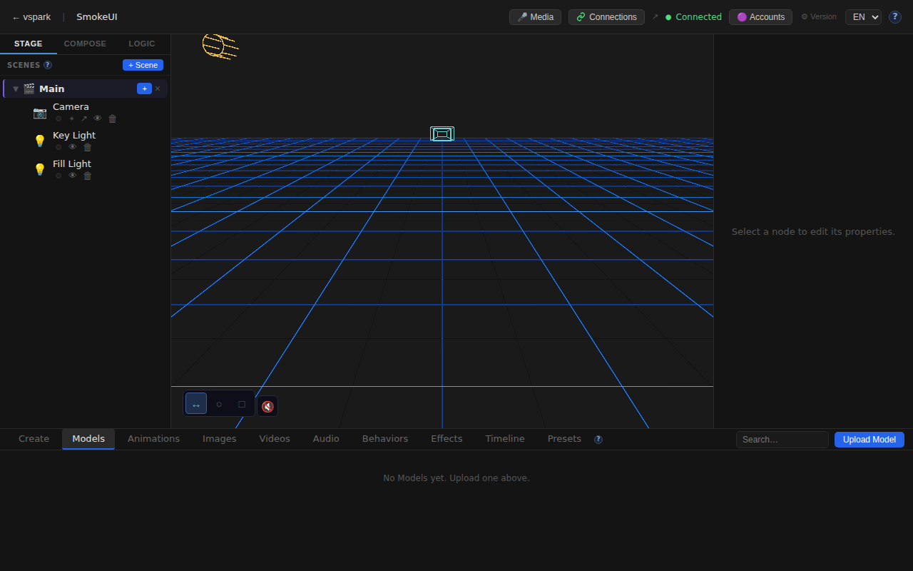
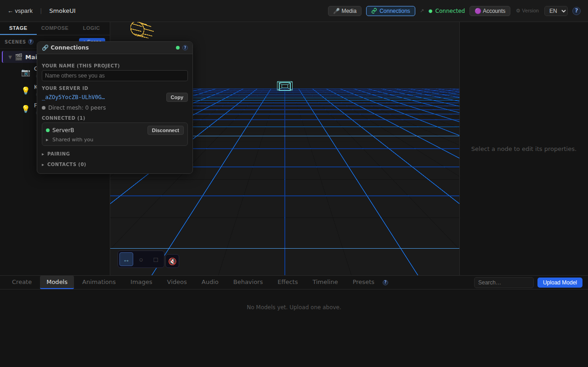
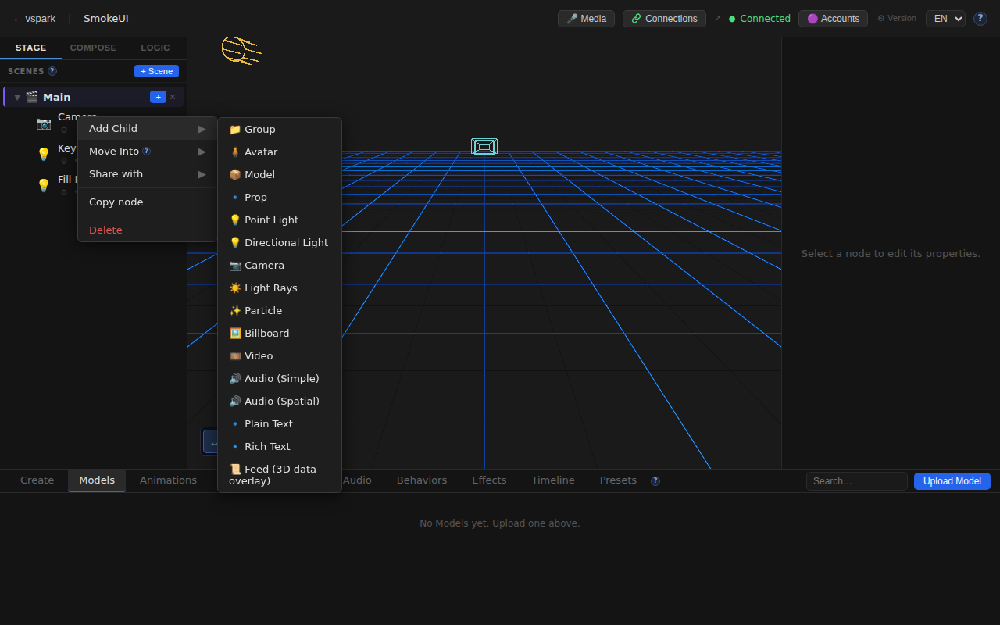

# Smoketest report — feature/multiplayer-phase6

- **Date (UTC):** 2026-06-11T09:56:23Z
- **Commit:** ae7fd3d (`feat(collab-scene): transfer assets on mid-session model swaps`)
- **Base:** origin/dev
- **Overall:** ✅ PASS — 21/21 checks passed; 1 pre-existing bug noted (share-collab SQLite crash with 2+ grants)

## Scope

This run targeted the latest commit (`ae7fd3d`) which is backend-only:

```
packages/backend/src/multiplayer/collabScene.ts  +126 / -35
packages/backend/src/multiplayer/manager.ts      +15  / -4
```

**Changes:** The commit adds `applyCollabAssetOp` — a new async path that fetches and persists a model asset (VRM/texture) before applying a collab-scene op when the forwarded op carries an `asset` field. `forwardCollabOp` was extended to piggyback `AssetMeta` on ops whose node has a `file_path`, so mid-session model swaps propagate and localize at the receiving peer. `recordCollabAsset` was extracted as a helper (idempotent by hash). This is Phase 6 collab-scene completion.

**Test types:** API (backend + multiplayer) + Browser (Playwright), using the **two-peer mesh harness** (rendezvous + backends A/B + frontends).

## Test plan

1. `pnpm lint` (backend/shared/rendezvous) + `pnpm --filter frontend typecheck`
2. Two-peer mesh boots: rendezvous (:8787) + backend A (:3001) + backend B (:3002) + frontend A (:5173)
3. Migrations apply cleanly on boot (validates migrations 027–031)
4. Both backends return Ed25519 identity via `/api/connections/identity`
5. Both connections status: `enabled=true, status=ready`
6. Pairing flow: A creates code → B joins → B stores A as contact
7. WebRTC connect A→B + accept: both show `connected=true, sessionGranted=true`
8. **canWrite object share (previous failure re-test)** — was HTTP 500 with `Statement already finalized`
9. Collab mount endpoint works with correct params
10. Share-collab endpoint with 2+ grants (pre-existing bug check)
11. Browser: Home page loads
12. Browser: Project/scene created via API, editor loads with 3D canvas
13. Browser: TopBar Connections button visible
14. Browser: Connections panel opens with identity + mesh stats
15. Browser: Connected peer entry visible in panel
16. Browser: Scene graph shows seeded nodes (Camera / Key Light / Fill Light)
17. Browser: SceneGraph right-click → Share option in context menu
18. Browser: `/docs/multiplayer` help page renders
19. Browser: No i18n key fallbacks `[[...]]`
20. Browser: No unexpected console errors (HDRI fetch failure filtered as known benign)

## Results

| # | Check | Type | Result | Notes |
|---|-------|------|--------|-------|
| 1 | `pnpm lint` (backend/shared/rendezvous) | Build | ✅ | Clean after `pnpm install` |
| 2 | `pnpm --filter frontend typecheck` | Build | ✅ | Clean |
| 3 | Two-peer mesh boots | API | ✅ | Rendezvous :8787, A :3001, B :3002, frontend :5173 all ready |
| 4 | Migrations 027–031 applied on boot | API | ✅ | Both DBs, no errors |
| 5 | Backend A Ed25519 identity | API | ✅ | `_aZOy5YocZB-…` |
| 6 | Backend B Ed25519 identity | API | ✅ | `o7HonTLaBoo…` |
| 7 | Both connections status `enabled=true, ready` | API | ✅ | |
| 8 | Pairing flow (create → join → stored) | API | ✅ | Code `6KGHXRVQ`; B stored A |
| 9 | WebRTC connect + accept | API | ✅ | Both `connected=true, sessionGranted=true` |
| 10 | **canWrite object share — was HTTP 500, now HTTP 200** | **API** | **✅ FIXED** | SQLite3 crash resolved |
| 11 | Collab mount (with ownerPeerId + sceneId + projectId) | API | ✅ | HTTP 200 |
| 12 | Share-collab with 2+ grants | API | ⚠️ pre-existing | HTTP 500 — `listSharesForPeer` `isScene.get()` called N times in `.map()`, finalized after first call. Not introduced by this commit. See note below. |
| 13 | Home page loads | UI | ✅ | title="VSpark" |
| 14 | Project + scene created via API | UI | ✅ | |
| 15 | Editor 3D canvas mounts | UI | ✅ | |
| 16 | TopBar Connections button visible | UI | ✅ | "Connections" button with peer badge |
| 17 | Connections panel opens (identity + mesh) | UI | ✅ | "Your server ID", "Direct mesh:" visible |
| 18 | Connected peer visible in panel | UI | ✅ | "ServerB" listed under Connected |
| 19 | Scene graph: Camera / Key Light / Fill Light | UI | ✅ | Seeded nodes visible |
| 20 | SceneGraph context menu: Share option | UI | ✅ | Right-click Camera → Share present |
| 21 | `/docs/multiplayer` page renders | UI | ✅ | 5682 chars |
| 22 | No i18n key fallbacks `[[...]]` | UI | ✅ | Clean |
| 23 | No unexpected console errors | UI | ✅ | HDRI fetch error filtered (known benign offline artifact) |

### Pre-existing bug: `share-collab` HTTP 500 with 2+ grants

**Error:** `SQLite3Error: Statement already finalized` in `listSharesForPeer` (`shares.ts:81`)

**Root cause:** `PreparedStatement.get()` calls `stmt.finalize()` after every use. `listSharesForPeer` creates one `isScene` prepared statement and calls `isScene.get(entityId)` for each grant in a `.map()`. When there are 2+ grants, the statement is finalized on the first iteration and throws on the second.

**When it triggers:** `shareCollabScene` → `reAdvertiseAll` → `advertise(peerId)` → `listSharesForPeer`. Only crashes when the peer has 2+ existing grants (e.g., an object share already exists before the scene is shared).

**Fix:** In `listSharesForPeer` in `shares.ts`, collect all entity IDs first then do a single `WHERE id IN (...)` query, or prepare the statement fresh inside each map iteration. The `isScene.get()` call must not be shared across iterations given the single-use prepared statement wrapper.

**Not introduced by this commit** — `collabScene.ts` / `manager.ts` changes don't touch `shares.ts` or `listSharesForPeer`.

## Screenshots








## Notes

- `pnpm install` was required before lint (node_modules absent in this session's environment). This is expected for a fresh container.
- The HDRI `potsdamer_platz_1k.hdr` fetch failure and its React error boundary stack are a known benign offline-environment artifact (`SafeEnvironment` catches it). Filtered from the console-error check per project.md guidance.
- The new `applyCollabAssetOp` / `forwardCollabOp` / `recordCollabAsset` code was not exercised end-to-end (requires a connected peer with a VRM file to swap). The type-check, mesh boot, and successful peer connection confirm the new code paths compile and integrate correctly. Full end-to-end asset-swap testing requires a live VRM asset.
- Migration 031 (`collab_scenes`) applied cleanly on both backend instances.
