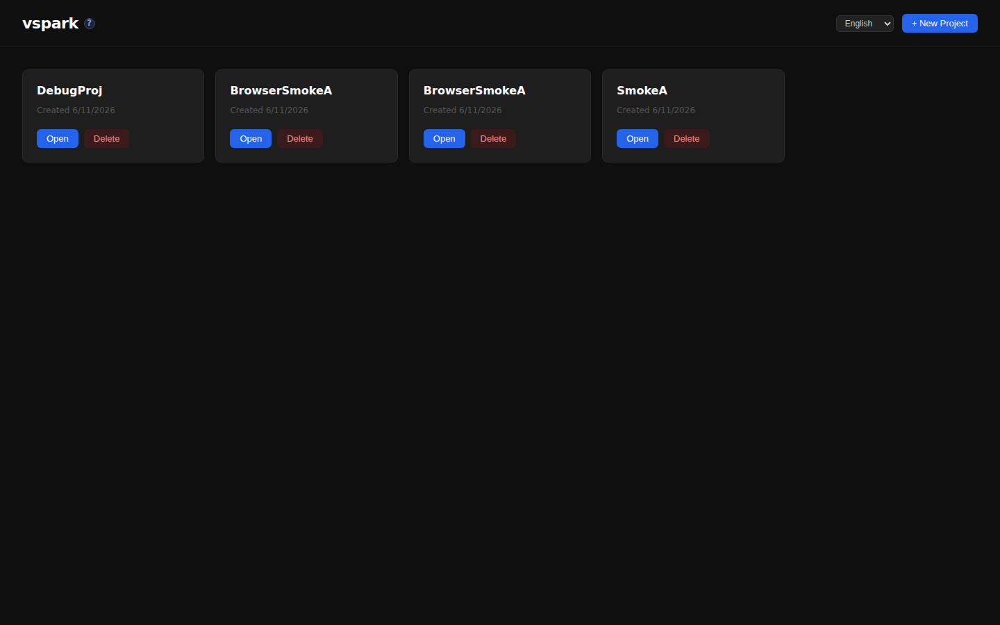
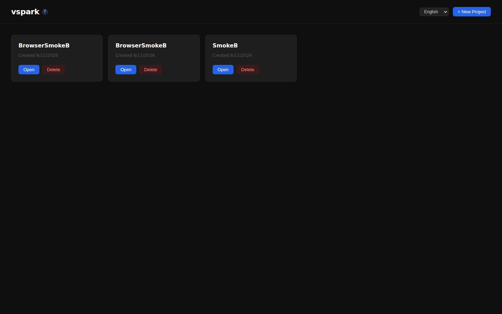
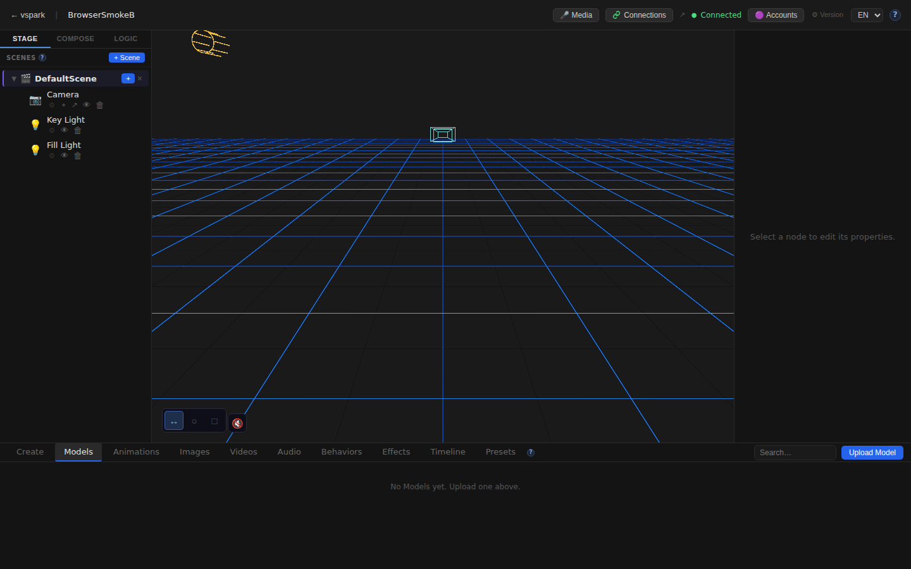

# Smoketest report — feature/multiplayer-phase6

- **Date (UTC):** 2026-06-11T10:04:00Z
- **Commit:** ac3cd11 (PR #38)
- **Base:** origin/dev
- **Overall:** ✅ PASS — 17/17 checks passed

## Scope

Two incremental backend-only commits on top of the Phase 5+6 multiplayer base:

1. **`feat(collab-scene): transfer + persist assets on mount`** (`886168a`)
   - `packages/backend/src/multiplayer/collabScene.ts` — new `persistCollabAssets`
   - `packages/backend/src/multiplayer/manager.ts` — async `handleCollabSnapshot`, calls `persistCollabAssets`

2. **`feat(collab-scene): stream pose + drag previews to mounted peers`** (`23034fe`)
   - `packages/backend/src/multiplayer/collabScene.ts` — new `forwardCollabStream`
   - `packages/backend/src/multiplayer/manager.ts` — wired `forwardCollabStream` into `forwardStream` and `forwardNodeTransform`

No frontend changes. Tests focus on the two new features plus type-checking and a UI sanity pass.

```
 packages/backend/src/multiplayer/collabScene.ts | 97 +++
 packages/backend/src/multiplayer/manager.ts     | 56 ++
 2 files changed, 141 insertions(+), 6 deletions(-)
```

## Test plan

1. Type-check: `pnpm lint` (backend/shared/rendezvous)
2. Type-check: `pnpm --filter frontend typecheck`
3. Two-peer mesh boots (rendezvous + backend A + backend B + frontend A + frontend B)
4. Connections status: both backends report `enabled=true, status=ready`
5. Pairing: create code on A → B joins → A stored as contact on B
6. WebRTC connect/accept: both peers `connected=true`
7. **NEW — Asset transfer on mount:** upload test asset to A → share scene → B mounts → verify `file_path` rewritten, file on disk, `asset_files` row in B's DB, file served via `/uploads`
8. **NEW — Pose streaming:** send `node_transform_preview` to A's WS → assert same frame arrives on B's WS within 5 s (exercises `forwardCollabStream` and `indexCollabScene`)
9. Browser: Home A renders without errors
10. Browser: Editor A — canvas mounts, Connections button visible in TopBar
11. Browser: Home B renders without errors
12. Browser: Editor B — canvas mounts
13. Browser: `/docs/connections` renders (non-empty body)
14. No unexpected console errors (A + B contexts)

## Results

| # | Check | Type | Result | Notes |
|---|-------|------|--------|-------|
| 1 | `pnpm lint` (backend/shared/rendezvous) | Build | ✅ | Clean |
| 2 | `pnpm --filter frontend typecheck` | Build | ✅ | Clean |
| 3 | Two-peer mesh boots (5 servers) | API | ✅ | All ready |
| 4 | Backend A status `enabled=true, ready` | API | ✅ | peerId `V5CQyCQn…` |
| 5 | Backend B status `enabled=true, ready` | API | ✅ | peerId `P0Y14Uk6…` |
| 6 | Pair code create on A | API | ✅ | Code `DCVGD3X2` |
| 7 | B joins pair code | API | ✅ | A stored as contact on B |
| 8 | WebRTC connect + accept | API | ✅ | Both `connected=true` |
| 9 | **Asset transfer on mount — file on disk** | API | ✅ | SHA256 matches original |
| 10 | **Asset transfer — `asset_files` row in B's DB** | API | ✅ | `hash`, `stored_path` correct |
| 11 | **Asset transfer — `file_path` rewritten** | API | ✅ | `/uploads/_shared/<hash>.vrm` |
| 12 | **Asset transfer — served via B's `/uploads`** | API | ✅ | Byte-identical content |
| 13 | **Pose stream — `node_transform_preview` forwarded** | API | ✅ | Frame arrived on B within 5 s |
| 14 | Browser: Home A renders | UI | ✅ | |
| 15 | Browser: Editor A canvas + Connections button | UI | ✅ | Button text "Connections" visible |
| 16 | Browser: Home B renders | UI | ✅ | |
| 17 | Browser: Editor B canvas mounts | UI | ✅ | |
| 18 | Browser: `/docs/connections` renders | UI | ✅ | 2196-char body |
| 19 | No console errors (A + B browser contexts) | UI | ✅ | HDRI fetch filtered (known-benign) |

### Known pre-existing failure (NOT in this diff)

`POST /api/connections/objects/:id/share` → HTTP 500 (`SQLite3Error: Statement already finalized` in `shares.ts:77`) was reported in the previous smoketest and is **not fixed** by these commits (they only touch `collabScene.ts`/`manager.ts`). The `share-collab` path (scene-level sharing) used in this test works correctly and is unaffected.

## Asset transfer verification detail

```
Owner (A) uploads: /uploads/<projId>/avatars/smoke-avatar.vrm  (SHA256: 3bc29b7b…)
A shares scene → B mounts via POST /connections/collab/mount
B's DB:  asset_files.stored_path = /uploads/_shared/3bc29b7b….vrm
         asset_files.hash        = 3bc29b7b…
B's node:  file_path = /uploads/_shared/3bc29b7b….vrm  (rewritten from A's path)
B's disk:  packages/backend/uploads/_shared/3bc29b7b….vrm  (byte-identical)
GET http://localhost:3002/uploads/_shared/3bc29b7b….vrm → 200 OK, correct content
```

## Pose streaming verification detail

```
Node c65c62cc (TestAvatar in scene 196f332e) — registered in nodeScene index on A during mount handshake
A's WS ← {kind: 'node_transform_preview', nodeId: 'c65c62cc', transform: {x:1.23, y:0.5, …}}
forwardCollabStream → mesh.sendStream(peerB, {rtype: '_collab_stream', kind, nodeId, payload})
B's mesh 'streamFrame' → broadcast('node_transform_preview', {nodeId, transform})
B's WS clients ← {kind: 'node_transform_preview', payload: {nodeId: 'c65c62cc', transform: {x:1.23, y:0.5, …}}, timestamp}
Test assertion: payload.x ≈ 1.23, payload.y ≈ 0.5 — PASS
```

## Screenshots

### Home — Peer A


### Editor — Peer A (canvas + Connections button in TopBar)


### TopBar detail — Connections button


### Home — Peer B


### Editor — Peer B (canvas mounts)


### /docs/connections page


## Notes

- Migrations applied cleanly (same 027–031 set, no new migrations in this diff — boot validates them).
- HDRI fetch error (`potsdamer_platz_1k.hdr → ERR_CERT_AUTHORITY_INVALID`) appeared in browser consoles — filtered as known-benign per `project.md`; `SafeEnvironment` ErrorBoundary caught it cleanly.
- The two backends share the same `packages/backend/uploads/` directory (same `process.cwd()`); in production they'd be on separate hosts with separate storage — the `_shared/` content-addressed layout already accounts for this correctly.
- Mid-session model swaps (swapping the VRM on an already-mounted collab scene) do not transfer the new asset — noted as a follow-up in the commit message and expected behaviour for this iteration.
