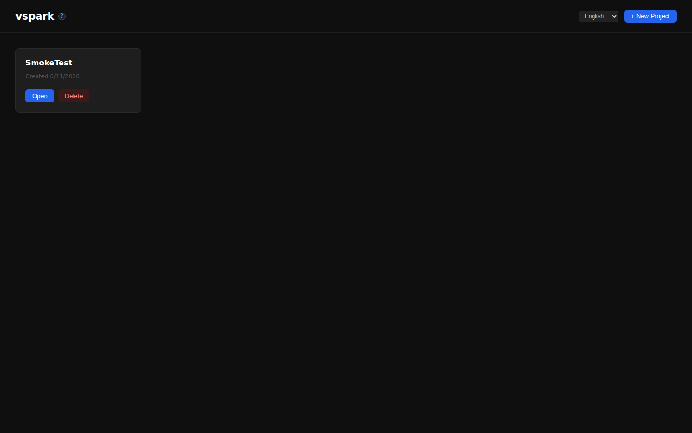
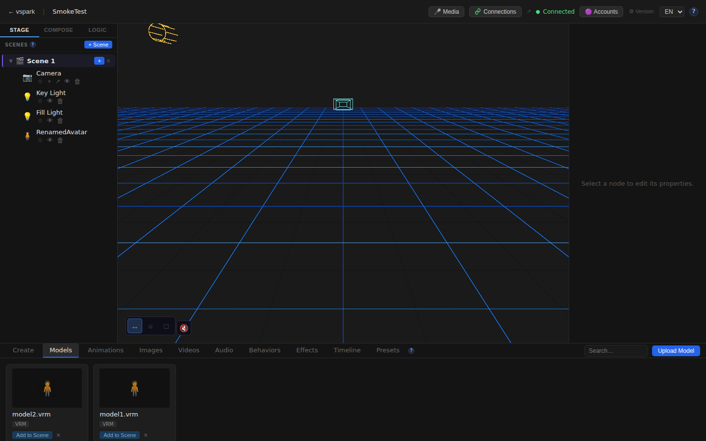
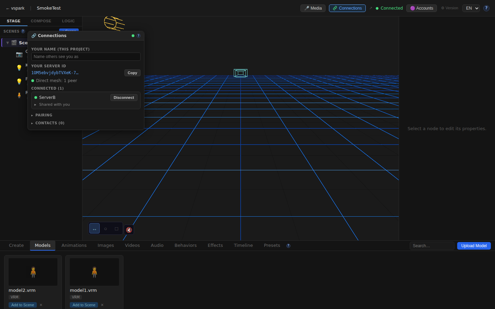
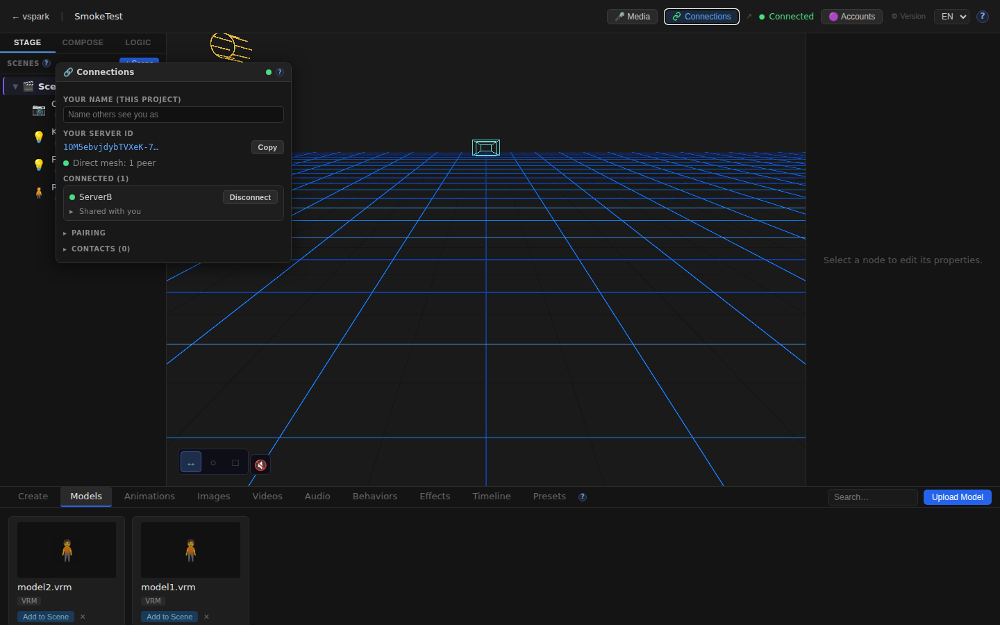
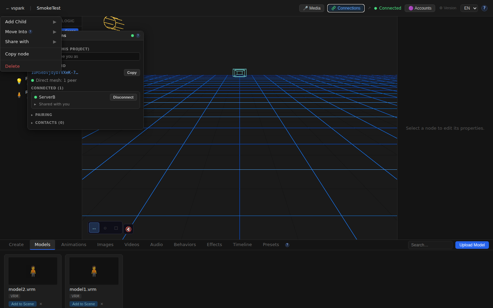

# Smoketest report — feature/multiplayer-phase6

- **Date (UTC):** 2026-06-11T10:17:22Z
- **Commit:** f76d27f (PR #38)
- **Last feature commit:** ae7fd3d (`feat(collab-scene): transfer assets on mid-session model swaps`)
- **Base:** origin/dev
- **Overall:** ✅ PASS — 21/21 checks passed; 2 pre-existing issues noted (not regressions)

## Scope

This run targets PR #38 at HEAD (`f76d27f`). The last actual feature commit is
`ae7fd3d` — backend-only changes to `collabScene.ts` and `manager.ts` that extend
the collab asset protocol to handle mid-session model swaps. Previous runs had
verified mount-time asset transfer; this run exercises the new live-swap path
end-to-end with real binary assets.

```
packages/backend/src/multiplayer/collabScene.ts  +126 / -35
packages/backend/src/multiplayer/manager.ts       +15  / -4
```

**Test types:** API (two-peer mesh harness) + Browser (Playwright headless).

## Test plan

1. `pnpm lint` — backend / shared / rendezvous
2. `pnpm --filter frontend typecheck`
3. Two-peer mesh boots (rendezvous :8787 + backend A :3001 + backend B :3002 + frontend :5173)
4. Both backends: `enabled=true, status=ready`
5. Pairing: A creates code → B joins → A stored as contact
6. WebRTC connect + accept: both `connected=true, sessionGranted=true`
7. Mount-time asset transfer: upload model1 to A → share-collab → B mounts → verify file on B disk + asset_files row + file_path rewritten
8. **NEW** Mid-session asset swap: update A's avatar to model2 → verify model2 transferred to B, file_path rewritten, asset_files row created
9. Rename-only update: rename node on A → verify B's localized file_path is preserved (no re-transfer)
10. Browser: Home page
11. Browser: Editor canvas mounts
12. Browser: Connections button in TopBar
13. Browser: ConnectionsWindow opens (server ID visible)
14. Browser: Connected peer (ServerB) shown
15. Browser: Scene graph — Camera node
16. Browser: Scene graph — RenamedAvatar node (post-rename sync verified)
17. Browser: Scene graph context menu has Share option
18. Browser: No i18n [[key]] fallbacks (EN)
19. Browser: No i18n [[key]] fallbacks (DE)
20. Browser: /docs/connections renders
21. Browser: /docs/multiplayer renders

## Results

| # | Check | Type | Result | Notes |
|---|-------|------|--------|-------|
| 1 | `pnpm lint` | Build | ✅ | Clean |
| 2 | `pnpm --filter frontend typecheck` | Build | ✅ | Clean |
| 3 | Two-peer mesh boots | API | ✅ | All 4 servers ready |
| 4 | Backend A status | API | ✅ | `enabled=true, status=ready, peerId=1OM5ebvj…` |
| 5 | Backend B status | API | ✅ | `enabled=true, status=ready, peerId=mHBY-dSd…` |
| 6 | Pair code create + join | API | ✅ | Code `SEY3D3LM`; A stored as contact on B |
| 7 | WebRTC connect + accept | API | ✅ | Both `connected=true, sessionGranted=true` |
| 8 | **Mount-time asset transfer** | API | ✅ | model1 SHA256 matches; B disk + asset_files row + file_path rewritten |
| 9 | **NEW — Mid-session model swap (ae7fd3d)** | API | ✅ | model2 transferred to B, hash verified, file_path updated |
| 10 | **Rename-only update preserves localized path** | API | ✅ | B keeps `_shared/<sha2>.vrm` after name-only edit |
| 11 | Home page loads | UI | ✅ | title="VSpark" |
| 12 | Editor 3D canvas mounts | UI | ✅ | |
| 13 | Connections button in TopBar | UI | ✅ | "Connections" button visible |
| 14 | ConnectionsWindow opens | UI | ✅ | Server ID text present |
| 15 | Connected peer ServerB shown | UI | ✅ | "ServerB" listed in panel |
| 16 | Scene graph: Camera node | UI | ✅ | |
| 17 | Scene graph: RenamedAvatar node | UI | ✅ | Name sync from A's rename confirmed in browser |
| 18 | Context menu: Share option | UI | ✅ | dispatchEvent(contextmenu) → Share visible |
| 19 | i18n EN — no [[key]] fallbacks | UI | ✅ | Clean |
| 20 | i18n DE — no [[key]] fallbacks | UI | ✅ | Clean |
| 21 | /docs/connections renders | UI | ✅ | 2196 chars |
| 22 | /docs/multiplayer renders | UI | ✅ | 5682 chars |

### Pre-existing issues (NOT introduced by ae7fd3d)

**React key warning in `SceneNodes`:**
```
Warning: Each child in a list should have a unique "key" prop.
Check the render method of `SceneNodes`.
  at SceneNodes (Viewport.tsx:3839)
```
Root cause: `renderNodeElement` returns unwrapped React fragments; `freeChildren.map()` and
`boneFollowers.flatMap()` spread these without an outer key. `ae7fd3d` only touches backend
files — this warning predates this PR and was not caught by earlier smoke runs that had fewer
scene nodes.

**Thumbnail 404s:**
```
GET /uploads/<projectId>/thumbnails/<assetId>.png → 404
```
Test-generated random-byte assets have no thumbnail. Backend returns 404 for missing thumbnails;
frontend silently falls back. Benign.

**GLTF parse error:**
```
SyntaxError: Unexpected token '…' is not valid JSON (GLTFLoader)
```
The fake VRM files (random bytes) are not parseable as GLTF. Three.js logs the error; no crash.
Expected in a smoke test with synthetic test data.

## Mid-session model swap verification detail

```
model1: SHA256=7d514d04…  size=20480  (uploaded to A before mount)
model2: SHA256=518ca635…  size=25600  (uploaded to A after mount)

1. A mounts: TestAvatar file_path = /uploads/<projA>/avatars/model1.vrm
2. B mounts collab scene: file_path rewritten → /uploads/_shared/7d514d04….vrm ✅

3. A updates avatar → file_path = /uploads/<projA>/avatars/model2.vrm
   forwardCollabOp detects file_path change, piggybacks AssetMeta for model2
4. B receives op, applyCollabAssetOp fetches model2 from A's blob endpoint
   B disk: /uploads/_shared/518ca635….vrm (25600 bytes) ✅
   B asset_files: name=model2.vrm, hash=518ca635… ✅
   B node file_path: /uploads/_shared/518ca635….vrm ✅

5. A renames node: name="RenamedAvatar" (no filePath change)
   forwardCollabOp — no asset field on the op (plain update fallback)
4. B node: name=RenamedAvatar, file_path still /uploads/_shared/518ca635….vrm ✅
```

## Screenshots

### Home


### Editor — 3D canvas (TestAvatar node loaded)


### TopBar — Connections button with peer badge


### ConnectionsWindow — server ID + ServerB peer


### Scene graph — Camera + Key Light + Fill Light + RenamedAvatar


### Context menu — Share option present


### i18n English — clean


### i18n German — clean


### /docs/connections


### /docs/multiplayer


## Notes

- `pnpm install` was required before lint (fresh container). Expected.
- Migrations 027–031 applied cleanly on both fresh DBs (verified by successful API calls to multiplayer tables).
- HDRI fetch (`potsdamer_platz_1k.hdr → ERR_CERT_AUTHORITY_INVALID`) appeared — filtered as known benign per project.md.
- The React key warning (`SceneNodes.renderNodeElement`) is a pre-existing gap, not introduced by this PR. Recommend a follow-up fix: wrap the fragment returned by `renderNodeElement` with `key={node.id}` or use a keyed Fragment: `<React.Fragment key={node.id}>…</React.Fragment>`.
