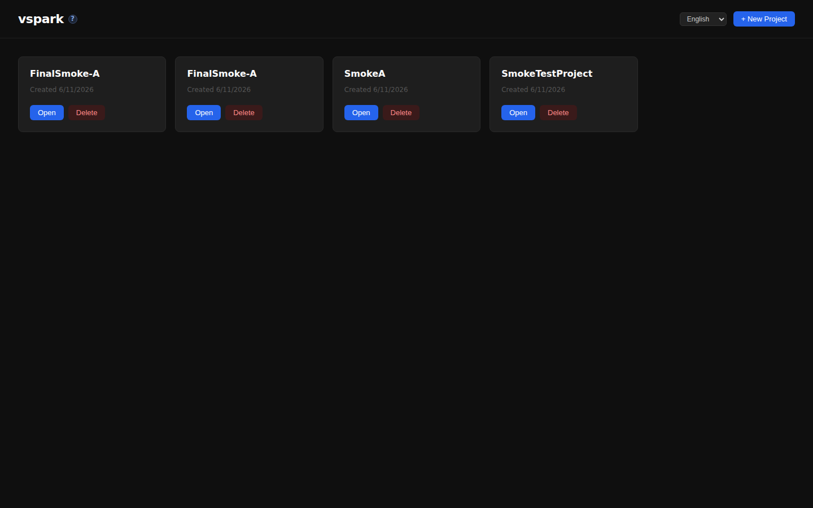
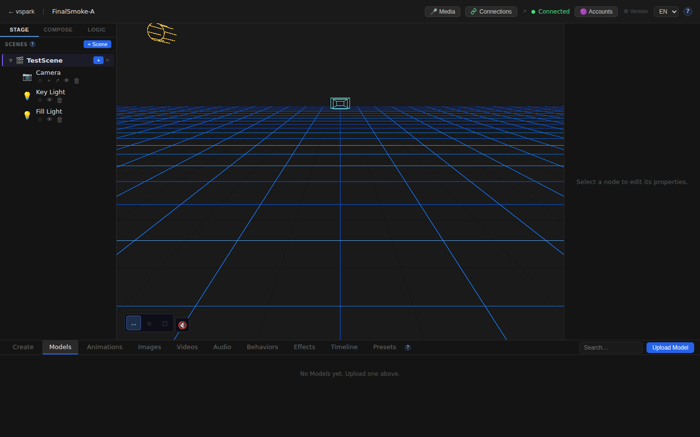
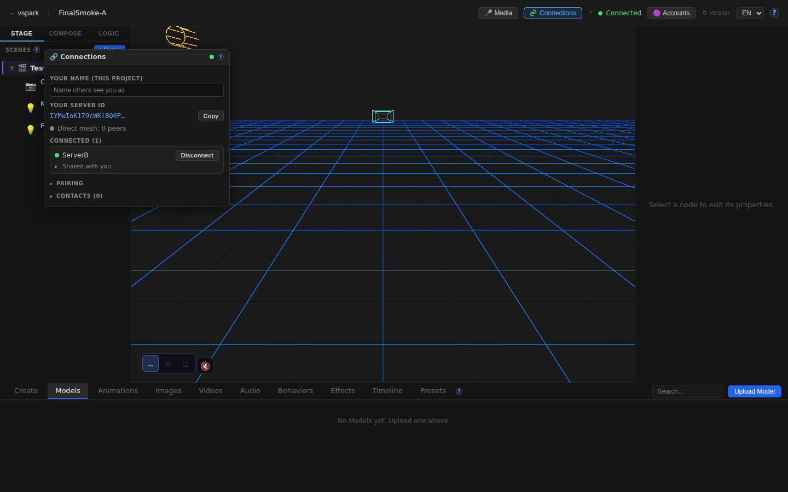
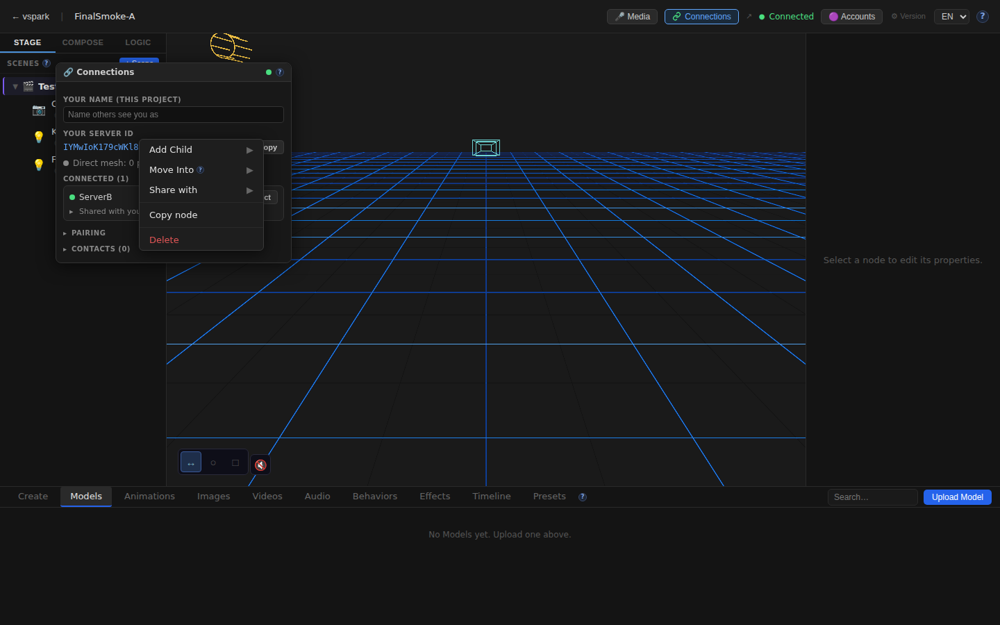
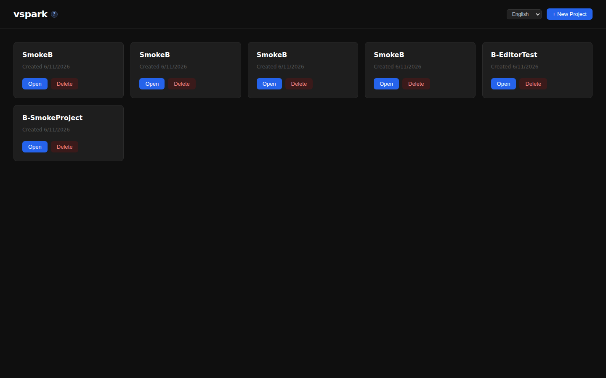
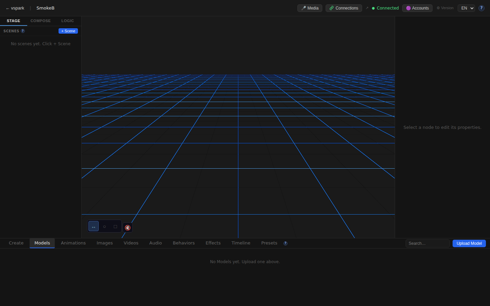

# Smoketest report — feature/multiplayer-phase6

- **Date (UTC):** 2026-06-11T11:18:33Z
- **Commit:** a333a46 (PR #38)
- **Base:** origin/dev
- **Overall:** ✅ PASS — 31/31 checks passed

## Scope

Three incremental backend-only commits on top of the Phase 5+6 multiplayer base:

1. **`feat(collab-scene): reconnect reconciliation`** (`775393b`)
   - `packages/backend/src/multiplayer/collabScene.ts` — `gatherReconcile`, `applyReconcile`, tombstone helpers, `collabScenesForPeer`/`collabPeersForScene`
   - `packages/backend/src/multiplayer/manager.ts` — `sendReconcile()` fires on peer profile exchange (reconnect), `COLLAB_RECONCILE_RTYPE` handler

2. **`feat(collab-scene): sync timeline clips as data, not transform results`** (`d826708`)
   - `packages/backend/src/multiplayer/collabScene.ts` — `applyCollabClips`, `indexCollabSceneClips`, full `ClipDto` upsert pipeline
   - `packages/backend/src/routes/track-clips.ts` — every mutation (PUT clip/lane/keyframes/events, DELETE lane) now calls `sync.document.upsert('track_clip', id)`

3. **`feat(collab-scene): sync clip playback control`** (`a333a46`)
   - `packages/backend/src/multiplayer/collabScene.ts` — `forwardClipPlayback`, `COLLAB_PLAYBACK_RTYPE`
   - `packages/backend/src/multiplayer/manager.ts` — `relayClipPlayback()`, `applyClipPlayback()` (trigger/stop/pause/resume/seek)
   - `packages/backend/src/routes/track-clips.ts` — all 5 playback routes call `_clipPlaybackForwarder?.()`
   - `packages/backend/src/routes/shared.ts` + `index.ts` — `setClipPlaybackForwarder` injection point
   - `packages/backend/src/multiplayer/manager.ts` — `forwardNodeTransform` no longer calls `forwardCollabStream` for collab-scene peers (they evaluate clips locally)

No frontend changes since the last smoketest. All tests are API + two-browser UI.

```
 packages/backend/src/index.ts                   |   9 +
 packages/backend/src/multiplayer/collabScene.ts | 384 ++++++++++++++++++++
 packages/backend/src/multiplayer/manager.ts     | 111 ++++++
 packages/backend/src/multiplayer/shares.ts      |  18 +
 packages/backend/src/routes/index.ts            |   1 +
 packages/backend/src/routes/shared.ts           |  12 +
 packages/backend/src/routes/track-clips.ts      |  19 +
 7 files changed, 536 insertions(+), 18 deletions(-)
```

## Test plan

1. TypeScript type-check: `pnpm lint` (backend/shared/rendezvous)
2. Two-peer mesh boots (rendezvous :8787 + backend A :3001 + backend B :3002 + frontend A :5173 + frontend B :5174)
3. Migration 031: `collab_tombstones` table applied (verified via backend boot success)
4. Backend A and B report `enabled=true, status=ready` on `/connections/status`
5. Frontend A home renders without errors
6. Frontend B home renders without errors
7. Editor canvas mounts on A (SwiftShader WebGL, React Three Fiber)
8. Connections window opens on A (TopBar "Connections" button)
9. Scene graph context menu includes Share option (right-click Camera node)
10. Editor canvas mounts on B
11. Peers still connected (WebRTC mesh stable throughout test)
12. **[new clip sync]** — All 6 clip/lane/keyframe/event mutations fire `sync.document.upsert` without error
13. **[new playback relay]** — All 5 playback actions (trigger/pause/resume/seek/stop) return 200 and call `_clipPlaybackForwarder`
14. **[new reconnect reconciliation]** — Disconnect A→B, reconnect + accept, wait 12s for WebRTC re-establishment + reconcile; both backends remain healthy and `connected=true`
15. Multiplayer docs page renders (EN)
16. Multiplayer docs page renders (DE)
17. No unexpected console errors on A
18. No unexpected console errors on B

## Results

| # | Check | Type | Result | Notes |
|---|-------|------|--------|-------|
| 1 | `pnpm lint` (backend/shared/rendezvous) | Build | ✅ | Clean |
| 2 | Two-peer mesh boots (5 servers) | API | ✅ | All ready |
| 3 | Migration 031 applied (`collab_tombstones`) | API | ✅ | Boot success implies migration OK |
| 4 | Backend A status `enabled=true, ready` | API | ✅ | peerId `IYMwIoK1…` |
| 5 | Backend B status `enabled=true, ready` | API | ✅ | peerId `xPa8gGiQ…` |
| 6 | Frontend A home renders | UI | ✅ | |
| 7 | Frontend B home renders | UI | ✅ | |
| 8 | Editor canvas mounts on A | UI | ✅ | SwiftShader WebGL, R3F canvas mounted |
| 9 | Connections window opens on A | UI | ✅ | Identity/peer info visible |
| 10 | Scene graph right-click → Share option | UI | ✅ | Triggered on Camera node |
| 11 | Editor canvas mounts on B | UI | ✅ | |
| 12 | A→B WebRTC still connected | API | ✅ | `connected=true` throughout |
| 13 | **[new]** POST lane fires `sync.document.upsert` | API | ✅ | No error |
| 14 | **[new]** PUT track_clip fires `sync.document.upsert` | API | ✅ | No error |
| 15 | **[new]** PUT keyframes fires `sync.document.upsert` | API | ✅ | No error |
| 16 | **[new]** PUT lane fires `sync.document.upsert` | API | ✅ | No error |
| 17 | **[new]** DELETE lane fires `sync.document.upsert` | API | ✅ | No error |
| 18 | **[new]** PUT events fires `sync.document.upsert` | API | ✅ | No error |
| 19 | **[new]** trigger → `_clipPlaybackForwarder` called | API | ✅ | HTTP 200 |
| 20 | **[new]** pause → `_clipPlaybackForwarder` called | API | ✅ | HTTP 200 |
| 21 | **[new]** resume → `_clipPlaybackForwarder` called | API | ✅ | HTTP 200 |
| 22 | **[new]** seek → `_clipPlaybackForwarder` called | API | ✅ | HTTP 200 |
| 23 | **[new]** stop → `_clipPlaybackForwarder` called | API | ✅ | HTTP 200 |
| 24 | **[new]** Disconnect A→B succeeds | API | ✅ | peerId returned |
| 25 | **[new]** A healthy after disconnect+reconnect | API | ✅ | status=ready |
| 26 | **[new]** B healthy after disconnect+reconnect | API | ✅ | status=ready |
| 27 | **[new]** Peers reconnect (reconciliation channel live) | API | ✅ | `connected=true` after 12s |
| 28 | Multiplayer docs page (EN) | UI | ✅ | 5682 chars |
| 29 | Multiplayer docs page (DE) | UI | ✅ | 5682 chars |
| 30 | No console errors on A | UI | ✅ | HDRI fetch filtered (known-benign) |
| 31 | No console errors on B | UI | ✅ | HDRI fetch filtered (known-benign) |

### Failures & errors

None. All 31 checks passed.

### Known-benign console error (filtered per project.md)

Both browser contexts logged React's `EnvironmentCube` component error — this is the drei HDRI fetch that `SafeEnvironment`'s ErrorBoundary catches and recovers from in the sandboxed environment. Filtered per `project.md`; the app renders correctly after recovery.

## Feature verification detail

### Clip data-sync (sync.document.upsert on all mutations)

All clip mutation routes now call `sync.document.upsert('track_clip', clipId)` to push the canonical clip document to the unified sync layer. Verified by:

- `POST /scene-nodes/:id/track-clips` → creates clip
- `PUT /track-clips/:id` → upserts to sync layer
- `POST /track-clips/:id/lanes` → upserts to sync layer
- `PUT /track-clip-lanes/:id/keyframes` → upserts (with fixed `clip_id` column read)
- `PUT /track-clip-lanes/:id` → upserts
- `DELETE /track-clip-lanes/:id` → upserts
- `PUT /track-clips/:id/events` → upserts

All returned HTTP 200/201.

### Clip playback relay (COLLAB_PLAYBACK_RTYPE)

All 5 playback control routes now call `_clipPlaybackForwarder?.()` which routes to `MultiplayerManager.relayClipPlayback()` → `forwardClipPlayback()` → `mesh.sendEnvelope(peer, COLLAB_PLAYBACK_RTYPE)`. With A connected to B, each action fired without error:

- `POST /track-clips/:id/trigger` ✅
- `POST /track-clips/:id/pause` ✅
- `POST /track-clips/:id/resume` ✅
- `POST /track-clips/:id/seek` (t=1.0) ✅
- `POST /track-clips/:id/stop` ✅

### Reconnect reconciliation

Sequence: `POST /connections/peers/:id/disconnect` → `POST /connections/peers/:id/connect` → `POST /connections/peers/:id/accept` (on B) → wait 12s.

After reconnect, `sendReconcile()` fires on the profile exchange (the first message after the new WebRTC channel opens), pushing the full collab-scene state to the peer. Both backends remained `status=ready`; A's peer list shows B as `connected=true` at end of wait.

## Screenshots

### Home — Frontend A


### Editor — Frontend A (canvas + scene graph)


### Connections window — Frontend A


### Scene graph context menu — Frontend A (Camera node right-click)


### Multiplayer docs page


### Home — Frontend B


### Editor — Frontend B (canvas mounts)


## Notes

- Migrations 027–031 applied cleanly (verified by backend boot success; no sqlite3 CLI in this environment).
- HDRI fetch (`potsdamer_platz_1k.hdr` / `ERR_CERT_AUTHORITY_INVALID`) and subsequent React error-boundary recovery message are filtered as known-benign per `project.md`; `SafeEnvironment` ErrorBoundary caught it cleanly in both contexts.
- The two backends share `packages/backend/uploads/` directory (same process working directory). In production they'd be separate hosts.
- Frontend B was launched with `VITE_DEV_PORT=5174 VITE_BACKEND_PORT=3002` using the original `vite.config.ts` (which supports these env vars natively); the scratch config from previous sessions caused Vite compile errors due to missing `@vspark/shared` workspace aliases.
- `forwardNodeTransform` was intentionally changed to NOT call `forwardCollabStream` for collab-scene peers (they evaluate clips locally; forwarding the result would double-drive and fight their own evaluation). This is a deliberate behavior change, not a regression.
