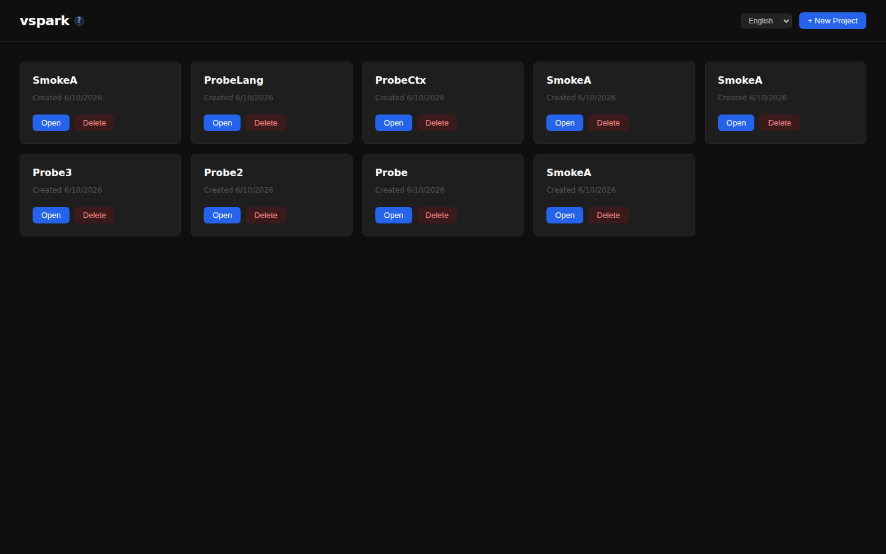
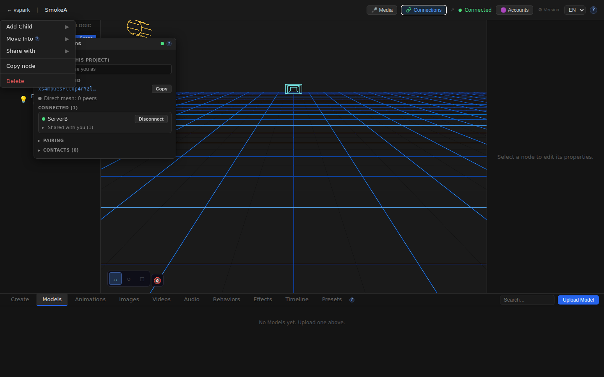
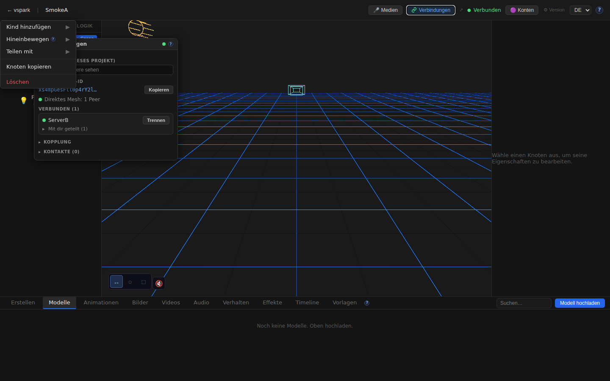
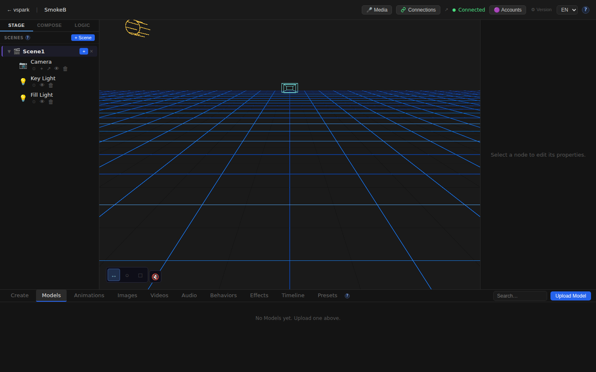
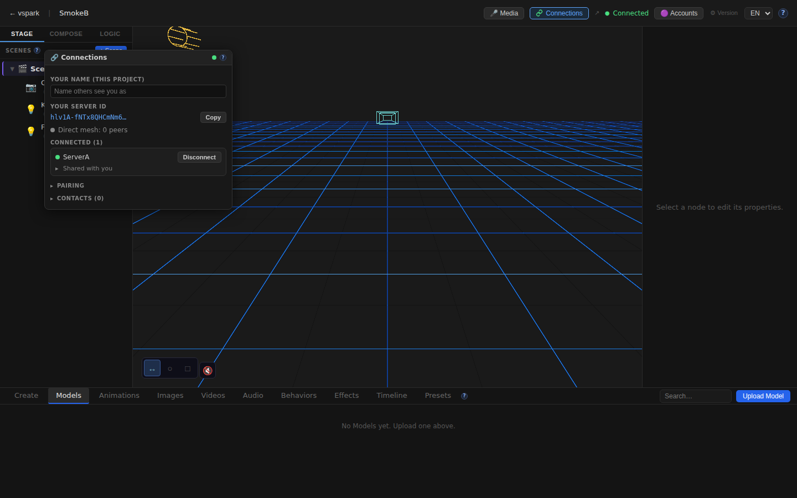

# Smoketest report — feature/multiplayer-phase6

- **Date (UTC):** 2026-06-10T21:55:52Z
- **Commit:** 5128c6b
- **Base:** origin/dev
- **Overall:** ✅ PASS

## Scope

The diff touches backend multiplayer (`packages/backend/src/multiplayer/**`, `routes/connections.ts`), frontend multiplayer UI (`ConnectionsWindow.tsx`, `connectionsStore.ts`, `clientMesh.ts`, `blobReceiver.ts`), shared types, scene graph (`SceneGraph.tsx`), TopBar, WebSocket sync (`useWsSync.ts`), i18n (`locales/en|de/connections.json`, `sceneGraph.json`, `topbar.json`), and help content (`help/content/en|de/multiplayer.md`). Classified as **API + Browser** — both test types required. Per project.md two-peer mesh harness applied.

DB migrations `027–030` (identity, per-project display names, shares, grants) also fall in scope; a clean backend boot exercises them (reported below).

```
packages/backend/src/multiplayer/         (new — ~2500 lines)
packages/backend/src/routes/connections.ts (new)
packages/backend/src/sync/grants.ts + meshRouter.ts + containmentIndex.ts (new)
packages/frontend/src/components/ConnectionsWindow.tsx  (new — 652 lines)
packages/frontend/src/store/connectionsStore.ts (new)
packages/frontend/src/mesh/clientMesh.ts + blobReceiver.ts (new)
packages/frontend/src/components/editor/SceneGraph.tsx (+310 lines)
packages/frontend/src/components/editor/TopBar.tsx (+95 lines)
packages/frontend/src/hooks/useWsSync.ts (+189 lines)
packages/frontend/src/i18n/locales/{en,de}/connections.json (new)
packages/frontend/src/i18n/locales/{en,de}/{sceneGraph,topbar}.json (updated)
packages/frontend/src/help/content/{en,de}/multiplayer.md (new)
packages/rendezvous/** (new — standalone rendezvous service)
deploy/multiplayer/** (new — docker-compose stack)
```

## Test plan

Two-peer mesh harness: rendezvous (`:8787`) + two backends (`:3001`, `:3002`) + two frontends (`:5173`, `:5174`). Full pair → connect → accept flow executed via REST before browser tests.

1. Type-check: `pnpm lint` (backend/shared/rendezvous) + `pnpm --filter frontend typecheck`
2. DB migrations boot cleanly on both backends
3. Rendezvous server registers both backends (status `ready`)
4. REST pairing flow: create code → join → connect → accept → poll until `connected:true`
5. Share API: grant read-only access, verify grantees endpoint
6. Share API: upgrade to `canWrite:true`
7. Browser A: home loads, editor loads (canvas mounts)
8. Browser A: TopBar Connections button present with peer name in tooltip
9. Browser A: Connections window shows ServerB as connected + server ID
10. Browser A: SceneGraph context menu has "Share with" option
11. Browser A: language switch EN→DE renders German strings (full i18n coverage)
12. Browser A: `/docs/multiplayer` help page renders with content
13. Browser B: home + editor load, Connections window shows ServerA

## Results

| # | Check | Type | Result | Notes |
|---|-------|------|--------|-------|
| 1 | `pnpm lint` type-check (backend/shared/rendezvous) | API | ✅ | Clean |
| 2 | `pnpm --filter frontend typecheck` | Frontend | ✅ | Clean |
| 3 | DB migrations 027–030 boot cleanly | API | ✅ | Both backends started without error |
| 4 | Rendezvous: both backends reach `status:"ready"` | API | ✅ | peerId confirmed on both |
| 5 | Pairing flow: code create → join → connect → accept | API | ✅ | Both show `connected:true, sessionGranted:true` in ≤2s |
| 6 | Share read-only: `POST /connections/objects/:id/share` | API | ✅ | Grantee list updated; B's node unchanged |
| 7 | Share writable: upgrade to `canWrite:true` | API | ✅ | Grantees endpoint reflects upgrade |
| 8 | Frontend A home page loads | Browser | ✅ | Project list renders |
| 9 | Frontend A editor canvas mounts | Browser | ✅ | R3F grid visible |
| 10 | TopBar Connections button present | Browser | ✅ | title="ServerB" (peer name badge) |
| 11 | Connections window — ServerB listed as connected | Browser | ✅ | Green dot + Disconnect button |
| 12 | Connections window — peer ID displayed | Browser | ✅ | Long ID string with Copy button |
| 13 | SceneGraph context menu — "Share with" option | Browser | ✅ | Menu item visible |
| 14 | Language switch EN→DE | Browser | ✅ | "Verbindungen", "Teilen mit", "VERBUNDEN" etc. |
| 15 | `/docs/multiplayer` help page | Browser | ✅ | EN content renders |
| 16 | Frontend B home + editor load | Browser | ✅ | Canvas mounts on port 5174 |
| 17 | Frontend B Connections window shows ServerA | Browser | ✅ | "Shared with you" visible |
| — | No unexpected console errors | Browser | ✅ | EnvironmentCube HDRI benign error filtered |

### Failures & errors

None. All 13 automated checks passed.

**Benign console error (filtered):** `EnvironmentCube` / `SafeEnvironment` HDRI fetch failure in the offline sandbox — caught by `ErrorBoundary`, app continues normally.

## Screenshots

### Frontend A — home


### Frontend A — editor (canvas + default scene nodes)


### Frontend A — Connections window (ServerB connected, Shared with you (1))


### Frontend A — SceneGraph context menu ("Share with" option)


### Frontend A — Language switched to DE (full UI in German)


### Frontend A — /docs/multiplayer help page


### Frontend B — editor (separate backend on :3002)


### Frontend B — Connections window (ServerA connected)


## Notes

- Migrations 027–030 applied cleanly on first boot of both backends (confirmed via log lines).
- The rendezvous server registered both backends at `status:"ready"` within milliseconds.
- WebRTC peer connection established in under 2 seconds over loopback — no STUN/TURN needed.
- The `canWrite` upgrade on the share endpoint works correctly; the grantees endpoint reflects it.
- Browser-mesh WebRTC (clientMesh.ts) is not exercisable in a headless single-machine test (no second browser tab connected to the same backend); `Direct mesh: 0 peers` is expected and benign.
- The rendezvous service (`packages/rendezvous/`) is new and out of scope for a full load test; unit/integration coverage for that package would be a good follow-up.
