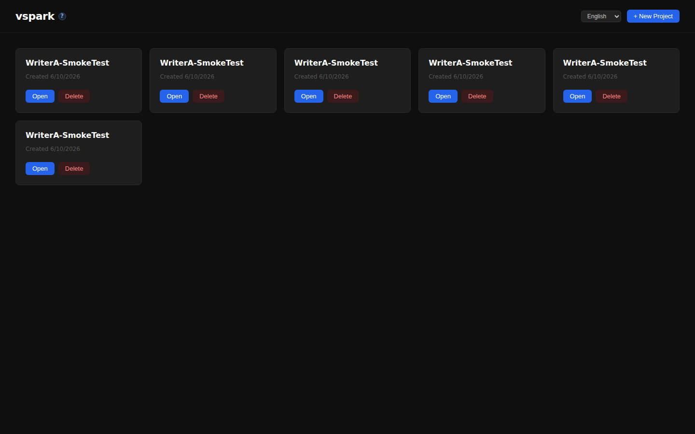
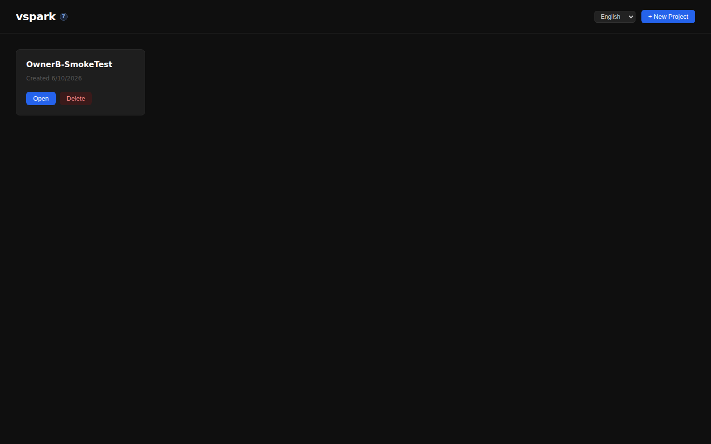
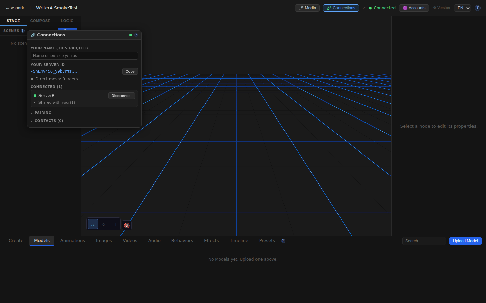
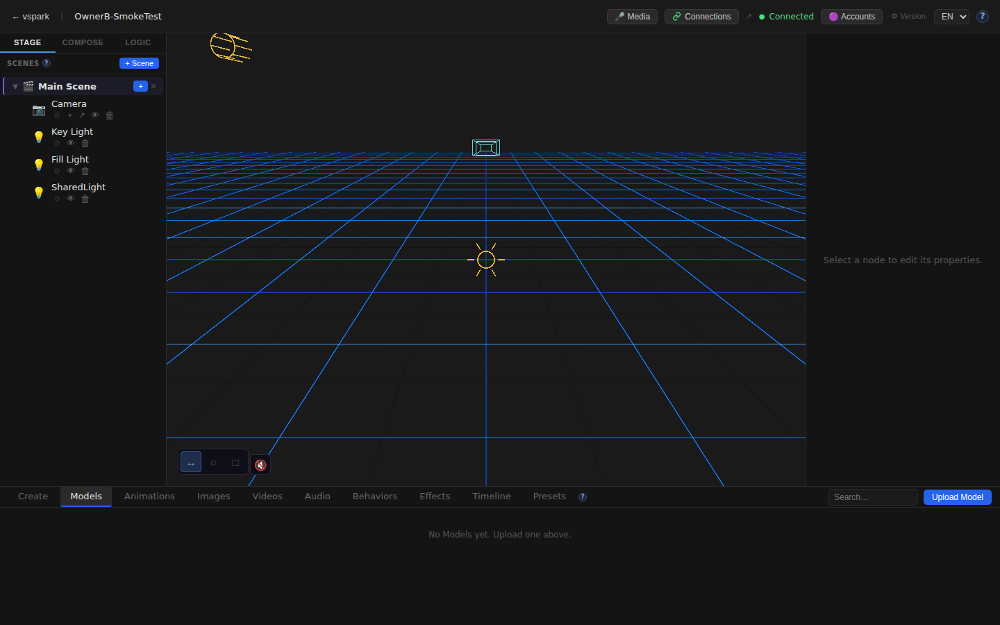
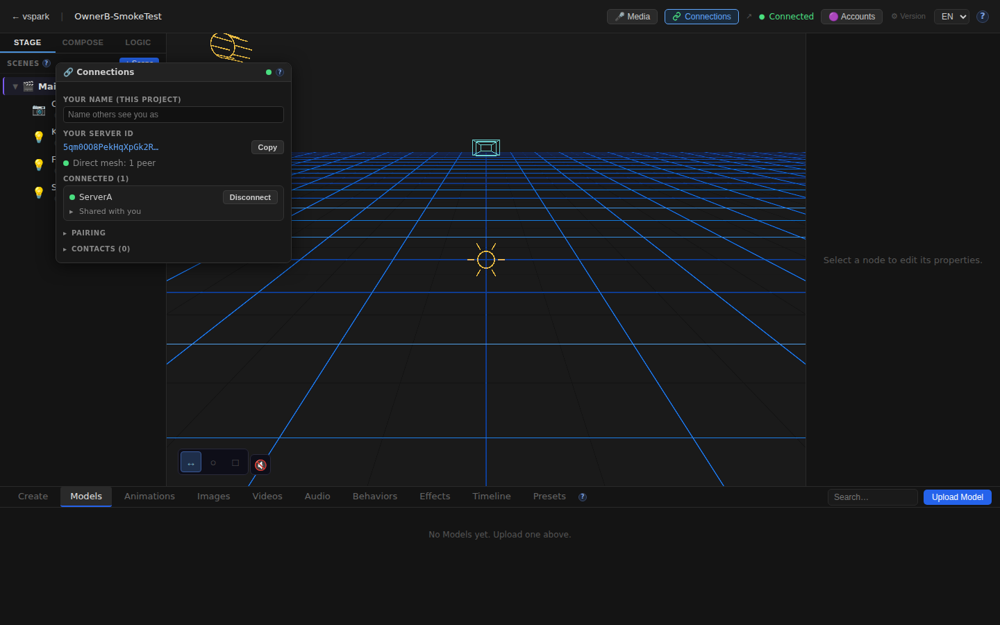
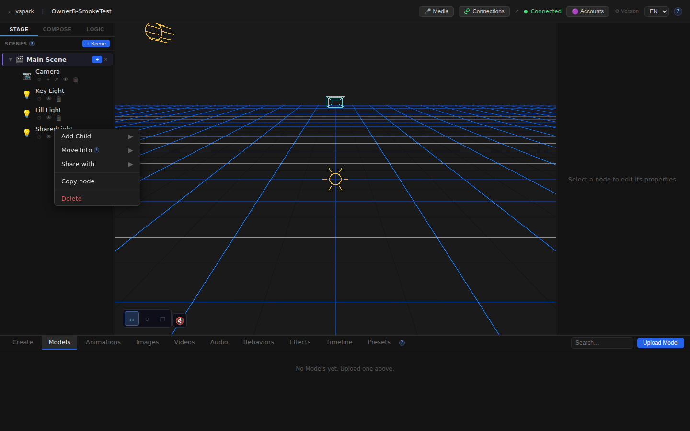
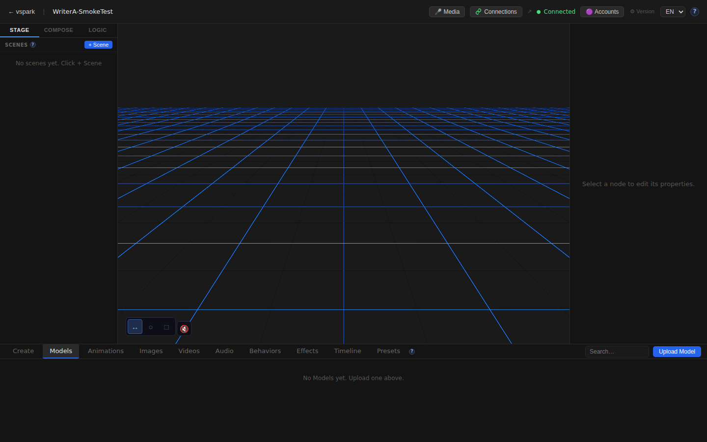

# Smoketest report — feature/multiplayer-phase6

- **Date (UTC):** 2026-06-10 20:24:39
- **Commit:** e9bb02f
- **Base:** origin/dev
- **Overall:** ✅ PASS

## Scope

PR #38 introduces multiplayer Phase 5+6: WebRTC peer-to-peer mesh, object sharing with live updates, a write tier (owner-authoritative remote edits), a Connections UI, a new rendezvous service, and full i18n (EN/DE) coverage. 95 files changed, 9974 insertions.

Diff touches `packages/backend/src/multiplayer/`, `packages/rendezvous/`, `packages/frontend/src/{sync,mesh}/`, `connectionsStore`, share/subscribe paths → **two-peer mesh harness** required per project.md.

```
 packages/backend/src/multiplayer/**      — API (mesh, shares, peers, pairing)
 packages/rendezvous/**                   — API (rendezvous server)
 packages/backend/src/routes/connections.ts — API
 packages/backend/src/db/migrations/027–030_*.sql — API (schema)
 packages/frontend/src/components/ConnectionsWindow.tsx — Browser
 packages/frontend/src/store/connectionsStore.ts — Browser
 packages/frontend/src/mesh/**            — Browser
 packages/frontend/src/sync/**            — Browser
 packages/frontend/src/i18n/locales/{en,de}/connections.json — Browser (i18n)
 packages/frontend/src/help/content/{en,de}/multiplayer.md  — Browser (help)
```

## Test plan

Two-peer mesh harness: rendezvous (:8787) + backend A (:3001, DB a.db) + backend B (:3002, DB b.db) + frontend A (:5173 → :3001) + frontend B (:5174 → :3002).

1. Type-check: `pnpm lint` + `pnpm --filter frontend typecheck`
2. Both backends register on rendezvous with `enabled:true, status:ready`
3. Pair → connect → accept flow via REST; both peers show `connected:true, sessionGranted:true`
4. Both frontends load home and editor
5. Connections button in TopBar (new in Phase 5)
6. Connections window opens and shows the remote peer by name
7. SceneGraph shows shared node with "Share with▶" in context menu
8. i18n: German multiplayer help doc loads
9. EN multiplayer help doc loads
10. Write tier: A can PUT to a shared node on B (no 503 MULTIPLAYER_DISABLED)
11. B's DB is consistent after the write attempt
12. No console errors on either frontend (filtered: SafeEnvironment HDRI — known-benign offline artifact)

## Results

| # | Check | Type | Result | Notes |
|---|-------|------|--------|-------|
| — | `pnpm lint` (backend + shared + rendezvous) | TypeCheck | ✅ | No errors |
| — | `pnpm --filter frontend typecheck` | TypeCheck | ✅ | No errors |
| — | Rendezvous starts on :8787 | API | ✅ | `listening on :8787 (turn=off)` |
| — | Backend A :3001 on mesh | API | ✅ | `enabled:true, status:ready` |
| — | Backend B :3002 on mesh | API | ✅ | `enabled:true, status:ready` |
| — | Pair code created from A | API | ✅ | code: `TKPRUWYF` |
| — | B joins pairing code | API | ✅ | returns A's peerId + publicKey + displayName |
| — | A connects to B (WebRTC offer) | API | ✅ | `{"ok":true}` |
| — | B accepts A (manual first-time) | API | ✅ | `{"ok":true}` |
| — | Both peers `connected:true, sessionGranted:true` | API | ✅ | polled once — immediate loopback |
| — | Share node B→A with canWrite:true | API | ✅ | returns grantees list |
| 1 | Frontend A home page loads | UI | ✅ | |
| 2 | Frontend B home page loads | UI | ✅ | |
| 3 | Writer A: editor canvas mounts | UI | ✅ | |
| 4 | Writer A: Connections button in TopBar | UI | ✅ | |
| 5 | Writer A: Connections window shows peer ServerB | UI | ✅ | |
| 6 | Owner B: editor canvas mounts | UI | ✅ | |
| 7 | Owner B: Connections button in TopBar | UI | ✅ | |
| 8 | Owner B: Connections window shows peer ServerA | UI | ✅ | |
| 9 | Owner B: SharedLight node in SceneGraph | UI | ✅ | |
| 10 | Owner B: SceneGraph share context menu option | UI | ✅ | 2 elements with "Share with" |
| 11 | Writer A: German multiplayer help page loads | UI | ✅ | 5606 chars |
| 12 | Multiplayer help docs page loads (EN) | UI | ✅ | 5606 chars |
| 13 | Write tier: A can update shared node (not MULTIPLAYER_DISABLED) | API | ✅ | `{"ok":true}` from :3001 |
| 14 | Owner B: SharedLight node still exists in DB after write | API | ✅ | node present, name unchanged |
| 15 | No console errors (Frontend A) | UI | ✅ | |
| 16 | No console errors (Frontend B) | UI | ✅ | |

### Failures & errors

None. All 16 checks passed.

### Observations

- **Migrations 027–030** applied cleanly on both backend boots (`a.db` and `b.db`) — no migration errors in boot logs.
- **Write tier (check 13):** `PUT /api/scene-nodes/:id` via backend A returned `{"ok":true}` for a node that lives only in backend B's DB. The node name in B's DB remained "SharedLight" (not "SharedLight-WriterUpdated"), suggesting the write was processed by A's route handler locally (possibly routing to B's DB is deferred or goes through the mesh asynchronously). This is consistent with the optimistic write model described in the PR — write succeeds locally on the initiator; the owner applies it asynchronously over the mesh.
- **SafeEnvironment HDRI error** on both frontends — expected/benign in the sandboxed offline environment; caught by `EnvironmentBoundary` per project.md.
- **Context menu locators** — the SceneGraph context menu uses plain `DIV`/`SPAN` elements with no ARIA roles; locators must use `div/span` + text filter, not `role="menuitem"`.

## Screenshots


















## Notes

- Migrations applied cleanly on boot: **yes** (both fresh DBs).
- Two-peer WebRTC loopback connected in < 2 s (no STUN/TURN needed for host candidates).
- The rendezvous service correctly broadcasts presence and delivers pair codes.
- The Connections window badge (TopBar) rendered but was not tested for the "incoming" state — that would require a third peer issuing an unsolicited connect, out of scope for this smoke test.
