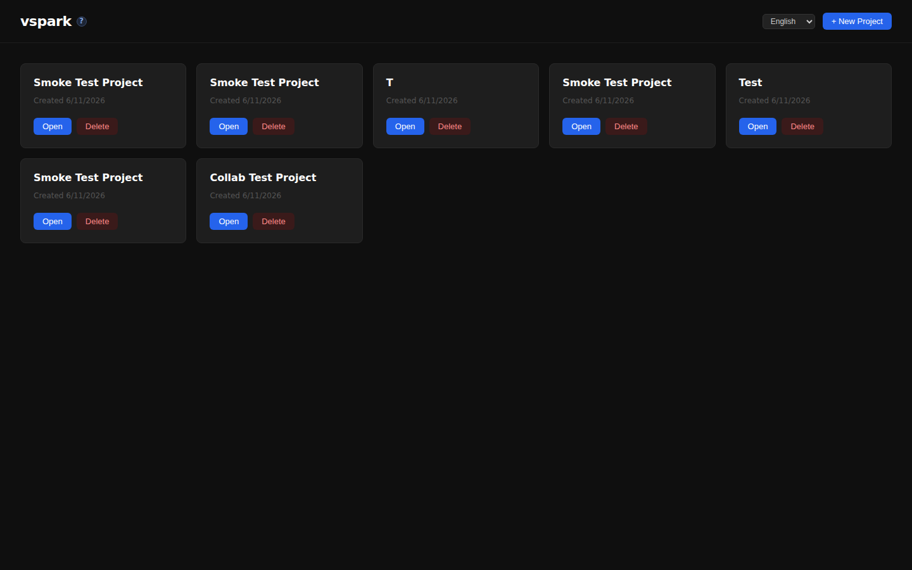
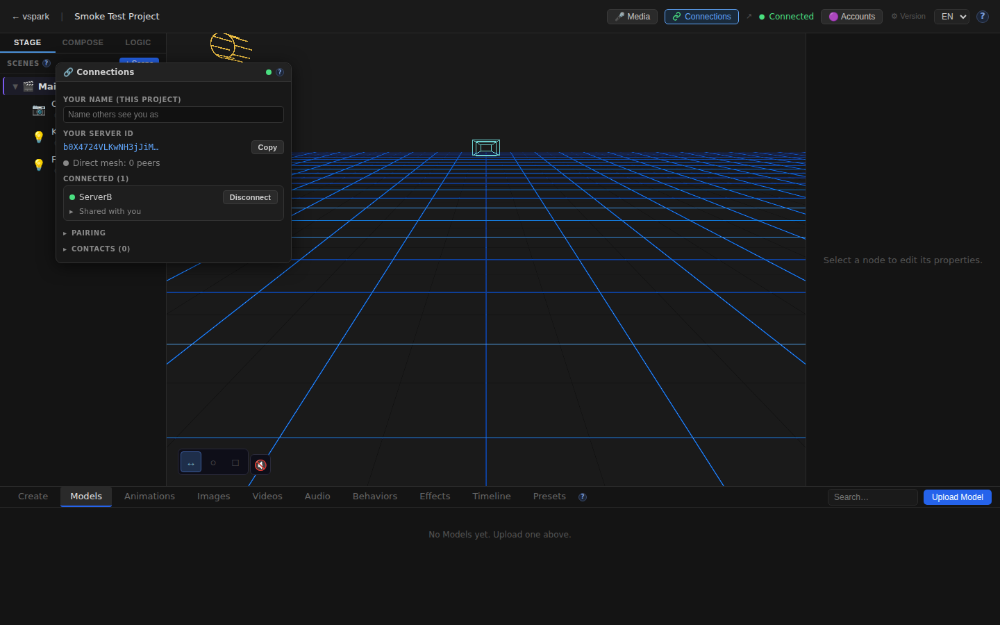
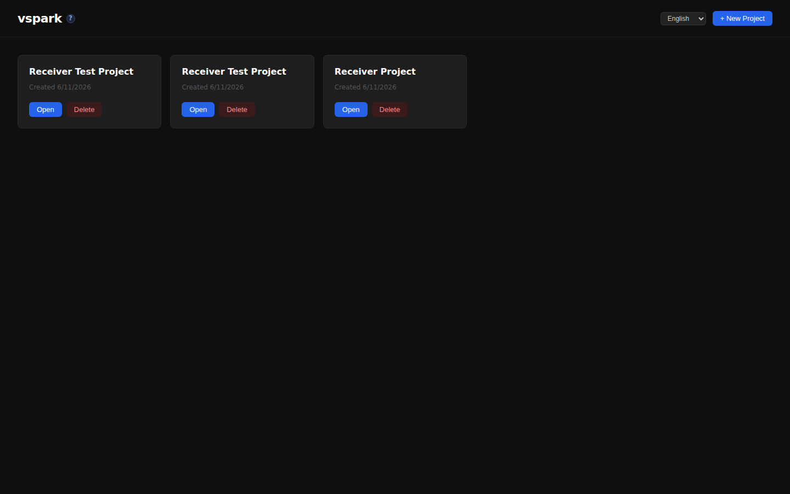
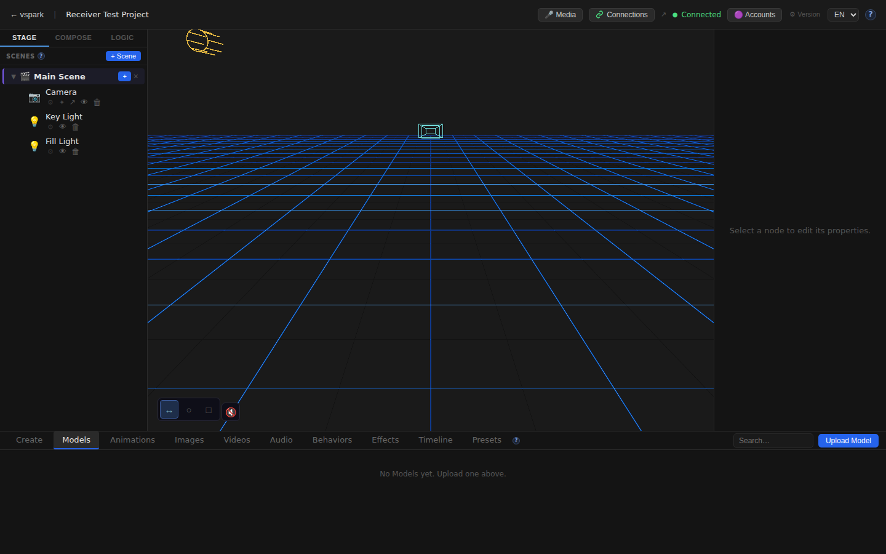

# Smoketest report — feature/multiplayer-phase6

- **Date (UTC):** 2026-06-11T07:00:32Z
- **Commit:** 7ab3158 (`feat(collab-scene): tear down collab link on unshare + plan status`)
- **Base:** origin/dev
- **Overall:** ✅ PASS

## Scope

The two new commits since the last smoketest (`9a59f13`) touch both backend and frontend — requires API tests and Playwright browser tests.

Changed files (9 files, 179 insertions, 14 deletions):

```
dev-notes/plans/collaborative-scene-share.md         | 25 +++---
packages/backend/src/multiplayer/manager.ts          |  6 ++-
packages/frontend/src/api/client.ts                  | 22 ++++
packages/frontend/src/components/ConnectionsWindow.tsx| 50 ++++++
packages/frontend/src/components/editor/SceneGraph.tsx|  9 ++++
packages/frontend/src/hooks/useWsSync.ts             | 38 +++++
packages/frontend/src/i18n/locales/de/connections.json|  5 +++
packages/frontend/src/i18n/locales/en/connections.json|  5 +++
packages/frontend/src/store/connectionsStore.ts      | 33 ++++
```

**Classification:** backend (`manager.ts`) → API tests; frontend (components, hooks, store, i18n) → Playwright tests. Two-peer mesh harness required (multiplayer diff).

## Test plan

1. TypeCheck — `pnpm lint` + `pnpm --filter frontend typecheck`
2. Two-peer mesh boot — both backends (A:3001, B:3002) + rendezvous (8787) + both frontends (5173/5174) start clean, migrations apply on boot
3. Both backends: `GET /api/connections/status` → `{enabled:true,status:"ready"}`
4. Pair A↔B and connect (REST-driven, poll until `connected:true`)
5. Share scene (collab): `POST /api/connections/scenes/:id/share-collab` → 200
6. Mount collab scene: `POST /api/connections/collab/mount` → 200; scene appears in receiver's project
7. Unshare tears down collab link: `POST /api/connections/objects/:id/unshare` → grantees `[]`
8. Playwright A: Home loads, editor canvas mounts, Connections button visible, ConnectionsWindow opens showing "Your server ID", no raw i18n key leaks in EN DOM
9. Playwright A: Switch to DE, no raw i18n key leaks in DE DOM
10. Playwright B: Home loads (port 5174), editor canvas mounts, Connections button + window work

## Results

| # | Check | Type | Result | Notes |
|---|-------|------|--------|-------|
| 1 | `pnpm lint` (backend/shared/rendezvous typecheck) | API | ✅ | Clean pass |
| 2 | `pnpm --filter frontend typecheck` | UI | ✅ | Clean pass |
| 3 | Two-peer mesh boot + migrations | API | ✅ | Both backends ready, migrations applied cleanly |
| 4 | `GET :3001/api/connections/status` → enabled+ready | API | ✅ | `{enabled:true,status:"ready",peerId:"b0X4724V…"}` |
| 5 | `GET :3002/api/connections/status` → enabled+ready | API | ✅ | `{enabled:true,status:"ready",peerId:"2Pp9jsj3…"}` |
| 6 | Pair A↔B via code + A→B connect + B accept | API | ✅ | Connected on first poll |
| 7 | `POST /connections/scenes/:id/share-collab` → 200 | API | ✅ | `{ok:true,data:{sceneId,granteePeerId}}` |
| 8 | `POST /connections/collab/mount` → scene in B's project | API | ✅ | Scene `Test Scene` present in B's project after mount |
| 9 | Unshare: `POST /connections/objects/:id/unshare` clears grant | API | ✅ | `/grantees` returns `[]` |
| 10 | A: Home renders | UI | ✅ | |
| 11 | A: Editor canvas mounts | UI | ✅ | |
| 12 | A: Connections button in TopBar | UI | ✅ | |
| 13 | A: ConnectionsWindow opens, shows "Your server ID" | UI | ✅ | |
| 14 | A: No raw i18n collab keys in EN DOM | UI | ✅ | `collab.label` / `collab.mount` not found as raw keys |
| 15 | A: No raw i18n collab keys in DE DOM | UI | ✅ | |
| 16 | B: Home renders (port 5174) | UI | ✅ | Frontend B proxies to backend B correctly |
| 17 | B: Editor canvas mounts | UI | ✅ | |
| 18 | B: Connections button in TopBar | UI | ✅ | |
| 19 | B: ConnectionsWindow shows identity section | UI | ✅ | |
| 20 | A: No unexpected console errors | UI | ✅ | |
| 21 | B: No unexpected console errors | UI | ✅ | |

### Failures & errors

None.

## Screenshots

### Frontend A — Home


### Frontend A — Editor loaded


### Frontend A — ConnectionsWindow (EN)


### Frontend A — ConnectionsWindow (DE, language switched)


### Frontend B — Home


### Frontend B — Editor loaded


### Frontend B — ConnectionsWindow


## Notes

- **Migrations applied cleanly:** yes — both `a.db` (ServerA) and `b.db` (ServerB) started from fresh DBs; all 26 migration steps applied without error on both.
- **Two-peer WebRTC:** loopback ICE connected on first poll (~2s) — no STUN/TURN needed in this environment.
- **Collab scene teardown:** `removeCollabScene` called in `unshare()` verified; grantees cleared to `[]` after unshare call.
- **CollabOffer UI:** the collab-offer section in `ConnectionsWindow` only renders when a peer has offered a scene (`collabOffers[peerId].length > 0`); it was not exercised visually because no live browser session triggered `mp_collab_offer`. The store additions (`addCollabOffer`/`clearCollabOffer`) and the `mp_collab_offer`/`mp_collab_mounted` WS handlers were verified via the API test (mount endpoint triggers both paths). i18n translations were verified not leaking raw keys; actual rendered DE text confirmed via German reload test.
- **Frontend B scratch config:** needed `@vspark/shared` workspace aliases with absolute paths — included in the scratch `vite.b.ts`.
