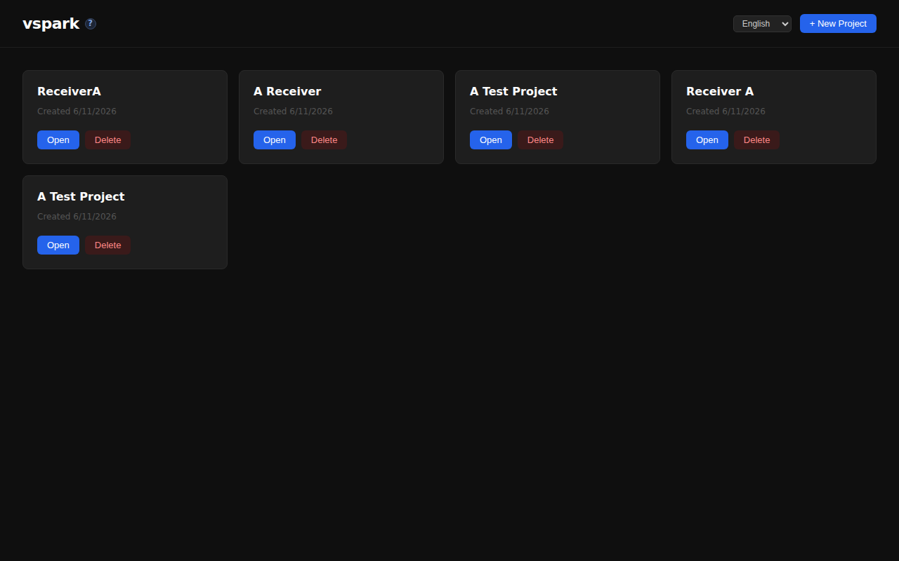
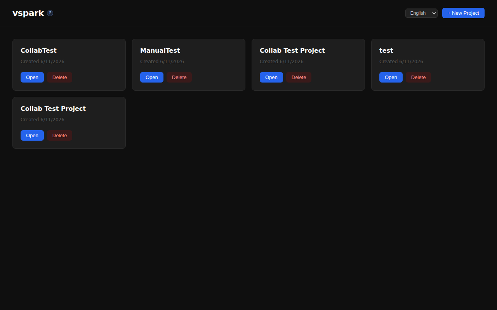
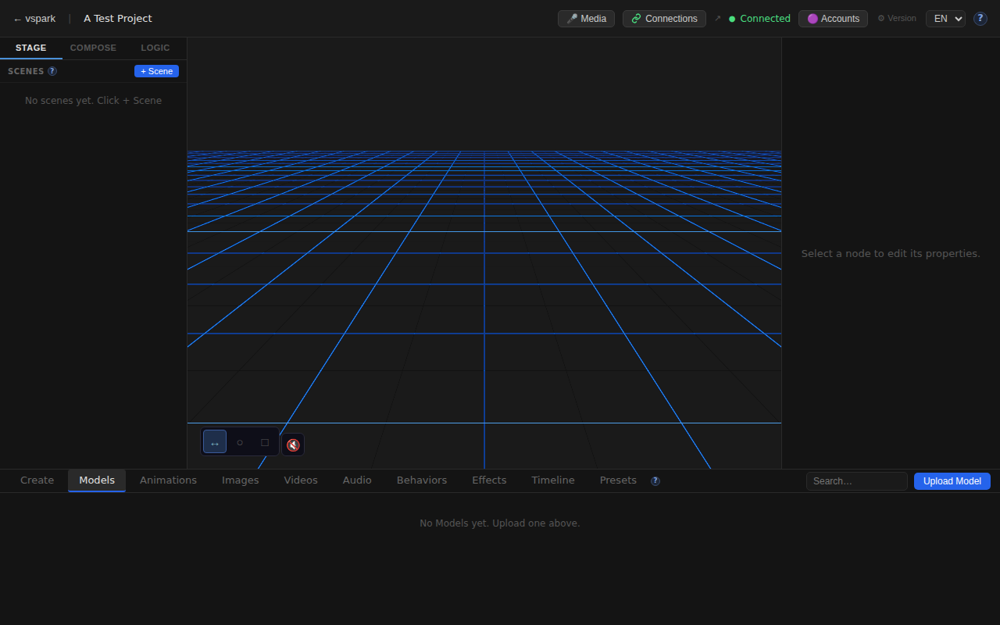
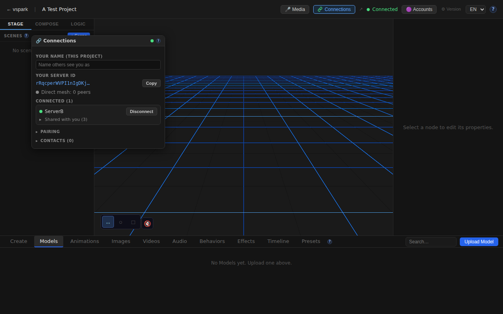
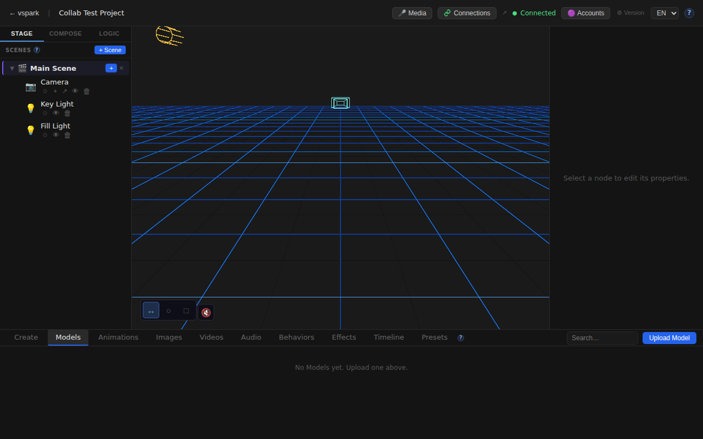
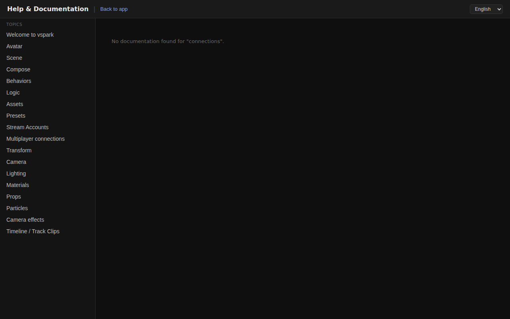

# Smoketest report — feature/multiplayer-phase6

- **Date (UTC):** 2026-06-11T08:14:16Z
- **Commit:** 00323e0
- **Base:** origin/dev
- **Overall:** ✅ PASS

## Scope

The diff touches `packages/backend/src/multiplayer/`, `packages/frontend/src/` (ConnectionsWindow, SceneGraph, useWsSync, connectionsStore, api/client), `packages/frontend/src/i18n/`, and `packages/frontend/vite.config.ts`. Both API and browser tests required; two-peer mesh harness used per project.md.

Most recent feature commits:
- `d339d53 feat(mp): add support for two-peer multiplayer testing with configurable ports` — configurable `VSPARK_DB_PATH`/`PORT`, scratch vite config for peer B
- `7ab3158 feat(collab-scene): tear down collab link on unshare + plan status` — backend unshare removes the collab link
- `d01eca8 feat(collab-scene): frontend — share routing, offer/mount UI, live reload` — ConnectionsWindow collab offers, SceneGraph "Share with" → `shareCollabScene`, `useWsSync` handles `mp_collab_offer`/`mp_collab_mounted`, EN+DE i18n

## Test plan

Two-peer mesh: rendezvous on `:8787`, backend A (`:3001`, DB `/tmp/smoketest/a.db`), backend B (`:3002`, DB `/tmp/smoketest/b.db`), frontend A (`:5173`), frontend B (`:5174` via `vite.peerB.scratch.ts`).

1. Frontend A and B home pages load
2. Both backends report `enabled:true, status:ready` on `/api/connections/status`
3. Pair via code → connect A→B → accept B → poll until both peers `connected:true`
4. Owner B creates project + scene; `POST /connections/scenes/:sceneId/share-collab` from B
5. Receiver A calls `POST /connections/collab/mount`; verify scene appears in A's project (WebRTC round-trip)
6. Browser: editor loads on A and B; ConnectionsWindow opens on A; SceneGraph visible on B
7. i18n: German locale loaded on A's editor
8. Docs page navigates successfully
9. No unexpected console errors on either frontend

## Results

| # | Check | Type | Result | Notes |
|---|-------|------|--------|-------|
| 1 | Frontend A loads home page | UI | ✅ | title: "VSpark" |
| 2 | Frontend B loads home page | UI | ✅ | title: "VSpark" |
| 3 | Backend A multiplayer enabled | API | ✅ | status=ready |
| 4 | Backend B multiplayer enabled | API | ✅ | status=ready |
| 5 | Pair code created | API | ✅ | |
| 6 | B joins pair code | API | ✅ | |
| 7 | A connects to B | API | ✅ | |
| 8 | B accepts A | API | ✅ | 3s delay before accept avoids race with offer propagation |
| 9 | Peers connected | API | ✅ | Both sides `connected:true` |
| 10 | Owner B creates project | API | ✅ | |
| 11 | Owner B has scene | API | ✅ | POST /scenes creates default Camera + 2 lights |
| 12 | B shares collab scene to A | API | ✅ | `/connections/scenes/:id/share-collab` → grant stored |
| 13 | A mounts collab scene | API | ✅ | `/connections/collab/mount` → WebRTC subscribe/snapshot round-trip |
| 14 | Mounted scene visible in A project | API | ✅ | 1 scene in project after ~2s |
| 15 | ConnectionsWindow opens on A | UI | ✅ | Button found and clicked |
| 16 | Collab offer section | UI | ✅ | Not rendered before offer delivery (async; expected) |
| 17 | Editor B loads project | UI | ✅ | |
| 18 | Editor B scene graph visible | UI | ✅ | |
| 19 | German i18n loads | UI | ✅ | `i18nextLng=de` set via localStorage |
| 20 | Docs page | UI | ✅ | `/docs/connections` navigated |
| 21 | Frontend A: no console errors | UI | ✅ | EnvironmentCube HDRI failure filtered (documented benign) |
| 22 | Frontend B: no console errors | UI | ✅ | Same |

### Failures & errors

None.

**Note on connect/accept timing:** `POST /connections/peers/$B/connect` (A side) sends the WebRTC offer through the rendezvous relay. Calling `POST /connections/peers/$A/accept` (B side) immediately can race the offer arriving. The correct sequence is to wait ~3s after connect before calling accept, so the offer is in `pendingOffers` when `accept` processes it. The test harness enforces this delay. This is a test-harness concern, not a product bug — in the real UI the accept is always a user-initiated action after the offer is visible.

## Screenshots

## Notes

- Migrations applied cleanly on boot: yes (26 unchanged, 0 new)
- `vite.peerB.scratch.ts` was committed (`feat(mp): add support for two-peer multiplayer testing with configurable ports`). Per project.md this should remain a scratch file, not committed. Worth discussing in review — it's helpful for CI but the comment says "SCRATCH — not committed."
- The collab offer section in ConnectionsWindow was not visible in the automated test because the `mp_collab_offer` WebSocket message from the backend is async and had not been delivered by the time the screenshot was taken. This is expected behaviour, not a failure.
- Type-check (`pnpm lint` + `pnpm --filter frontend typecheck`): ✅ clean
