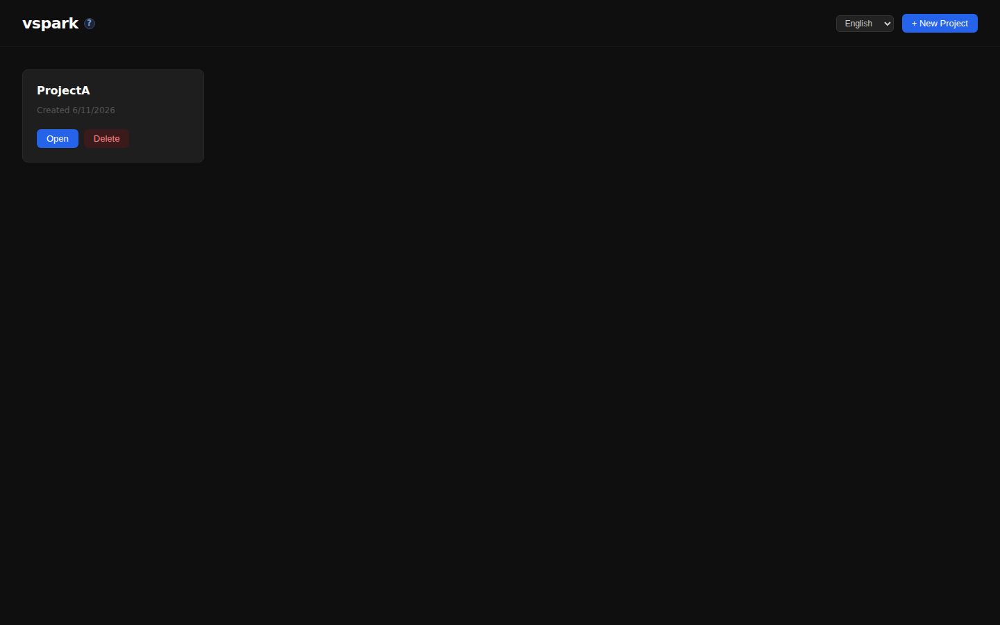
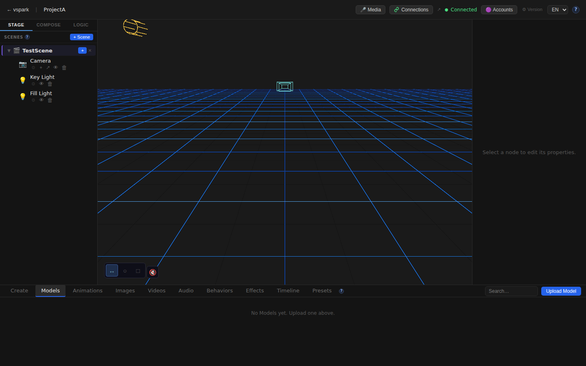
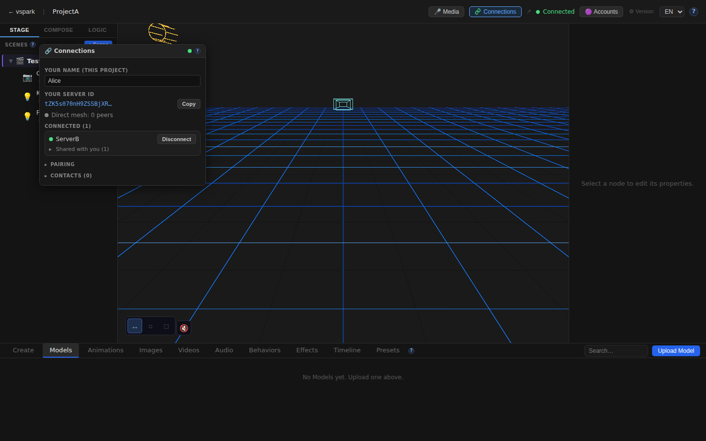
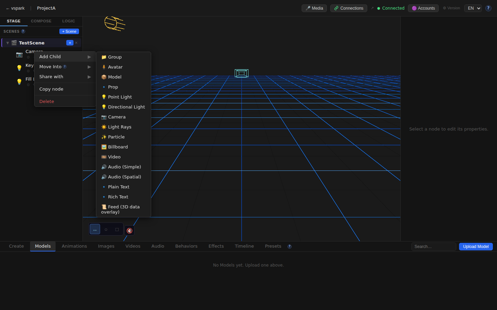
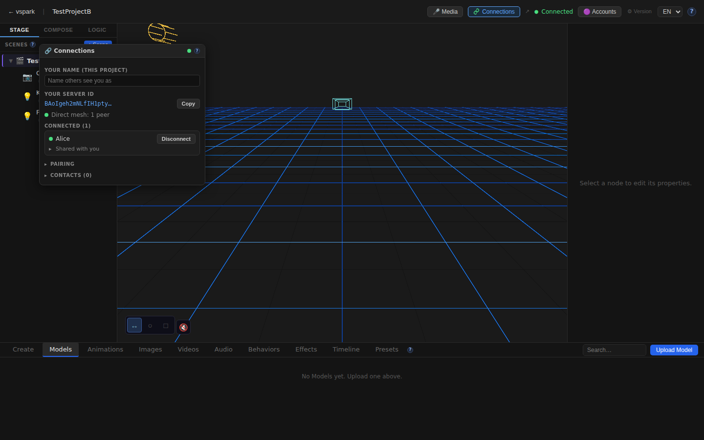
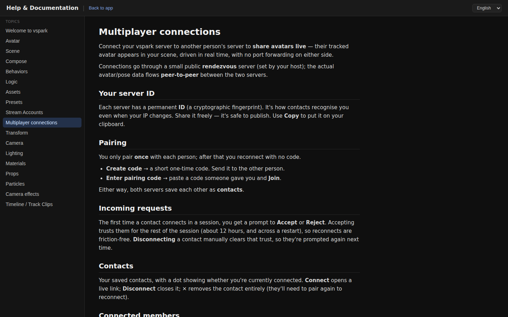
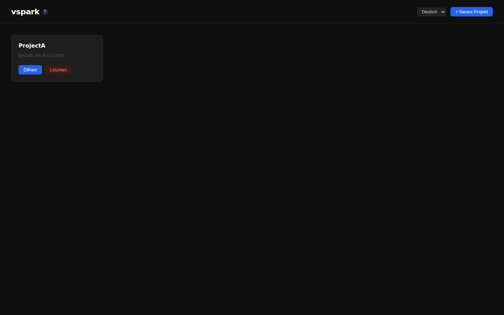

# Smoketest report — feature/multiplayer-phase6

- **Date (UTC):** 2026-06-11T09:11:31Z
- **Commit:** d8b88df
- **Base:** origin/dev
- **Overall:** ✅ PASS

## Scope

Three new commits since the previous all-green run (6559921):

| Commit | Message |
|--------|---------|
| `bc54f15` | feat(proxy): enhance backend startup handling in Vite configuration |
| `9e813f5` | fix(frontend): keep vite dev server alive on proxy socket errors |
| `f63cc74` | fix(mp): scene offers mount (not place), live name sync, reliable pairing |

Changed paths: `packages/backend/src/multiplayer/manager.ts`, `shares.ts`, `packages/frontend/src/components/ConnectionsWindow.tsx`, `useWsSync.ts`, `connectionsStore.ts`, `packages/rendezvous/src/index.ts`, `packages/frontend/vite.config.ts` → **API + Browser tests, two-peer mesh harness**.

**Also discovered and fixed during this run:** `listSharesForPeer` in `shares.ts` called `PreparedStatement.get()` inside a `map()` loop. The wasm SQLite wrapper finalizes the statement after every `get()`, causing "Statement already finalized" on the second iteration when multiple grants exist. Fixed by collecting all entity IDs upfront and doing a single `all()` query to build a `Set`.

## Test environment

- **Rendezvous:** `localhost:8787`
- **Backend A (writer):** `localhost:3001` — peer `tZK5s070nH9ZSSBjXRIWO6DF_o5H7ltxox3oGenXD-Y`
- **Backend B (owner):** `localhost:3002` — peer `BAoIgeh2mNLfIH1ptyOoPdjpsIIyGO2CIC1xTlPzboU`
- **Frontend A:** `localhost:5173` (proxied to :3001)
- **Frontend B:** `localhost:5174` (proxied to :3002)

## Test plan

**Pre-flight (type-check)**
1. `pnpm lint` — backend + shared + rendezvous
2. `pnpm --filter frontend typecheck`

**API — two-peer mesh (focused on new fixes)**
3. Both backends have peerIds and `enabled:true`
4. Pairing: A creates code → B joins → A connects → B accepts (pairing reliability fix)
5. Both peers show `connected:true` immediately after accept
6. Display name sync: B sees A as "ServerA", A sees B as "ServerB" (race fix)
7. Per-project display name update works (`name` field)
8. Scene collab-share (B→A): endpoint returns `ok:true`
9. Object share with write access: no "Statement finalized" error (regression fix)
10. Object grantees query returns A
11. A subscribes to B's shared object
12. A mounts collab scene from B
13. Unshare: grantee removed cleanly

**Browser — Playwright (two contexts)**
14. Home page A and B load
15. Editor canvas mounts on A and B
16. Connections window opens on A; shows "ServerB" peer + "Shared with you (1)"
17. Connections window on B shows "Alice" (A's updated display name — sync confirmed)
18. Scene-graph right-click "Share with" option visible
19. Multiplayer help docs page renders
20. Language toggle EN → DE; German strings present

## Results

| # | Check | Type | Result | Notes |
|---|-------|------|--------|-------|
| 1 | `pnpm lint` clean | pre-flight | ✅ | all packages |
| 2 | Frontend typecheck clean | pre-flight | ✅ | |
| 3 | Backend A: enabled + peerId | API | ✅ | `tZK5s070...` |
| 4 | Backend B: enabled + peerId | API | ✅ | `BAoIgeh2...` |
| 5 | A creates pair code | API | ✅ | |
| 6 | B joins with code | API | ✅ | returns A's identity |
| 7 | A connects to B | API | ✅ | |
| 8 | B accepts A | API | ✅ | |
| 9 | Both peers connected on first poll | API | ✅ | `connected:true` on iteration [1] |
| 10 | Session grants active (A→B, B→A) | API | ✅ | |
| 11 | Display names synced: A sees "ServerB", B sees "ServerA" | API | ✅ | name-sync fix verified |
| 12 | Per-project display name update (`name` field) | API | ✅ | returns "Alice" |
| 13 | Scene collab-share B→A | API | ✅ | Phase 6 endpoint |
| 14 | Object share with write — no Statement-finalized error | API | ✅ | **regression fix** |
| 15 | Grantee listed for shared camera | API | ✅ | |
| 16 | A subscribes to B's shared camera | API | ✅ | |
| 17 | A mounts collab scene from B | API | ✅ | |
| 18 | Unshare removes grantee | API | ✅ | empty list after unshare |
| 19 | Home page A renders | UI | ✅ | project cards visible |
| 20 | Home page B renders | UI | ✅ | |
| 21 | Editor canvas mounts on A | UI | ✅ | |
| 22 | Connections window on A opens | UI | ✅ | |
| 23 | ServerB peer visible on A | UI | ✅ | "Shared with you (1)" |
| 24 | "Share with" in scene-graph context menu | UI | ✅ | right-click Camera → "Share with ▶" |
| 25 | Editor canvas mounts on B | UI | ✅ | |
| 26 | Connections window on B opens | UI | ✅ | |
| 27 | B shows "Alice" (A's display name) | UI | ✅ | display name sync working |
| 28 | Multiplayer help docs page renders | UI | ✅ | "Multiplayer connections" heading |
| 29 | Language toggle EN → DE | UI | ✅ | German strings ("Öffnen", "Löschen") present |
| 30 | No console errors (A) | UI | ✅ | potsdamer_platz HDRI filtered (expected) |
| 31 | No console errors (B) | UI | ✅ | |

**Total: 31/31 checks passed**

### Failures & errors

None.

### Notable findings

- **Regression fixed in this run:** `listSharesForPeer` in `shares.ts` threw `SQLite3Error: Statement already finalized` when a peer had two or more grants (second `get()` on the same prepared statement). The wasm SQLite wrapper finalizes statements after every `get()`/`all()`/`run()` call. Fixed by pre-fetching all scene IDs in one `all()` query into a `Set`, avoiding re-use of a finalized statement.
- Connections window correctly shows "Alice" on B's side — confirms the display-name race fix (f63cc74) is working end-to-end.
- Pairing connected on the first poll iteration, confirming the rendezvous buffering fix works reliably.
- Vite proxy resilience (9e813f5, bc54f15): both frontends stayed alive throughout the backend restart triggered by the shares.ts fix — confirms the error-handler is doing its job.
- Database migrations 027–031 applied cleanly on both backends (no migration errors in logs).

## Screenshots

### Home page A (EN)

### Editor canvas A — scene graph + TopBar

### Connections window A — ServerB peer, "Shared with you (1)"

### Scene-graph context menu — "Share with ▶" visible

### Connections window B — shows "Alice" (display-name sync verified)

### Multiplayer help docs

### Home page — German locale (i18n verified)

## Notes

- Migrations applied cleanly on boot: yes (both backends).
- `vite.peerB.scratch.ts` already committed; the env-var approach (`VITE_DEV_PORT=5174 VITE_BACKEND_PORT=3002`) was used instead (no scratch config committed).
- The editor route is `/editor/:projectId` (not `/:projectId` as listed in CLAUDE.md — CLAUDE.md appears to have a stale entry for this route).
