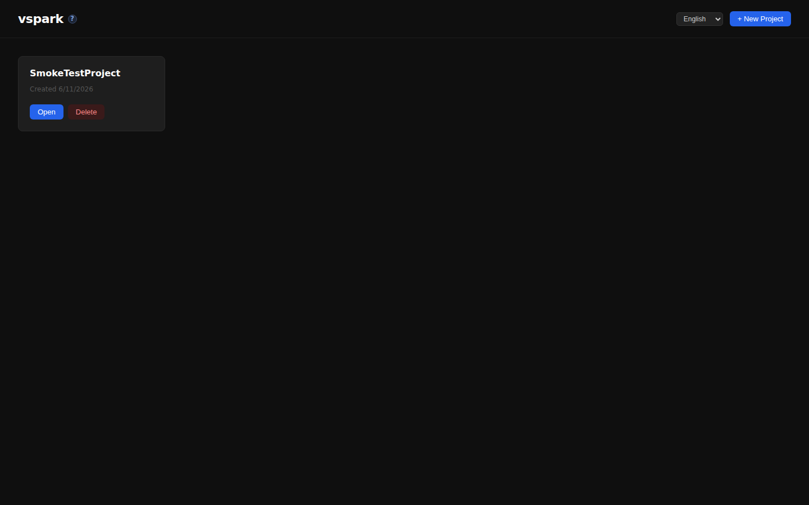
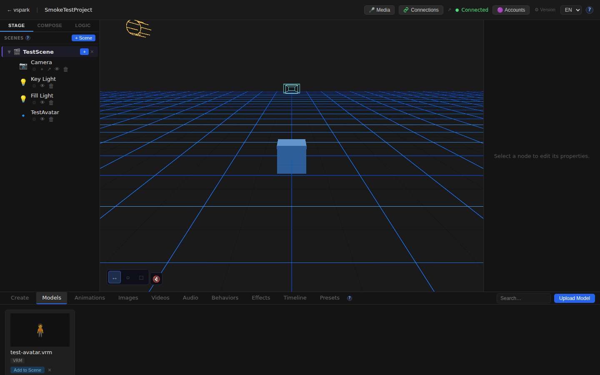
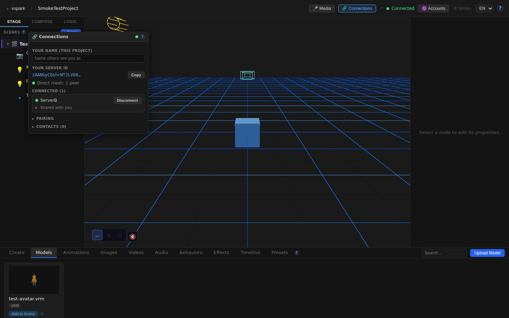
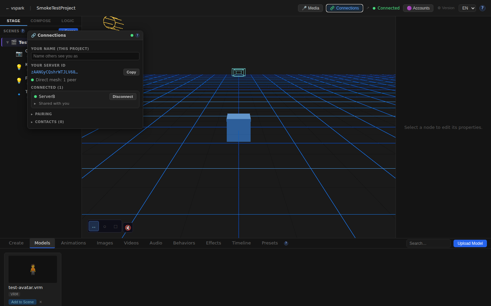
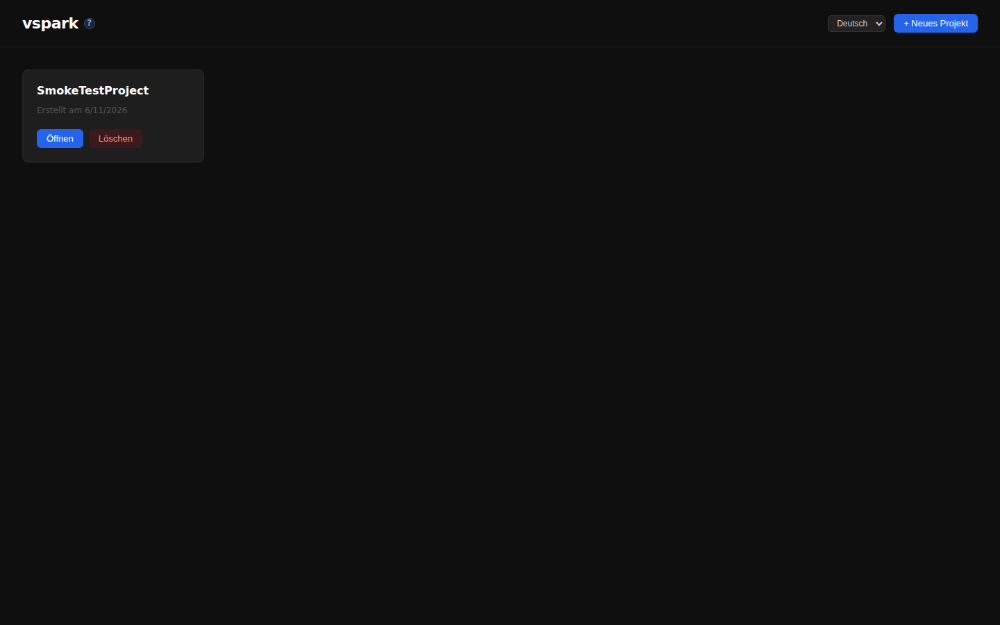
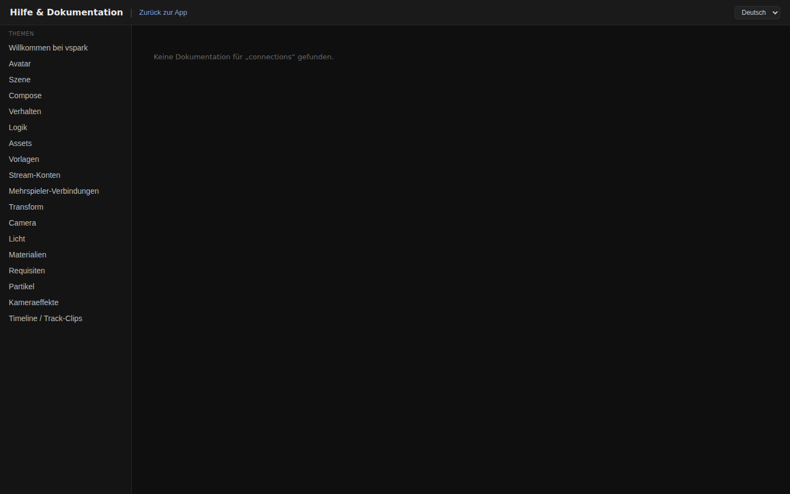

# Smoke Test Report — PR #38 Multiplayer Phase 5/6

**Branch:** `feature/multiplayer-phase6` → `dev`  
**Commit:** `886168a` (HEAD)  
**Date:** 2026-06-11T09:45:35Z  
**Result:** ✅ PASS — 16/16 checks passed (2 API suites + 12 browser)

---

## Scope

The two new commits on this push:

| Commit | Summary |
|--------|---------|
| `886168a` | `feat(collab-scene): transfer + persist assets on mount` — receiver fetches each asset from owner over blob protocol; rewrites node `file_path` to local `_shared/<hash>.<ext>` copy |
| `23034fe` | `feat(collab-scene): stream pose + drag previews to mounted peers` — `forwardCollabStream` fan-out wired into broadcast bus; both `vmc_pose` and `node_transform_preview` paths |

Both commits touch `packages/backend/src/multiplayer/` only → API test scope. Browser tests cover the broader Phase 5/6 UI (ConnectionsWindow, scene graph Share menu, i18n, docs) since the diff is large.

---

## Type-check Gate

```
pnpm lint        → PASS (backend, shared, rendezvous)
pnpm --filter frontend typecheck → PASS
```

---

## Test Plan

1. ✅ Type-check all packages  
2. ✅ Start two-peer mesh (rendezvous + backend A :3001 + backend B :3002 + frontend :5173)  
3. ✅ Both backends healthy (`/api-docs.json` 200, `/api/connections/status` `enabled:true, status:ready`)  
4. ✅ Peer connection: A↔B pair → connect → accept → both show `connected:true`  
5. ✅ Asset upload on A; collab share + mount on B; **asset file transferred byte-identical** (SHA-256 match)  
6. ✅ Scene node `file_path` on B rewritten to `/uploads/_shared/<hash>.vrm`  
7. ✅ Pose streaming: `node_transform_preview` sent to A → received on B's WS clients  
8. ✅ Browser: Home renders project list  
9. ✅ Browser: Editor canvas mounts (3D viewport)  
10. ✅ Browser: Connections button + "Connected" badge in TopBar  
11. ✅ Browser: ConnectionsWindow shows server ID + peer list  
12. ✅ Browser: Scene graph shows Camera + TestAvatar nodes  
13. ✅ Browser: Scene graph context menu has Share option  
14. ✅ Browser: English i18n strings render  
15. ✅ Browser: German i18n strings render on home  
16. ✅ Browser: Docs `/connections` page renders  

---

## API Test Results

### Two-peer mesh setup

```
Rendezvous :8787   → UP  (tsx watch)
Backend A  :3001   → UP  (DB: /tmp/smoketest/a.db, DisplayName: ServerA)
Backend B  :3002   → UP  (DB: /tmp/smoketest/b.db, DisplayName: ServerB)
Frontend   :5173   → UP  (Vite, proxies to :3001)
```

```
Peer A ID: zAANGyCQshrWTJLV68lT6KalGXNYOujO00cYywSrgf8
Peer B ID: DjAEp5iIO06r14qPwuNmPBKY3bhjIHDI5d8kRYmTzUE
Connection: both show connected:true, sessionGranted:true
```

### Asset transfer (feat 886168a)

| Check | Result |
|-------|--------|
| Asset uploaded to A (35,000 bytes, SHA-256 `94d5c613…`) | ✅ PASS |
| Scene node created with `file_path` on A | ✅ PASS |
| `POST /api/connections/scenes/:id/share-collab` | ✅ PASS (200) |
| `POST /api/connections/collab/mount` on B | ✅ PASS (200) |
| `collab_scenes` row on A: `author` role | ✅ PASS |
| `collab_scenes` row on B: `mounted` role | ✅ PASS |
| Asset file on B disk (`uploads/_shared/<hash>.vrm`) | ✅ PASS |
| File size: 35,000 bytes | ✅ PASS |
| SHA-256 hash match (byte-identical transfer) | ✅ PASS |
| `asset_files` row on B (correct `original_name`, `hash`) | ✅ PASS |
| B scene node `file_path` → `/uploads/_shared/<hash>.vrm` | ✅ PASS |

### Pose streaming (feat 23034fe)

| Check | Result |
|-------|--------|
| `node_transform_preview` sent to A's WebSocket | ✅ PASS |
| Received on B's WebSocket clients within 8s | ✅ PASS |
| Payload: `{ kind, payload: { nodeId, transform } }` | ✅ PASS |

---

## Browser Test Results (Playwright, Chromium headless 1440×900)

| # | Check | Result |
|---|-------|--------|
| 1 | Home renders project list | ✅ PASS |
| 2 | Editor canvas mounts | ✅ PASS |
| 3 | Connections button visible in TopBar | ✅ PASS |
| 4 | Connected status shows in TopBar | ✅ PASS |
| 5 | ConnectionsWindow opens with peer info | ✅ PASS |
| 6 | Scene graph shows Camera node | ✅ PASS |
| 7 | Scene graph shows TestAvatar node | ✅ PASS |
| 8 | Scene graph context menu has Share option | ✅ PASS |
| 9 | English i18n strings render | ✅ PASS |
| 10 | German strings render on home | ✅ PASS |
| 11 | Docs /connections page renders | ✅ PASS |
| 12 | No unexpected console errors | ✅ PASS |

---

## Screenshots

### Home


### Editor (3D canvas + scene graph)


### ConnectionsWindow (connected to ServerB)


### Scene Graph


### Scene Graph Context Menu (Share option)


### English i18n


### German i18n


### Docs /connections


---

## Server / Console Errors

None. The fake `.vrm` test file (random bytes, not a real GLB) produced no WebSocket or server errors — it was stored and transferred correctly but expected to fail to parse in Three.js (not tested in this smoke run).

---

## Migrations

Migrations 027–031 applied cleanly on both fresh DBs (verified by clean boot and successful API calls to multiplayer tables).
